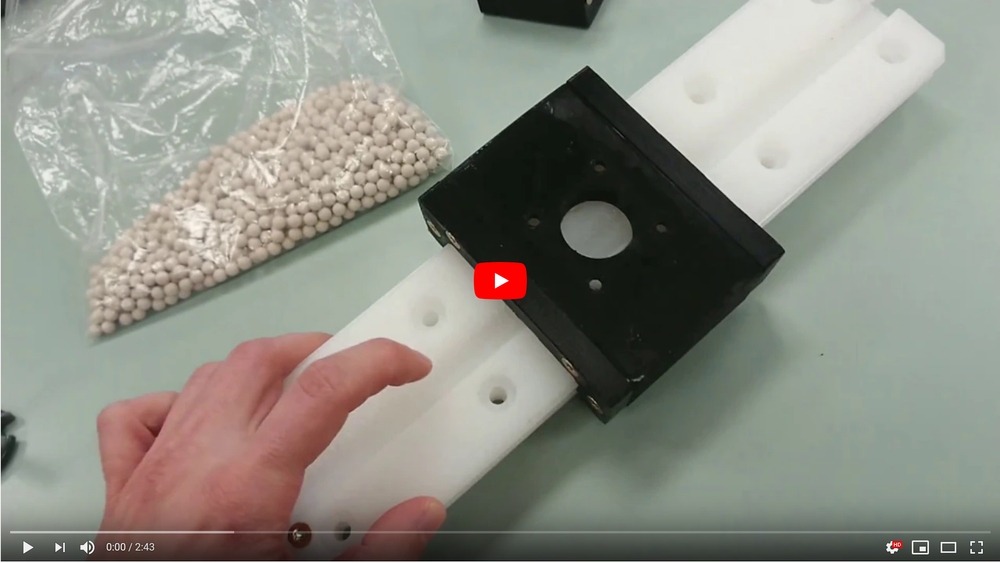

# Linear guide
*by Jens Dyvik, January 2020*

### Status
Work in progress / early development. These are the files from the first test.

### What it is

A recirculating ball bearing, also known as a linear rail/guide. The commercial metal type is more and more becoming the standard rail type for high quality digital fabrication machines. I am curious to whether it is realistic to fabricate these at decent quality ourselves. Inspired by the work of:

- Johann Rocholl https://youtu.be/UTxivqmK4s0
- Solidus labs https://youtu.be/7ksZgqKZnZo
- EasilyBuild https://youtu.be/VrYiAUcE6vI
- 3D Printing World https://youtu.be/cF8fXATjccQ

### Gallery
*coming soon*

### Why
*coming soon*

### What worked well
- For being a first test, the perfomance is pretty good
- It rolls quite smooth
- Even with 20 kg+ pressure it still rolls smoothly
- It is quite stiff under axial and radail loads *(that means it could make a decent stiff axis for a milling machine)*
- Using a canoe milling bit with with 6.35mm diamter in combination with the 5.95mm diamter softgun balls was a great succcess
- It is possible to mill the axes with regular CAM software *(like V-carve pro)*
- It is possible to mill the axes without an special jig *(since the milling bit noes not need to be bellow the axes, unlike in the v-bird experiments)*
- Since the axes are milled it is possible to make big machines
- Using a softgun speedloader to fill the bearing with balls worked like a dream and makes it realistic to assemble these in a commercial setting

### What didn't work well
- Motion is a bit uneven *(probably as the balls enter and exit the raceway/rail. The racewya and the printed channels were not matching 100%)*
- The 3D print warped a with. So even when the raceways were machined to decent precision, the channels for the balls to return was still a bit off.
- It is challenging to align the printed part precicely on the milling machine
- Elephants foot and other artifacts on the 3D prints makes a challenge *(this can be partially solved with chamfers, fillets and oversized holes)*
- Milling PLA is tricky *But multiple passes and some rubbing/cleaning by hand helps)*

### How to make
*coming soon*

### Todo / future plans
*coming soon*
