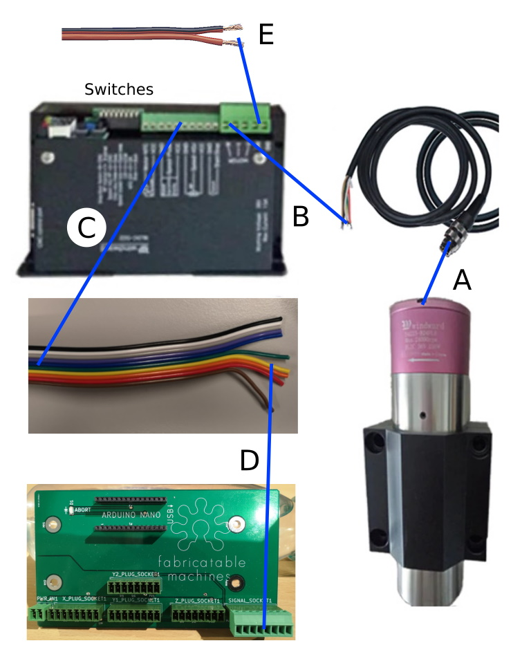
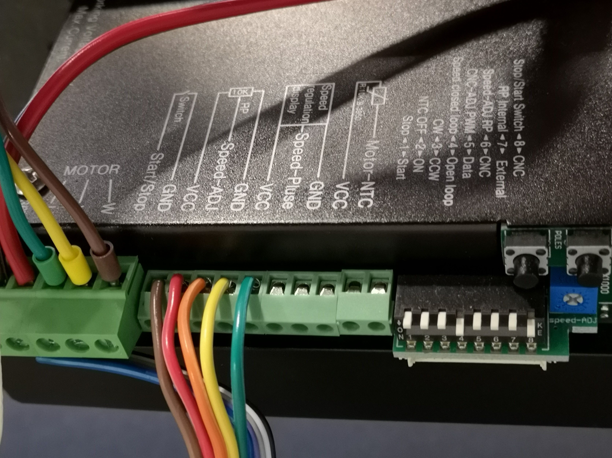
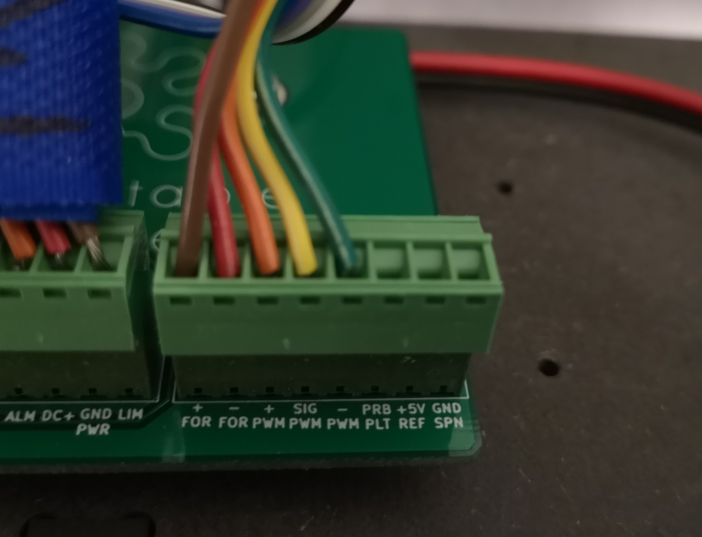
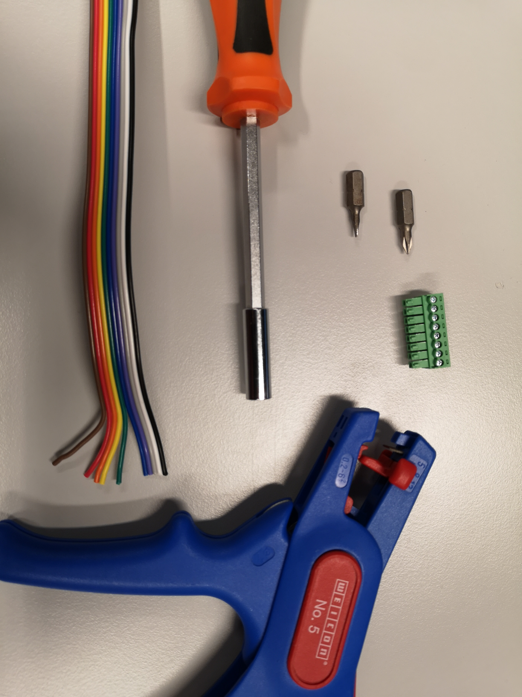
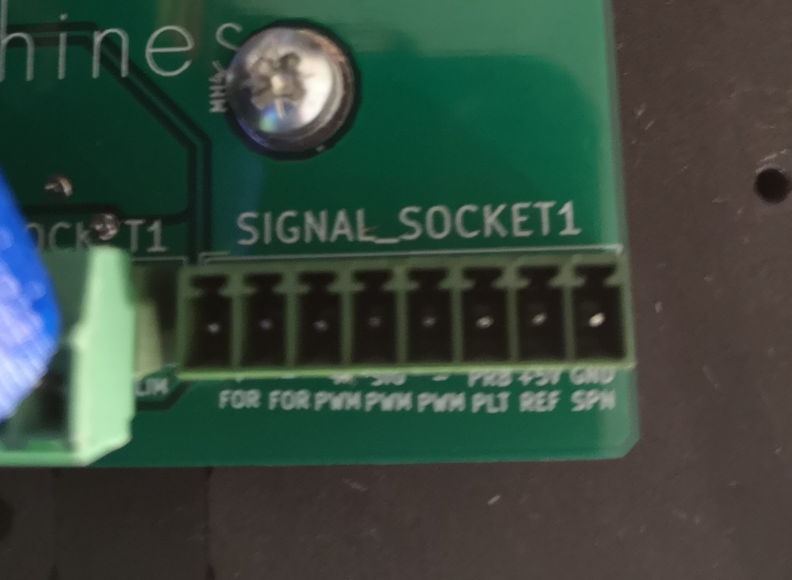
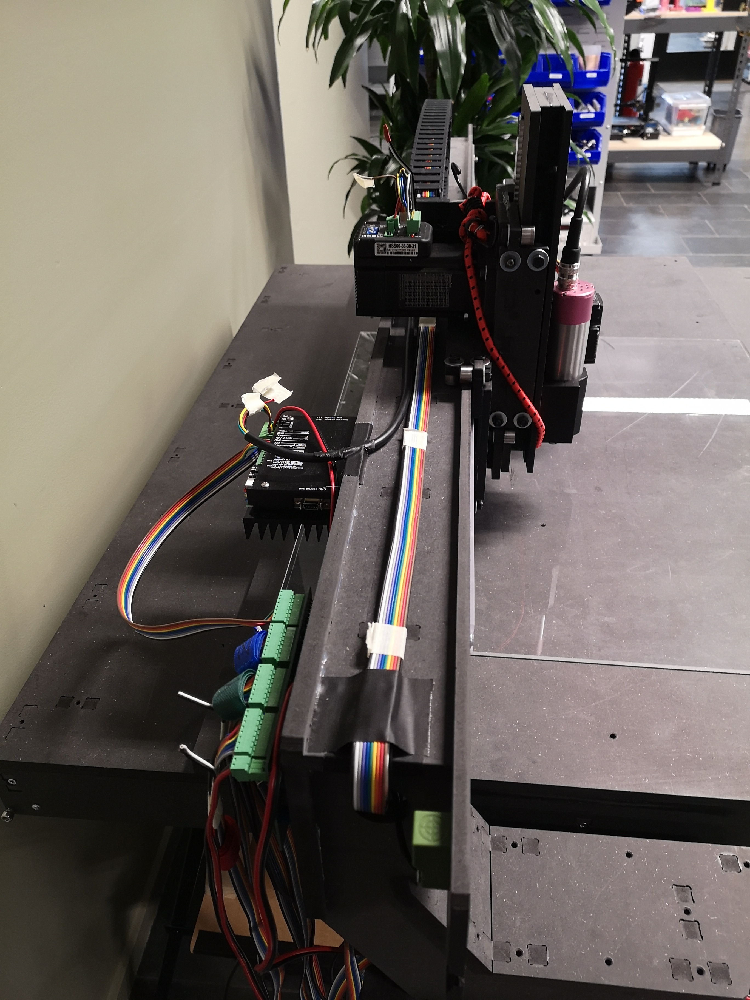
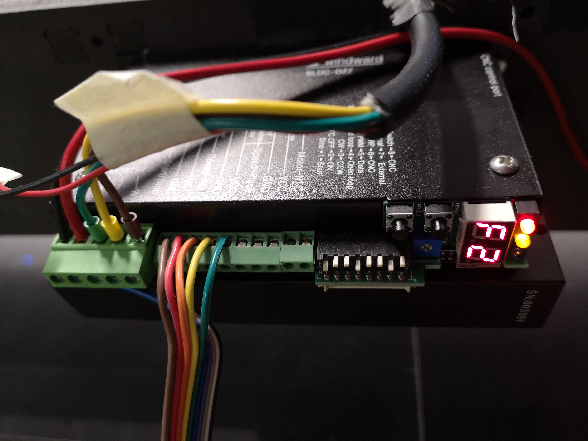
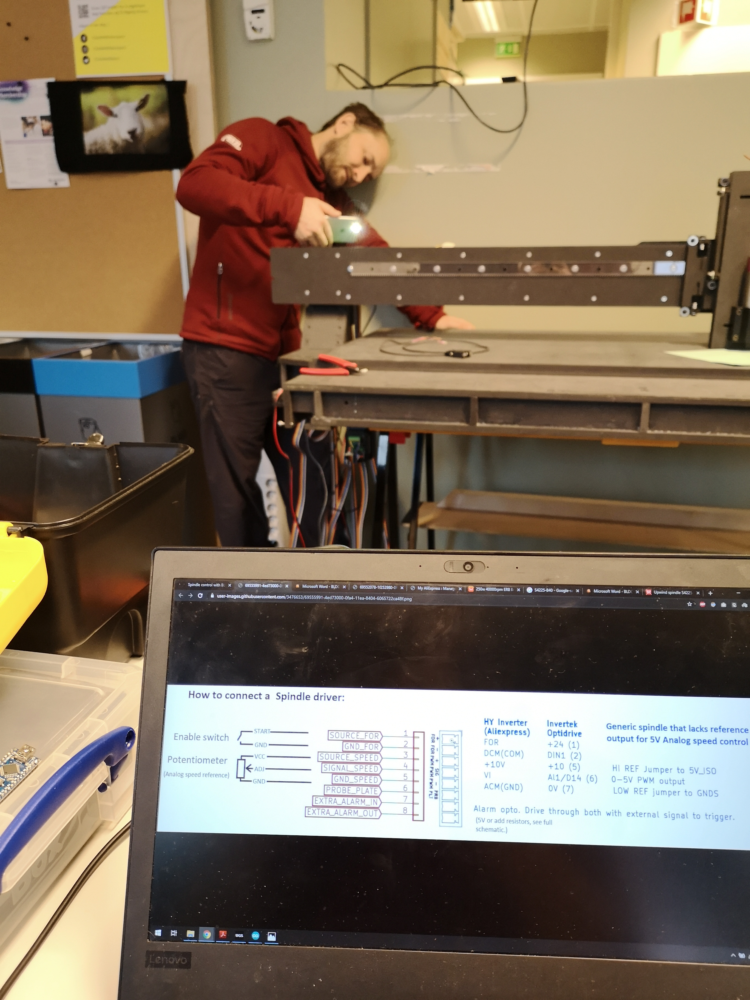

# 250W 40 000
*Spindle Model: S4225-B40
*Spindle driver: Windward BLDC-DZZ

## Guide to conect up a 250W 40000rpm Spindle
### Work in progress... 9th of December 2019

## Start
To connect the spindle for testing you will need:
* Screw driver
* Cable stripper
* Ribbon cable
* Power cable, two colors, preferably black (GND) and red (+)
* Spindle, 250W 40 000rpm
* Spindle to driver cable, round screw in on one end, 5 loose cableson the other
* Spindle driver, Windwards BLDC-DZZ
* HRBL shield + connector for spindle

## Diagram of connections: A to E

* A) Spindle to driver, screw in place. Fits only one way (easy peasy)
* B) Spindle to driver: 
Green cable to U
Yellow cable to V
Brown cable to W (double check!)
2 remaining cables are probably for an inbuilt thermistor(?) in the spindle. Probably connect to: Motor-NTC and VCC (check manual)
* C) Spindle driver ribbon cable, need only 5 strands: 
brown to switch Start/stop
red to Switch GND
orange to 10K VCC 
yellow to 10K Speed-ADJ
green to 10K GND

* D) Ribbon cable to HRBL: 
brown to + FOR
red to - FOR
orange to + PWM 
yellow to SIG PWM
green to - PWM

* E) Power cable to power supply

## Switch flip on spindle driver
### Current setup: F2 error message on spindle driver display on startup, spindle spins slowly when (1) is flipped down. Able to adjust speed then but not a direct correspondence with the value sent by GRBL. Needs more troubleshooting!
* 1) Down
* 2) Up
* 3) Up
* 4) Down
* 5) Up
* 6) Up
* 7) Up
* 8) Down

## First testing
Commands in GRBL:
M3: start spindle
S10000: set spindle speed to 10000rpm
Test device for rpm: Tachometer (norwegian: turtallsmåler / turtallsteller)
Example: https://www.kjell.com/no/produkter/elektro-og-verktoy/maleinstrumenter/turteller/uni-t-ut373-turtallsmaler-p48883

## Further testing
Test switches function.
Read manual of spindle driver to figure out [MENU] and [POLES] on spindle driver.
Figure out correct flipping of switches and options in [MENU] and [POLES] for GRBL speed set to equal actual Spindle speed.

##Some more pictures:

---
Reading different rpm
Just some reading to check what switch (5) did
*RPM, Display [5] PWM UP, Display [5] PWM DATA  
*5000, 36, 7-10
*10000,38, 10-11
*15000, 39, 16
*20000, 40, 17-18
*25000, 40, 20-21
*30000, 40, 33-35
*40000, 41, 41
What is displayed: power usage?

---
Jakob guide from issue:

The manual

First I would run their startup and test guide to see that it works and has the correct nr of poles set.
Please document this testing since it isn't very clear in the manual.

When you have tested it and want to control it with the HRBL card
These are the connections that need to be made:
Spindle_illustrated

The switches on the top right corner also needs setting.
We want a hybrid of external controller mode and CNC mode (since we are not sending it digital signals but using external speed and start signal).

Switches:
[8] Stop/start Switch
[7] External
[6] Speed-ADJ RP
[5] CNC-ADJ PWN
[4] Open loop (for max power always, I am not sure about this one, test it)
[3] CW (Direction of spin, flip if it is wrong)
[2] NTC OFF (it's the motor temperature sensor, unless you have one, then it can be ON!)
[1] Stop (I think it's in paralell with the Stop/start wires)

Configuring GRBL:
Set max RPM in firmware settings in UGS or type:
$30 = your-maximum-rpm-value
I'll use 60000 rpm in this example.
$30 = 60000
And also set the miniumum rpm value to 0 to avoid scaling issues.
$31 = 0
Offical guide to configuring GRBL spindle speed

Testing the spindle with GRBL:
Type into the console of UGS
Start the spindle at 60000 rpm
M3 S60000
Stop the spindle
M5
Just set the current RPM to 20000
S20000

Troubleshooting:
If it doesn't work, try putting switches:
[8] to CNC
or
[6] to CNC
or
[1] to Start
and try again. Document which one that worked.

Bonus question:
When you are running milling jobs, try with switch [4] in the Closed loop setting and see if it works better or worse. I worry that one of the modes will have a drop in RPM as the bit enters the material. It might be that one of the modes works better when you have set a lower than max RPM, I worry that it will loose lots of torque when the RPM is lowered. Remember to document!

Let me know if there are more questions and PLEASE write down a guide as you go through this, write it straight into github or it is likely to not happen.

