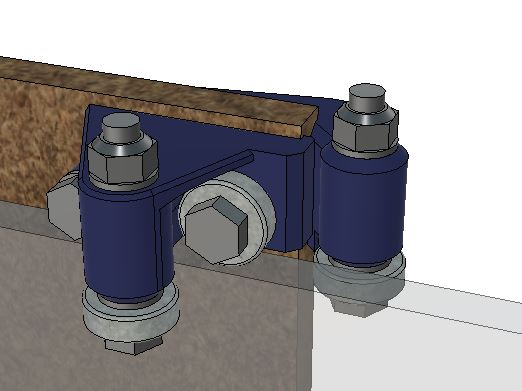

# Bootstrap CNC mill - concept 

*Full sheet CNC milling machine, work area 2,6 x 1,2m*

## Description
* Design concept for making all parts for a full size CNC milling machine using a local 3D printer, a laser cutter and a plywood saw. 
* Heavily inspired by the previusly developed [Humphrey CNC mills](https://github.com/fellesverkstedet/fabricatable-machines/blob/master/humphrey-large-format-cnc/README.md) made from valchromat and aluminium.
* Plan to use use a skateboard bearing (608) based [roller axis](https://github.com/fellesverkstedet/fabricatable-machines/wiki/Fabricatable-axis#roller-rail) guide system. 
* Plan to use the ["large size" rack and pinion](https://github.com/fellesverkstedet/fabricatable-machines/wiki/Fabricatable-axis#rack-and-pinion---sizes) with laser cut rack and 3D printed pinions.
* First full version is intended to be built in Skellefteå Sweden using their local machines.
* The supporting structural parts will be have to be built with non-cnc methods.
* Glue and nailgun assembly of wooden parts. Possibly 8mm OSB/plywood for structural, non-guiding parts to make it lighter and allow for higher acceleration settings of the motors.

## Philosofy 
* The machine should be made entirely using local machines and techniques the users are familiar with, the intent is to give the users a stong sense ownership and the feeling that they can fix and tweak anything.
* Experimental tuning hypothesis: Seting up the initial tuning and maintaining it has been a challange in the past. Here we try "Fixed tuning" using shims and semi-flexible materials in an attempt to simplify the tuning for somewhat coarser quality machines.   

## BOM
* 12 mm Plywood rails, cut and planed straight and paralell.
* Integrated stepper motors 3Nm
* Hrbl controller
* Laser cut plastic racks, ca 6mm thick (material?)
* 3D printed pinion (6 teeth, 60 mm per revolution Ø6mm tooth diameter)
* 48 of type 608 bearings mounted on 3D printed simple holders. (Can be doubled?)
* M8 Hex head screws, washers and locknuts (Some M5 will also be needed)
* Spindle, 800W 24000 rpm, air cooled + VFD. (Could be lighter, heavier and stronger is not recommended due to tool force flex)
* Dust extraction

# Files

[Full size Fusion360 model (no rollers but fully jointed)](https://a360.co/33g6WgV)

# Bed and supports
The files here only covers the "machine" part of the CNC, the bed and its supports needs to be designed and built by local talents.
See [this torsion box video](https://www.thewoodwhisperer.com/videos/episode-18-assembly-table-torsion-box/) for ideas.

## Images

* [images](img/)

## Roller holders

* Most tuning is made by changing 3D-printed shim plates. Locknuts are important, the wood and plastic will not withstand full M8 pretension = would come loose. The wood will shrink and the plastic creep so some tuning will have to be done after a while but hopefully it wil be very robust.
* Needs many walls and either controller infill zones or 100% fill, will take ages to print.
* 48 holders are needed.
* Tuning is done at assembly. The rollers are fixed in a position of pretension aginst the wood.

[Fusion360 link](https://a360.co/2pHU1Xv) 

## Guessed performance 
* Errors under 1 mm should be very realistic, errors under 0,5mm is optimistic.
* Main error sources will be material flex and motor-position error (undershoot) from the low gearing.

## Todo
* Finish rough design of roller holders, testprint with high / max infill for strenght.
* Make a test axis and test them under load. 3D print flex and wood deterioration from roller load is very interesting.
* Add rollers to machine layout.
* Import large teeth rack and pinion from wiki. Large teeth = Lower maximum performance but should be stronger.
* Add motor mounts
* Decide on axis width, now all have 120mm = low on X and hight on Y, ok on Z?
* Decide on fasteners, 3D prints with trapped nuts or metal threaded inserts?
* Add probing plate
* Consider hiding Y rails under bed for dust protection. Add spacer.
* Develop a wiper system, consider covers for rollers.

## Improvement ideas
* If tuning does not stay tight, add tuning features to prints
* Double rollers on high stress places = behind X top +2, front x bottom +2, top edge x +2 and y +4 = +10 => 58 total. All double = 96 bearings, perhaps worth it?

## Assembly
### Y rails
* Positioning of the two rails is critical to the precicion of the machine. This should be though about when designing the bed support structure.
* The two long Y rails need to be mounted and fixed in the same plane. This can be measured using a [laser plane on a tripod](https://en.wikipedia.org/wiki/Laser_level) and a ruler. The vertical rail supports should be adjusted first (adjustable feet or shims?) to allow the rails paralellity to be tweaked during the next step of assembly.
* More importantly, the two Y rails need to be paralell to each other or the machine can not be well tuned, ever. This can be measured using a homemade guide stick that reaches around the bed (or before the bed is placed). When their position is satisfactory the rails can permanently fastened to the bed.
