# Hattori - Small-Format CNC Mill and 3D printer
*July-September 2017, Jens Dyvik and many collaborators*

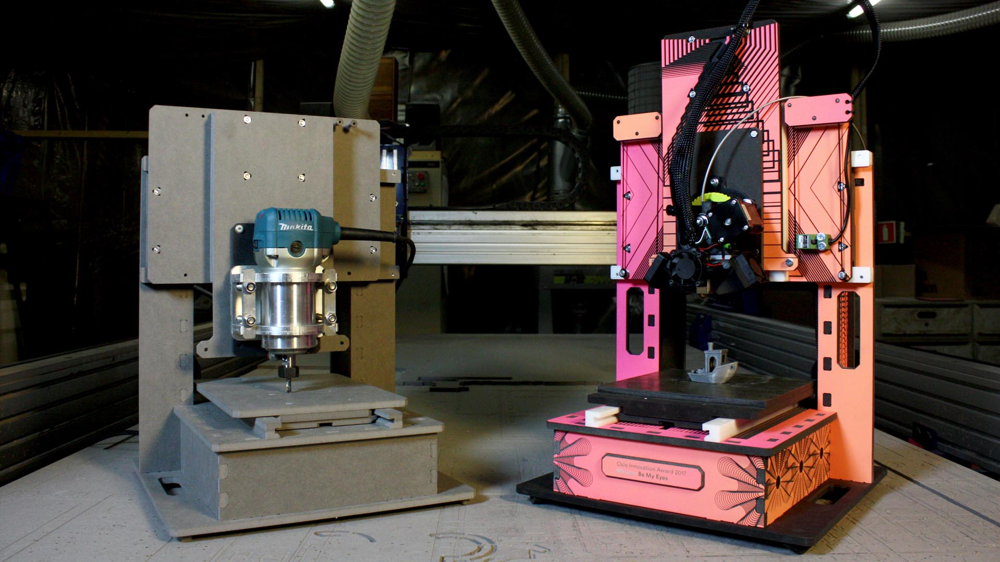
*CNC mill version on the left, 3D printer version on the right*

*The chamfer rail axis system makes hot-swapping the machine bed and z-axis easy*
Hattori_AwardPrinterEdition_hotswap_bed.jpg

* A solid, small-format desktop CNC platform for CNC milling and 3D printing
* Fabricatable with a CNC mill
* Uses the [Chamfer Rail](../chamferrail) system
* Current version has a 200mm x 300mm x 120mm work volume
* Each axis is identical and can be made from from 130mm x 8mm aluminium flat bar or HDF sheet (reduced from 10mm) 
* Hot-swappable build platform and end-effectors for quick job processing or transition between milling and 3D-printing

**Design wins**
* Identical axes types for X, Y and Z makes part removal, fixturing and mash-ups easy
* Having two out three motors static motors allows for very snappy performance
* The machine base is very sturdy
* The HDF wood base is strong enough for most applications, but can be substituted with an aluminium base for hardcore tasks
* Making the chamfer rail from HDF (valchromat) instead of aluminium gives sufficient perfromace for 3D printing and and light milling
* Overall part count is very low
* The parts are easy to fabricate
* The machine is easy to assemble
* Split chamfer rails solves POM warping and scraping challenge
* Works with regular nema 17 motors (nema 23 reccomended for tighter axis tuning and higher performance)
* Using a temporary CNC spindle to surface a 3D printer bed before applying a PEI sheet woks great
* Aluminium and POM version is able to mill mild steel using trochoidal milling techniques

**Design fails**
* Split chamfer rail requires semi complex cnc machining operations
* Drilling and tapping in aluminium adds a lot of assembly time (though an HDF wood base glued with wood glue is a great allrounder)
* Integrating a versatile electronics enclousere is half solved (ihss57 motors with integrated drivers seems promising for reducing enclosure columen and cable mangament)
* Spring or elastic band gravity assist on Z-axis is half solved (the goal is to have automateable hotswap of Z-axis)
* Cable mamangement and filamet hooks/guides is half solved

### Hattoris in the wild
* Hattori 1, by Jens Dyvik. Now at bitraf in Oslo, Norway
* Hattori 2, by Torbjørn Nordvik Helgesen. Work in progrees CNC mill for Kuben upper secondary school
* Hattori 3, by Torbjørn Nordvik Helgesen. Work in progrees CNC mill for commercial client
* Hattori A.P.E (Award Printer Edition), by Jens Dyvik, Jakob Nilsson and Erling Knudsen. Trophy for Oslo Innovation Award 2017. Now in Copenhagen, Denmark
* Hattori 5, by Jens Dyvik and Nadya Peek. Work in progress heavy duty 3D printer

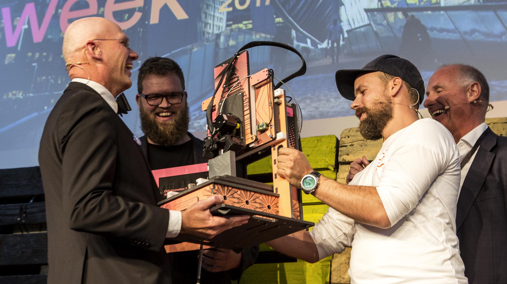
*Winners of Oslo Innovation Award 2017 reciveing their Hattori A.P.E*

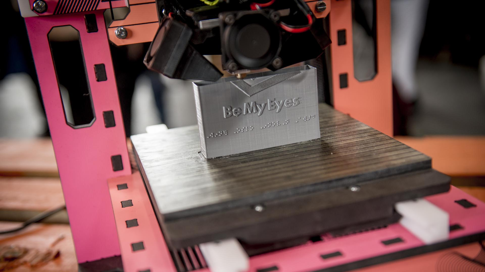
*The winners have developed "Be my eyes" an app that connects blind people and volunteers. So their trophy was set to print another trophy with braille text*

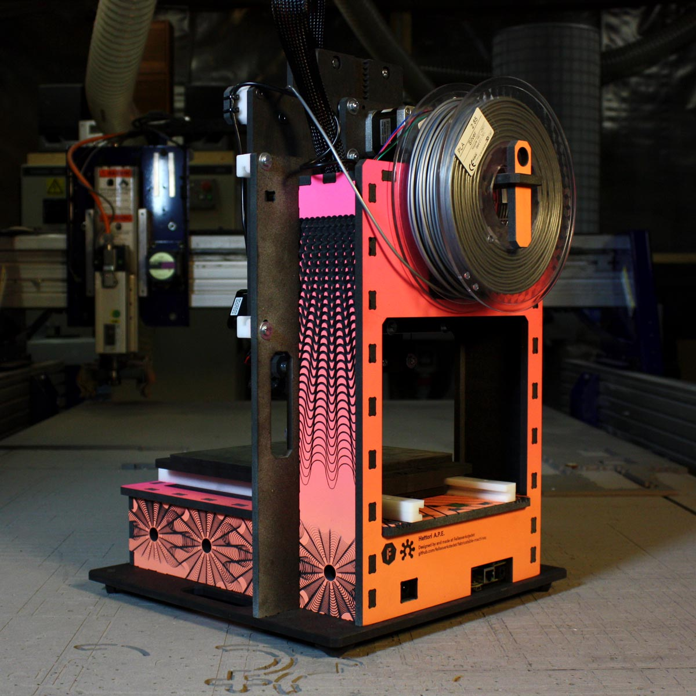
*Filamnet roll, electronics, motors, proximity switches and cable harness are all integrated*

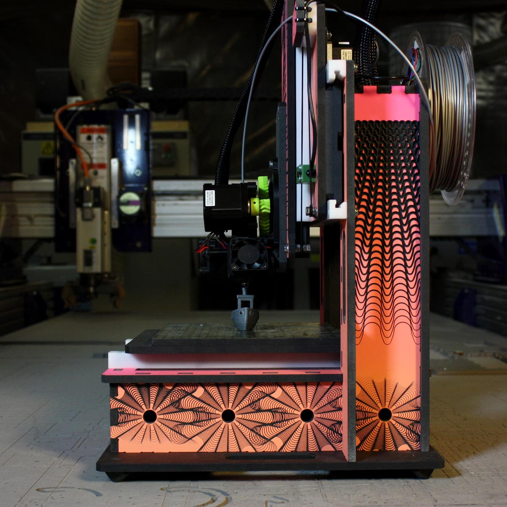
*Custom grahics by Erling Knudsen. 3D v-bit engraved on valchromat screenprinted with a gradient matching the OIW 2017 profile*

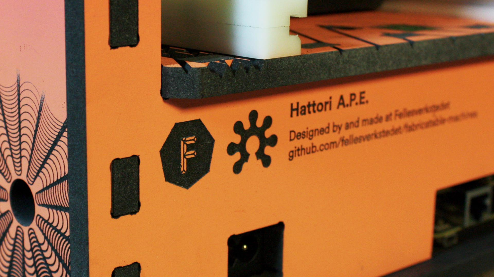
*The open source hardware logo has been hacked to match the chamfer rail roller pinion*

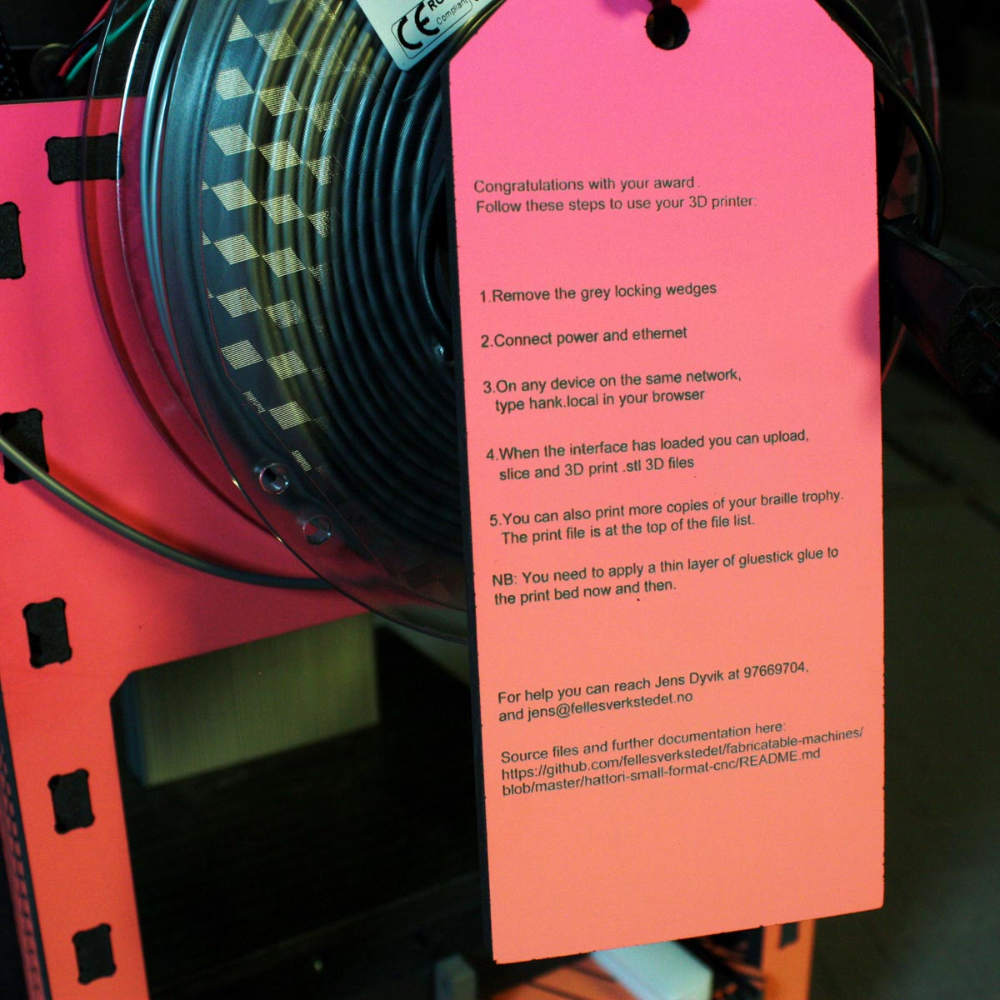
*Label with intructions for the winner of the 2017 Oslo Innovatoin Award*

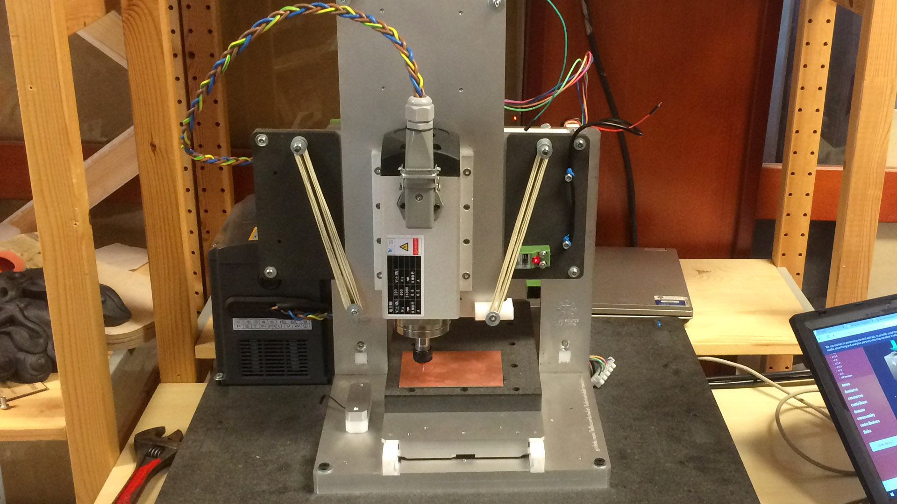
*Hattori CNC mill version making first PCB test*

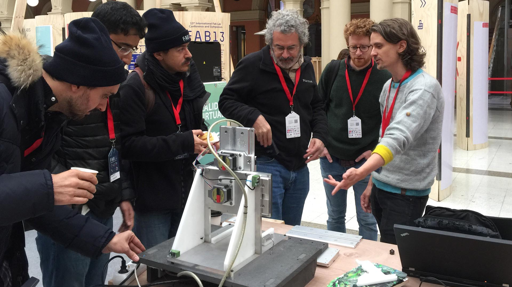
*Hattori at FAB13 in Santiago, Chile*

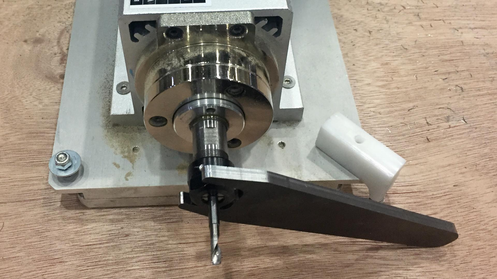
*Z axis and spindle with a steel spanner milled by Hattori. Trochoidal milling with Bark Beetle in 5mm mild steel*

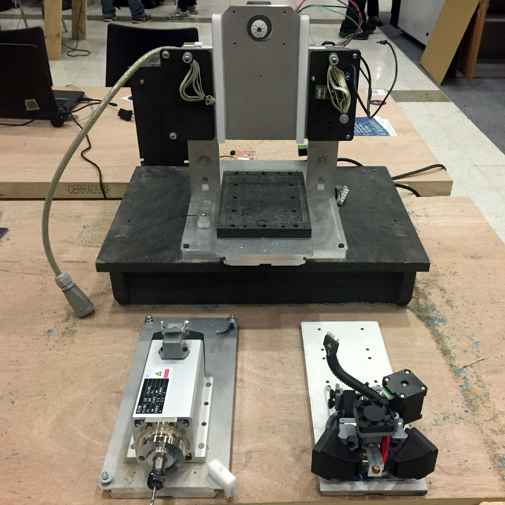
*First self replication test. A new Z axis milled from two parts*

### To do
* Test UHMW tape on HDF and Aluminium glide blocks
* Update base design to play nice with larger motors like ihss57
* Update CAD files in repo
* Make how to build guide (work in progress [here](http://www.thnordvik.com/hattori-mucj))
* Make bill Of Materials (BOM)
* Develop safey enclosure
* Test saddle type elastic band for Z axis power out assist
* Ass handle to build plate axis for easier hot swap
* Make larger adjustment holes for glide blocks to allow
* Make longer, better umbilical cord. make it possible to use machine with bottom plate detached?
* Find a easy way to maount the umbilical cord to the base plate
* Add horns to X axis front plate for filament leading and homing?
* Add mounting hoels for proximity switches to CAD model
* Remove wedge lock from main design?
* Solve fileament roll squaek - bigger fillet?

### Development log
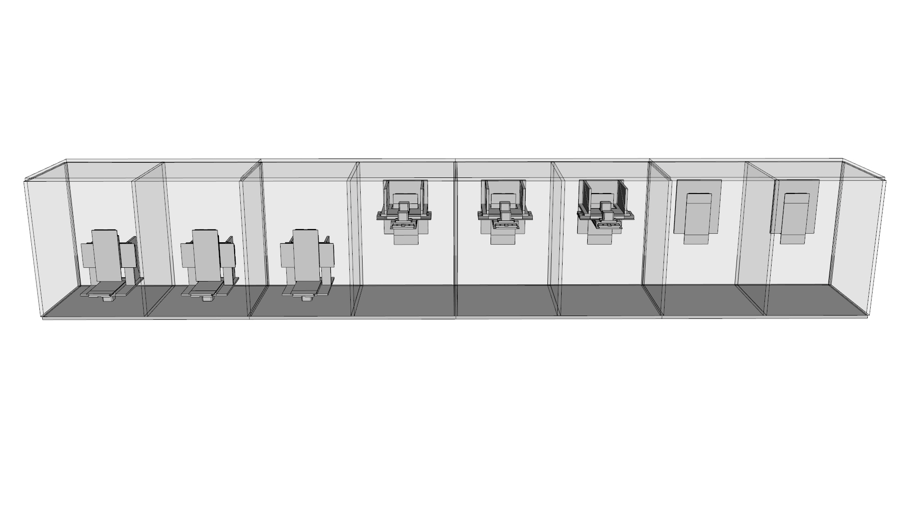
*3D-Printer / CNC Mill array concept sketch*

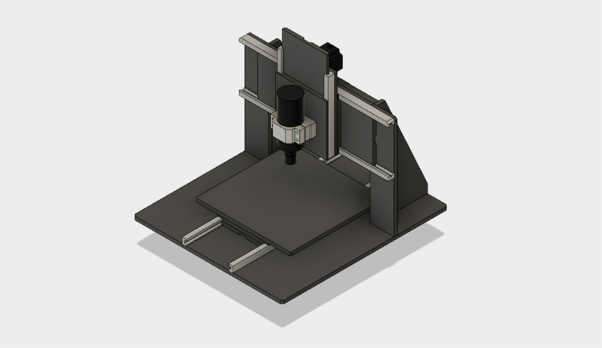
*Hattori-280 development sketch*

 
*Kinematic motion study of all axes in Fusion 360*

View Charile Banthorpes iteration in the browser [here](http://a360.co/2q95BZO)

**