# Hedy PCB mill

Named after [Hedy Lamarr](https://no.wikipedia.org/wiki/Hedy_Lamarr), the Hedy PCB mill is a small and fast three axis CNC milling platform which primarily is designed to be a dedicated FR-1, FR-2 or FR-3 circuit board rapid milling and drilling machine.

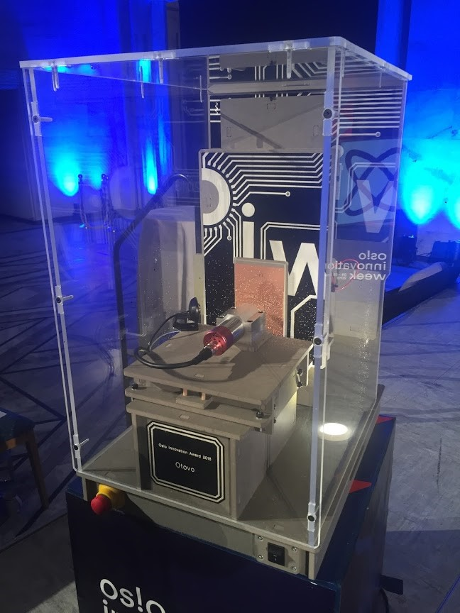

This is the first version of Hedy and was the [Oslo Innovation Award given to Otovo during Oslo innovation week 2018.](http://www.innomag.no/otovo-vant-oslo-innovation-award/)

#### Specifications
* 100x180x30 mm work volume
* Width: 432mm, depth: 537mm and height 700mm.
* 40.000 RPM spindle
* Enclosed
* Grbl-motion control using a Arduino NANO
* Octo-print web control interface using a Raspberry Pi 3
* Double contactor safety circuit
* Uses three Nema23 2 Nm closed loop stepper motors with integrated drivers
* Full optoisolation for all signals and sensors
* Built in 36V power supply
* Decorated with laser engraved film purchased from [Alvøen](alvoen.no)

## Making your own

We want it to be possible for you to make your own copy or customized version of the Hedy PCB mill so all files and instructions for how to make it are shared here. All parts can be milled with a 3 mm milling bit and are prepared with dogbones. Please test fit a part and ensure you have a good fit, it should be tight but not so tight that you risk breaking things. We used an 0.07 mm extra allowance in all pockets.

### Bill Of Materials
#### Stock
* 1 sheet (2440x1220mm) of 8 mm thich valchromat
* Small piece of 12 mm thick POM plastic (100x50mm) for the three 8pinions 
* *(Optional)* 3D-prints of the 60-circumference pinions using PLA or simmilar
*  Small piece of 8 mm thick plastic sheet (85x322mm) for making small toothed 40mm-circumference rack [(can be made from valchromat if using larger teeth, see below)](readme.md#rack-and-pinion-tooth-sizes)
* 18 of Ø16mm track roller, fixed Ø6 mm shaft [link](https://www.kugellager-express.de/stud-type-track-roller-kr16-16x6x28-mm)
* 18 of Ø16mm track roller, adjustable +/- 0.5mm Ø9 mm shaft [link](https://www.kugellager-express.de/stud-type-track-roller-kre16-pp-16x9x28-mm) ([Larger aliexpress alternative](https://www.aliexpress.com/item/10PCS-High-precision-KRE22-track-needle-roller-bearing-Stud-Type-Cam-Follower-Roller-Bearings-curve-roller/32807588995.html))

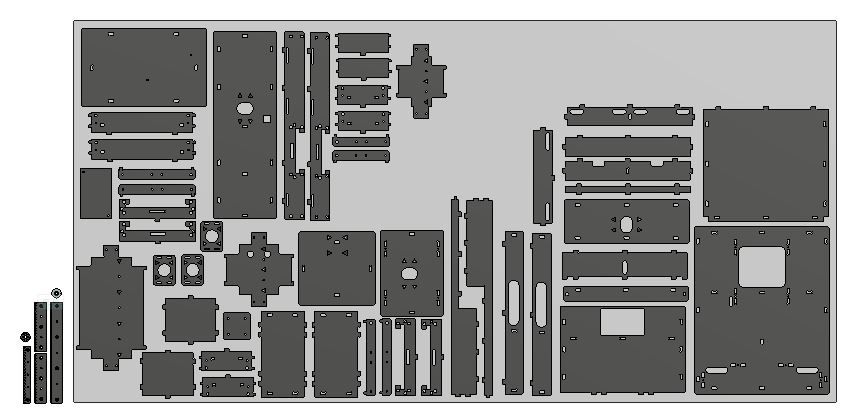

[Hedy_award_PCB_mill_assembled_and_cutsheet_STEP.zip](Hedy_award_PCB_mill_assembled_and_cutsheet_STEP.zip)

[Hedy_award_PCB_mill_cutsheet_DXF.zip](Hedy_award_PCB_mill_cutsheet_DXF.zip)

[Pinion dimensions PDF](pinion_dims.pdf)

[Rack dimensions PDF](rack_dims.pdf)

[Online 3D model, can be downloaded in various formats FUSION360](https://a360.co/2xl9Fsn)

#### Machines, fasteners and equipment
* Shopbot Alpha or [Humphrey](https://github.com/fellesverkstedet/fabricatable-machines/tree/master/humphrey-large-format-cnc) "full size" CNC milling machine
* 3 mm milling bit
* Wood glue
* Ø6 mm Wooden dowels
* M5x12 with cylinder head machine screws
* M5x16 with cylinder head machine screws
* M5 nuts
* 8mm long ø3.5mm wood screws
* Ø2,5 mm drill for predrilling holes
* 5 mm drill for zip ties

#### Assembly

#### Tuning the wheels and motor-pinons

Hedy is built from three very similiar linear motion axis. If you have learned to tune one, you can use the same principles for the others. You always start with tuning the wheels and they are always mounted in pairs, one is fixed and one is adjustable, between them they hold the rail. We want want there to be no slop that allows the rail to rattle between the wheels as this will translate to poor preformance later. Making the wheels squeeze the rails too tight may damage the rails, wear out the wheels faster or reduce precision by uneccessarily incresing the force required for movement.

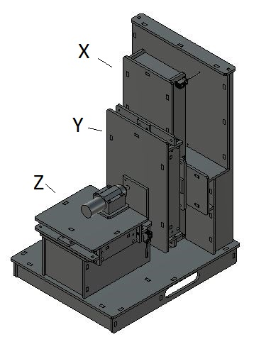

We need to start with tuning the Y-carriage (y is vertical motion). To do this you need to first take out the x-motor so that we can take off the X and Y carriage assembly from the machine. Use a long 4 mm hex key to reach the outer screws holding the x-motor position adjustment plate to the machine and remove the screws. (Don't remove the inner screws that holds the motor to the adjustment plate.) 

When you have removed the x-y assembly from the machine, take off the y-motor in the same way.

On the y-carriage. Identify which wheels are adjustable and use a 10 mm wrench to release the nut on one of them. Then use a 4mm hex key (allen key) to rotate it's excenter until there is no slop or sideways motion of the rail possible between this adjustable wheel and the opposing fixed wheel. Be careful so that you don't overtighten the wheel, it's very easy to do. There should be a low even resistance to rolling it along it's full travel and you should be able to stop or spin each roller with a finger so that it spins or slides relative to the rail. Test and tune each wheel pair on the y-carriage brefore proceeding.

Now we can tune the poisiton of the y-motor and its pinion. The goal is to mount the motor so that the gear teeth are just engaged with no slop but without pressing the pinion into the rack with any force. Find a position where the pinion rests in the rack teeth and fasten the motor witout pressing it into the gear. If you now give power the motor you can try pushing back and forth on the carriage to make sure it's free from slop. Overtightness is harder to judge but will give a more pronounced occilation to the force needed to push the carriage along the rail when the motor is unpowered. When you are satisfied with the y-motor tuning you can move on to the X-carriage.

To tune the x-carriage (x is horizontal motion) you need the x-y carriage assembly back on the machine. To access the wheels roll the x-carriage so that it is just beyond it's rail on one side. Tighten one adjusable wheel on the protruding side, roll it back and test the tightness. If not perfect, roll off again and adjust some more. When you are satisfied with the tuning of the x-carriage you can tune the x-motor the same way as you tuned the y-motor.

The z-carriage is tuned the same way as the x-carriage.

#### Electronics
* Arduino NANO on the [HRBL-controller card](https://github.com/fellesverkstedet/fabricatable-machines/tree/master/hrbl-shield)
* Raspberry Pi 3 for online control. 
* 36V power supply
* Nema23 2 Nm closed loop stepper motors with integrated drivers
* 40.000 RPM spindle with driver
* Door switch [link](	https://www.sick.com/se/en/safety-switches/electro-mechanical-safety-switches/i16s/i16-sa203/p/p12219)
* Door actuator	[link](https://www.sick.com/se/en/ie16-s1/p/p249401)
* Emergency-Stop	[link](https://www.sick.com/se/en/safety-switches/safety-command-devices/es21/es21-sb10g1/p/p81746)
* Two Cable Plugs	[link](https://www.sick.com/se/en/m20-gland/p/p315311)
* Two 230V contactors [link](https://www.kjell.com/no/produkter/elektro-og-verktoy/el-produkter/sterkstrom/din-produkter/malmbergs-installasjonskontaktor-2-pinners-20-a-p67231#ProductDetailedInformation)
* 230V 10A fuse for DIN rail [link](https://www.clasohlson.com/no/Automatsikring-1-pol,-10-A/Pr363069000)
* Five blue DIN two tier terminals blocks [link](https://www.elfadistrelec.no/en/terminal-block-series-blue-mm-weidmueller-zdk-5v-bl-1745880000/p/30093409?q=*&filter_Poles=4&filter_Category3=Standard+Terminal+Blocks&filter_Buyable=1&page=10&origPos=104&origPageSize=25&simi=99.9)
* One green ground DIN two tier terminals block [link](https://www.elfadistrelec.no/en/terminal-block-green-yellow-mm-weidmueller-a4c-pe-2051560000/p/30092748?q=*&filter_Poles=4&filter_Category3=Standard+Terminal+Blocks&filter_Buyable=1&page=9&origPos=103&origPageSize=25&simi=99.9)
* Four component DIN enclosure [link](https://www.clasohlson.com/no/Kapsling/Pr325682000)
* Wago connectors, for 2 and 3 poles.
* 5 m Three wire rubber cable for 230V 10A.
* 3 m 7 wire ribbon cable
* 2 m single wire cable for probe signal.
* Ferules and pliers to attach them.
* Zip ties

[Wireing schematic PDF](https://github.com/fellesverkstedet/fabricatable-machines/raw/master/hedy-pcb-cnc/Power_and_safety.pdf)

[Hrbl card connections SVG](https://github.com/fellesverkstedet/fabricatable-machines/blob/master/hedy-pcb-cnc/electronics/hrbl_shield.svg)

#### Rack and pinion tooth sizes

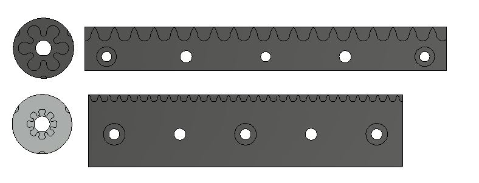

The files include two teeth sizes for the rack and pinion. However only the small tooth size is a complete set. Anyone fluent in CAD can however cut and paste together a functioning set with the larger teeth.

The larger size gives a 60 mm translation per motor shaft rotation and the smaller size 40 mm per rotation. They are referred here as the 40mm or 60mm circumference types. The larger tooth size is strong enough that they can be milled directly from valchromat wood fibre board while the smaller teeth gives a higher gearing ratio, making the machine stronger which gives higher potiential precision. [In testing we have shown that high precision is possible also with the large teeth.](https://github.com/fellesverkstedet/fabricatable-machines/wiki/Fabricatable-axis#test-results)

[The wiki has more information about the tooth sizes pros and cons](https://github.com/fellesverkstedet/fabricatable-machines/wiki/Fabricatable-axis)

## Pictures 

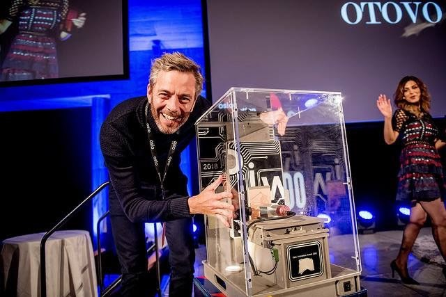

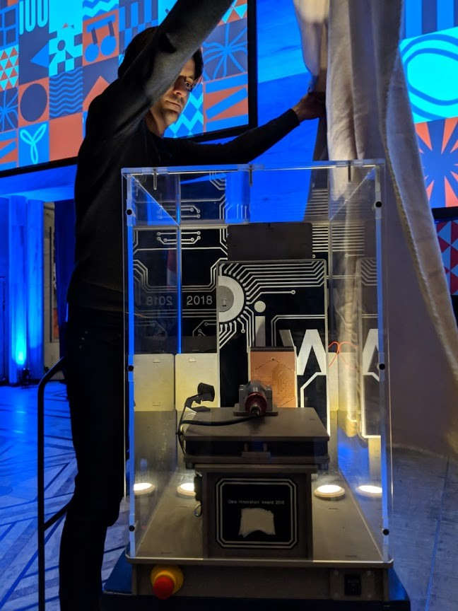

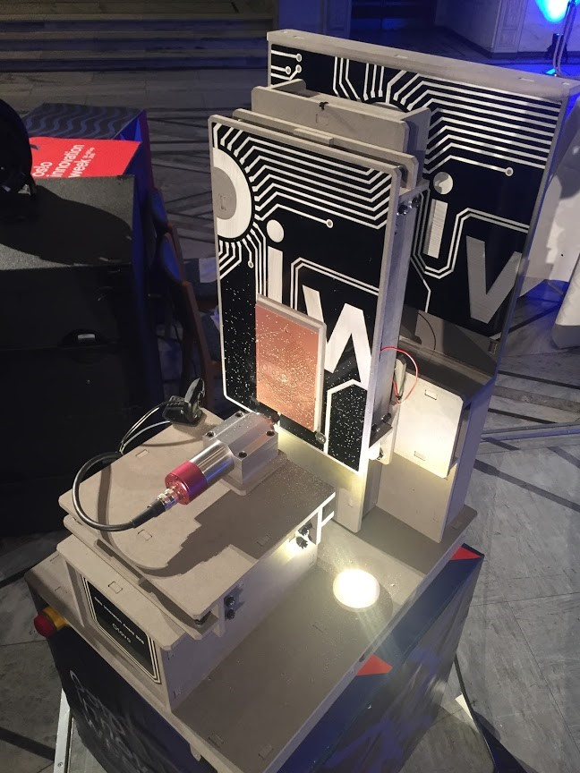

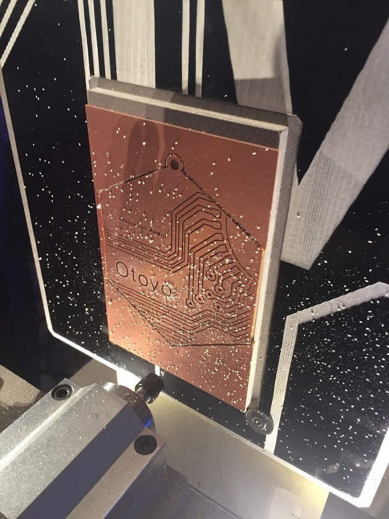

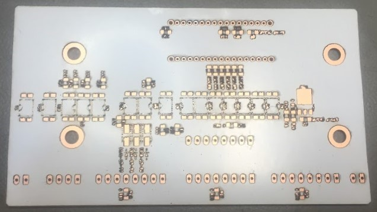

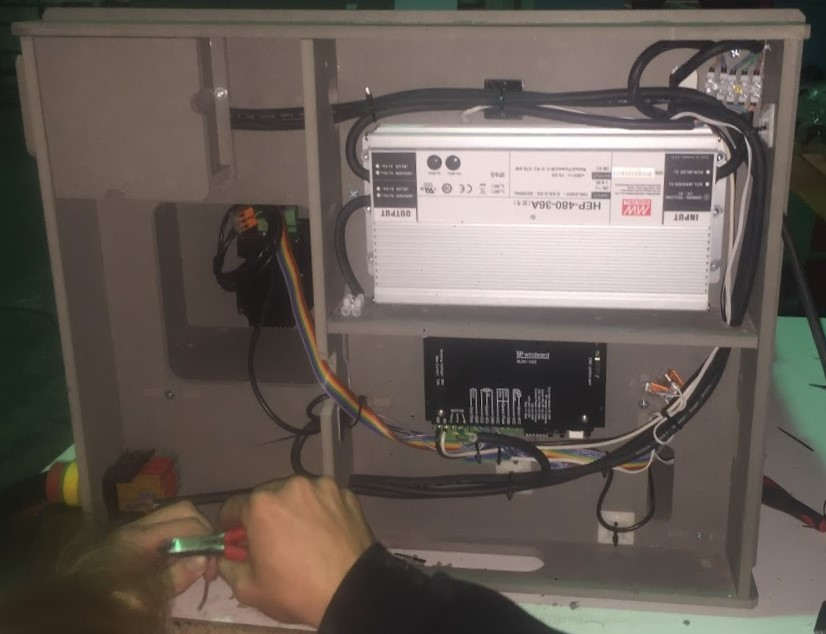

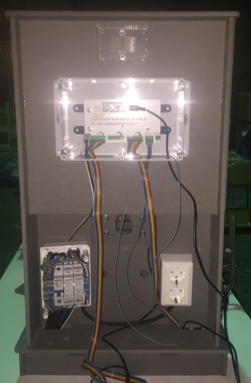

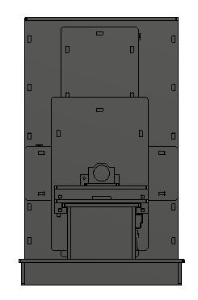

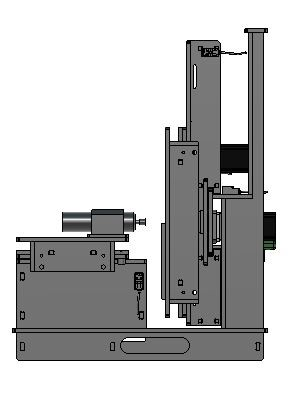

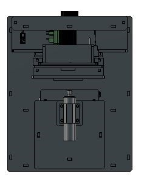
