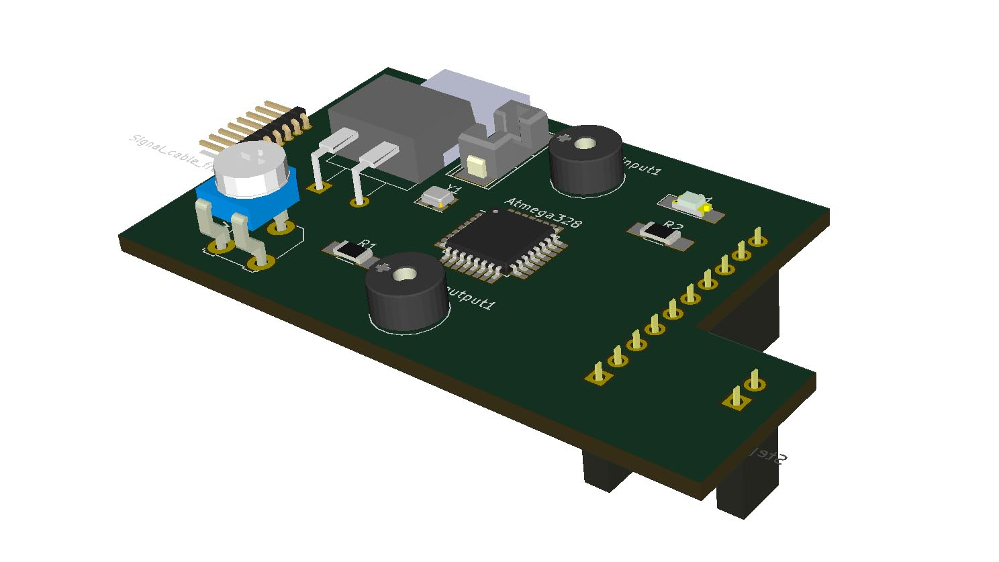
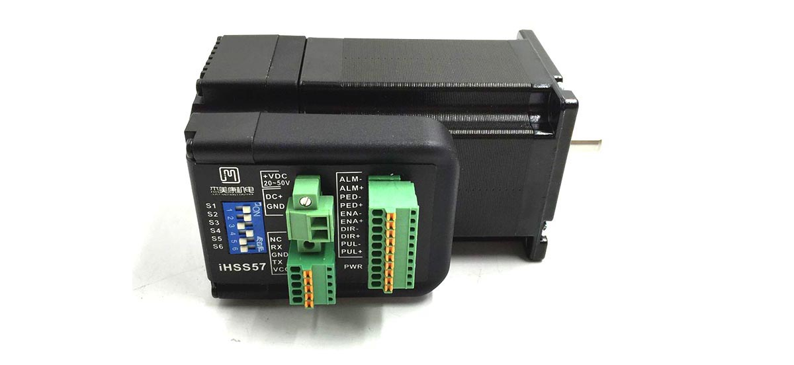
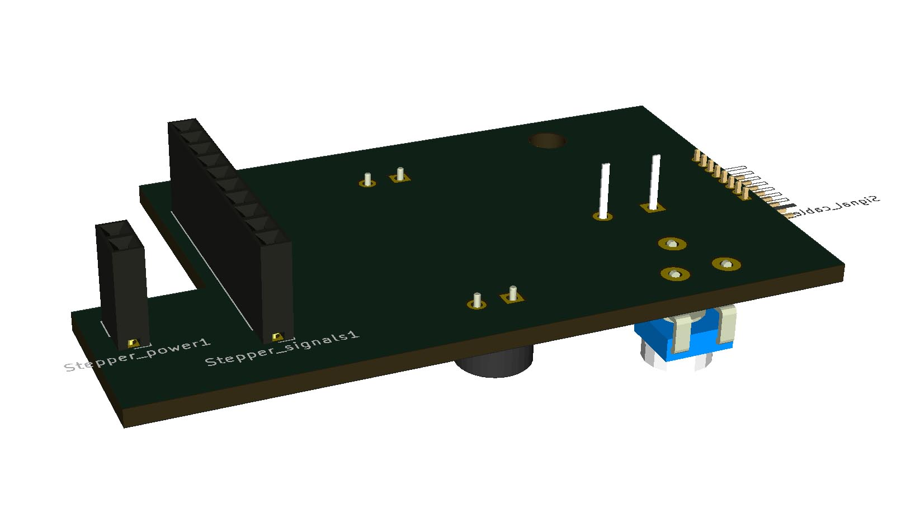
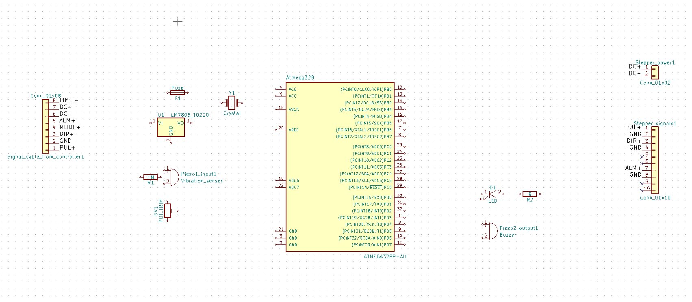

# Hertz - Axis monitoring board

*First sketch of board. Visualized with KiCAD*

Hertz is a machine state sensing board that monitors the state of an axis on a fabricatable machine. The goal is to have detect if components are not well tuned or worn, and communicate thes to the machine operator. There are also all kinds of cool other usse cases that pops up when an axis ha a vibration sensor with smarts.

### Core functionality

* Measures vibration with piezo element while listening to/passing step dir commands
* Interprets data and makes an assumption of axis state
* Should be sensitive to over and under tightened pinions, loose glide blocks, worn out parts, abusive milling jobs
* Form factor is a pcb that plugs into jmc motors integrated driver
* Input: piezo (vibration), mode pin (on, on with speaker, on for milling feedback, homing/verification mode and off), potmeter (manual calibration), step and dir, power, gnd
* Output: piezo (beeps), led (blinks), pwm for signal to mothership (same as led?), homing signal, step and dir (passthrough), alarm (passthrough), 36v (passthrough)
* Doubles as a quick connect shield for jmc motors
* When combined with the hrbl shield for Arduino UNO and ready made cables it can make a plug and play solution for the electronic side of machine building
* The design should be optimized for DIY CNC milling of the PCB, but also made commercially available as a ready made

### Potential challenges

* Might be sensitive to stepper orientation (solve with two piezos at 90deg?)
* Calibration may require the same levl of skill and patience as needed to tune an axis (so it should ideally work out of the box)
* Beep may be annoying

### Other cool us extra functions the board can provide
* Could be used as homing switch by detecting crash
* Homing could be combined with metal to metal probing if repeatability is low from piezo
* The same piezo element might be used for vibration input and sound output
* Potentially great for automated quality control of commercial machines
* Can potentially be used to to verify fabrication results. By switching milling bit to round ball probe, it is possible to probe an object in x, y and z direction. 
* Could be adapted to nema 17 form factor and work with polulu steppers
* Could upload crowd sourced data to a cloud database and machine operator dashboard

### How to contribute with the development off this
* FFT analysis seems to be the thing. Which chip and firmware is most suited to the task?
* Listening to the frequency of the step commands from the controller can help make intelligent analysis. For instacne when step frequencies are steady, low vibration is expected. When the rise an fall sharply a higher degree of vibration is expected. Direction change with a delayed shocked could for instance indicte a pinion too far from the rack. Are there any libraries for this? Like FreqCount
* Which SMD components to use? Which resistor values etc.? Focus on Seeds open parts library?
* What is the best kind of cable and connector? Is it cool or stupid to have signal and power through the same cable?
* What kind of protection smarts do we need?

*The board is inted to sit on these motors like shield. Remove the plugs and insert. The motors are ihss57 closed loop integrated steppers. We love them.*

*The female connectors of the board underside need to be matched to the ihss57 motor*

*First start of the schematic*

*Test layout of pcb*

Example circuits and hardware
https://learn.sparkfun.com/tutorials/piezo-vibration-sensor-hookup-guide

https://michaelfranzl.com/2016/05/09/diy-piezo-electric-touch-probe-high-sensitivity/

http://precibalance.com

https://www.murata.com/en-us/products/sensor/guide/sensorguide3/sensorguide/pkgs

https://www.murata.com/en-us/products/sensor/shock/apps. 

https://www.arduino.cc/en/Reference/FFTAnalyzerClass

https://hackaday.io/project/12109-open-source-fft-spectrum-analyzer

http://forum.arduino.cc/index.php/topic,38153.0.html