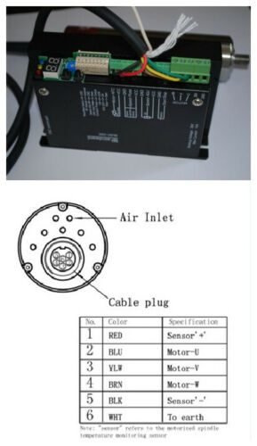
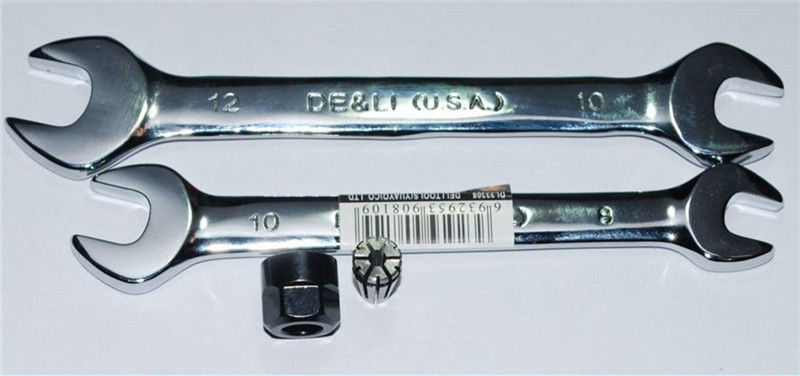
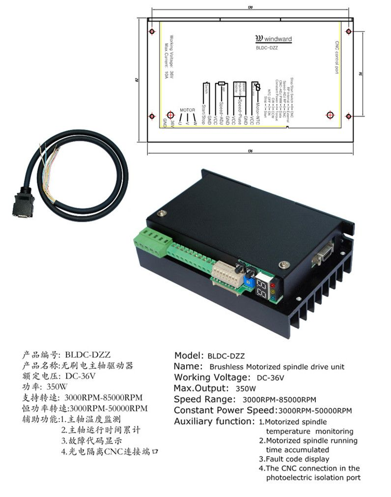
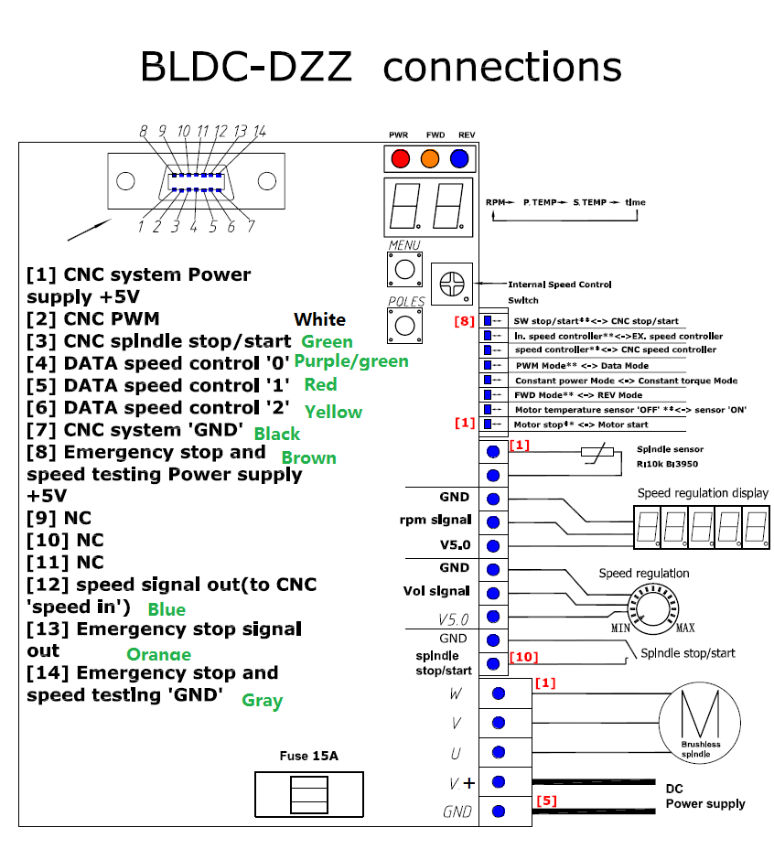
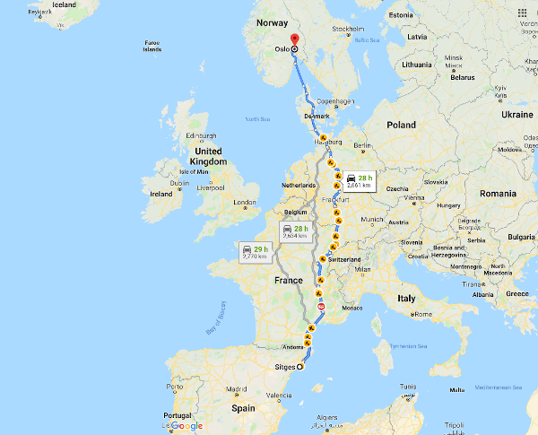

# Highway - mobile large format CNC mill

*August 2018*

Warning this is a WIP (Work in progress) documentation.

## Story

During Fab14 in Tolousse (France) Jens Dyvik and his fabricatable machines team and Fran from [The Beach Lab](https://github.com/thebeachlab) decided to assemble a full size CNC machine on the roof of a Mercedes G wagon. The idea was successfully prototyped using a [Hobo](https://github.com/fellesverkstedet/fabricatable-machines/tree/master/hobo-large-format-cnc) version.

Prof. Neil Gershenfeld from the Center for Bits and Atoms at MIT sponsored the parts under the condition of controlling it with a networked interface.

## Needs and challenges

- Highway will be aerodynamic
- Highway will be waterproof
- Highway will be light
- Highway will be black
- Highway will have a low height profile
- Highway will be controlled in a network array by [`mods CE`](https://github.com/fabfoundation/mods) (CBA requirement)

## Roadmap, deadlines and Milestones

- [x] Fully disassemble Humphrey. September 2019
- [ ] Build Highway MK I. June 2020
- [ ] Build Highway MK II. Next Nordic Fab Labs meeting?

## Disassembling Hobo (Highway MK 0)

While Hobo was a great proof of concept of Highway, I need to dissasemble it to get the electronics and mechanical parts. It is too heavy, too tall and un-aerodynamic to be permanently assembled in a vehicle.

### Spindle

The spindle is a Windward S4225-B60FL8. Max 60000 rpm BLDC 36V 250W which has it's own controller Windward BLDC-DZZ. 

I am missing the cable shown below to control the spindle:

At the moment the spindle unit is wired in manual mode:

- Brown --> Motor U
- Green -->  Motor V
- Yellow --> Motor W
- Red (small) --> Unused
- Black (Small) --> Unused

In the spindle controller Dip-switch 1 controls the ON/OFF of the unit and the RPM are controlled with a potentiometer. This will be changed in a future iteration.

### Stepper motors

Stepper motors are powered by 36V DC and the following color code:

- PUL+ --> Blue
- PUL- --> Green (GND)
- DIR+ --> Yellow
- DIR- --> Orange (GND)

They all have the following Dip-Switch configuration:

- S1 OFF
- S2 ON
- S3 ON
- S4 OFF
- S5 OFF

Dip-Switch S6 varies with the motors (to recheck and adjust in MKI):

- XR OFF
- XL ON
- Y OFF
- Z ON

The pins on the arduino are as follow:

- Z Dir (yellow) --> D7
- Z Pul (blue) --> D4

- Y Dir (yellow) --> D5
- Y Pul (blue) --> D2

- X Dir (yellow) --> D6
- X Pul (blue) --> D3

### Sending G-Code

The arduino has a GRBL Gcode interpreter loaded. It shows up in /dev/ttyACM0 and connection is made at 115200 bps. Remember to set permissions to the port `sudo chmod 666 /dev/ttyACM0` at each login. Or if you want a persistent solution add your user to the `dialout` group (in ubuntu).

In my first test seems like X and Y axis are swapped.

### Reverse engineering the serial connection

When Neil Gershenfeld accepted to sponsor the machine he put one condition: That I use a networked interface to drive the motors. My idea is using the UART connection that every stepper has. I talked to Jens in a dinner of the fab conference in Egypt and he told me that this interface was used to change settings in the motors. I found a video in youtube where they were going through this process but at the end the person also war performing some test to check the movement of the motor. So maybe there is an indocumented way to move the motors using the UART interface. For that purpose I will use the logic analyzer to try to reverse engineer the commands.

## The making of Highway MK I

Highway MK I is a temporary iteration of the fabricatable CNC. I will use some commercial parts like an Igus linear axis and upcycle the Z axis from an old Probotix V90 CNC.

### Making the X axis

This X axis rollers use standard *skateboard bearings* type 608 (8mm bore, 22mm diameter and 7mm wide). I used FreeCAD to design the rollers and 3D printed them with an Ultimaker 2 using flexible PLA. Jens warned me about the flexibility of the roller during operation.

Dimensions of the cable carrier:

- X axis cable carrier. The X axis is 2.40 m length and the cable carrier will be 1.3 m.

### Making the Y axis

The Y axis is an Igus linear axis model 1539406 001 001

Dimensions of the cable carriers:

- Y axis cable carrier. The Y axis is 1.40m. The cable carrier will be 0.8 m.

### Making the Z axis

## The making of Highway MK II

Highway MK II will become the truly fabricatable iteration of the CNC. For that purpose a trip to Oslo will be scheduled around ~~easter 2020 (April 5 to April 12), when there is no ice on the roads~~. Coronavirus stepped in the way, so I am rescheduling the trip to the next Nordic Fab Lab meeting.

In the mean time I became quite confident that I can redraw the parametric axes in blender/sverchok.

## Files

- [iHSS57-36-20 Stepper motor/driver datasheet (PDF)](./files/ihss-ds.pdf)
- [Windward S4225-B60FL8 Spindle manual (PDF)]()
- [Windward BLDC-DZZ Spinde controller (PDF)](./files/BLDC-DZZ-manual.pdf)
