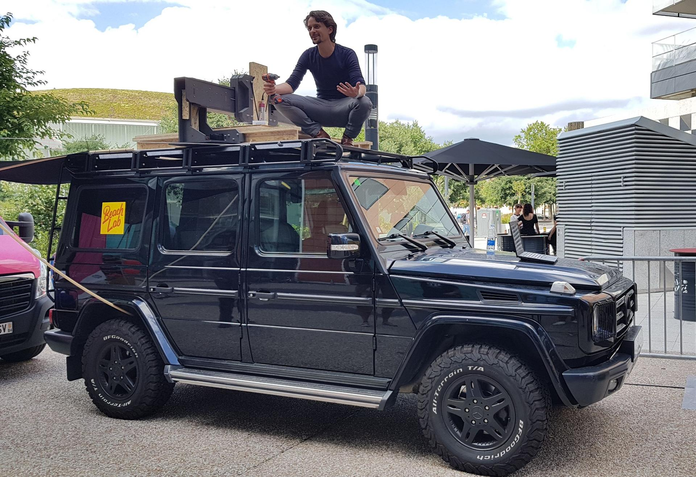
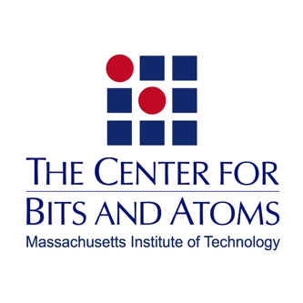
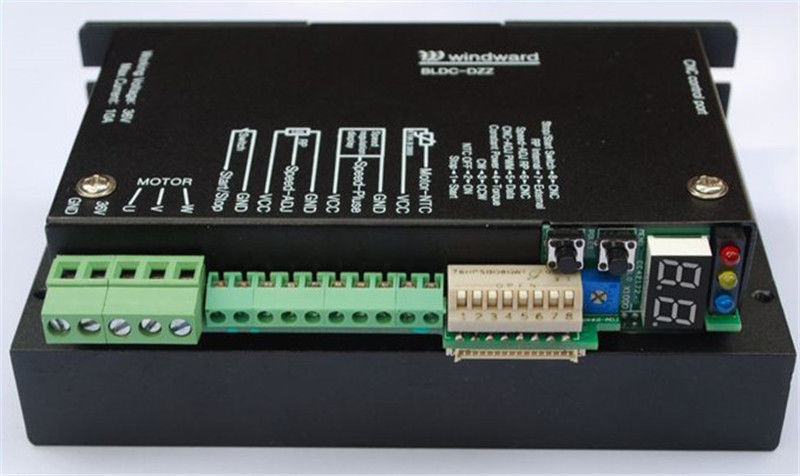
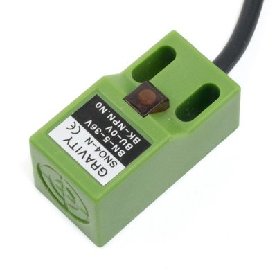

# Highway - mobile large format CNC mill

> Warning this is a WIP (Work in progress) documentation.

*Below is a picture of Highway MK-0 (Hobo) in August 2018*

This project is kindly sponsored by [MIT's CBA](http://www.cba.mit.edu/)

<!-- vim-markdown-toc GFM -->

* [Story](#story)
* [Needs and challenges](#needs-and-challenges)
* [Roadmap, deadlines and Milestones](#roadmap-deadlines-and-milestones)
* [Disassembling Hobo (Highway MK-0)](#disassembling-hobo-highway-mk-0)
* [Electronic Components of Highway](#electronic-components-of-highway)
	* [Spindle](#spindle)
	* [Stepper motors](#stepper-motors)
	* [Inductive proximity sensors](#inductive-proximity-sensors)
* [Sending G-Code](#sending-g-code)
* [Reverse engineering the serial connection](#reverse-engineering-the-serial-connection)
* [The making of Highway MK I](#the-making-of-highway-mk-i)
	* [Making the X axis](#making-the-x-axis)
	* [Making the Y axis](#making-the-y-axis)
	* [Making the Z axis](#making-the-z-axis)
* [The making of Highway MK II](#the-making-of-highway-mk-ii)
* [Resources](#resources)

<!-- vim-markdown-toc -->

## Story

During Fab14 in Tolousse (France) Jens Dyvik and his fabricatable machines team and Fran from [The Beach Lab](https://github.com/thebeachlab) decided to assemble a full size CNC machine on the roof of a Mercedes G wagon. The idea was successfully prototyped using a [Hobo](https://github.com/fellesverkstedet/fabricatable-machines/tree/master/hobo-large-format-cnc) version.

Prof. Neil Gershenfeld from the Center for Bits and Atoms at MIT sponsored the parts under the condition of controlling it with a networked interface.

## Needs and challenges

- Highway will be aerodynamic
- Highway will be waterproof
- Highway will be light
- Highway will be black
- Highway will have a low height profile
- Highway will be controlled in a network array by [`mods CE`](https://github.com/fabfoundation/mods) (CBA requirement)

## Roadmap, deadlines and Milestones

- [x] Fully disassemble Hobo (Highway MK-0). September 2019
- [ ] Build Highway MK-I. June 2020
- [ ] Build Highway MK-II. Next Nordic Fab Labs meeting?

## Disassembling Hobo (Highway MK-0)

While Hobo was a great proof of concept of Highway, I need to dissasemble it to get the electronics and mechanical parts. It is too heavy, too tall and un-aerodynamic to be permanently assembled in a vehicle. I keep Hobo frame in my boxroom for historical/sentimental reasons.

## Electronic Components of Highway

### Spindle

The spindle is a Windward S4225-B60FL8. Max 60000 rpm BLDC 36V 250W which has it's own controller Windward BLDC-DZZ.

I am missing the cable shown below to control the spindle:

At the moment the spindle unit is wired in manual mode:

- Brown --> Motor U
- Green -->  Motor V
- Yellow --> Motor W

There are also two small cables for a temperature sensor based in a 10K Thermistor - 3950 NTC. Here is the [lookup table](./files/103_3950_lookuptable.pdf) of temperature/resistance. If you want to use the temperature protection make sure to set Dip-switch 2 to ON. In that mode when the temperature reaches 75C the spindle will stop with F4 error code. The spindle is cooled down with forced air from the orifices at the top.
- Red + (small) --> VCC in Motor NTC
- Black - (Small) --> Motor NTC

> TODO: Design a venturi cone to force air through the cooling orifices while driving.

In the spindle controller Dip-switch 1 controls the ON/OFF of the unit when Dip-switch 8 is set to manual start/stop mode. If Dip-switch 6 isn't set to CNC mode, the RPM are controlled with a potentiometer (internal or external based on Dip-switch 7). RPM are shown in the 2-digit display.

The controller manual says the spindle is 2 poles, but only when P1 is selected I can read up to 50k rpm in the 2 digit screen. I need to investigate that.

### Stepper motors

Stepper motors are powered by 36V DC and the following color code:

- PUL+ --> Blue
- PUL- --> Green (GND)
- DIR+ --> Yellow
- DIR- --> Orange (GND)

They all have the following Dip-Switch configuration:

- S1 OFF
- S2 ON
- S3 ON
- S4 OFF

Which according to the datasheet indicates 2000 microsteps per turn. SW5 is used for setting the activate edge of the input signal.

- S5 OFF in all motors

Dip-Switch S6 indicates running direction and varies with the motors (to recheck and adjust in MKI):

- XR OFF => CCW
- XL ON => CW
- Y OFF => CCW
- Z ON => CW

The pins on the arduino are as follow:

- X Dir (yellow) --> D5
- X Pul (blue) --> D2

- Y Dir (yellow) --> D6
- Y Pul (blue) --> D3

- Z Dir (yellow) --> D7
- Z Pul (blue) --> D4

### Inductive proximity sensors

There are 2 Gaode SN04-N sensors. This inductive proximity sensor will detect the prescence of a metallic object within 5mm of the surface of the sensor. The detection distance may vary slightly depending on the shape, size, and type of metal the object is made of. It can detect through thin, non-metallic materials and has an LED indicator that turns on when the device is powered, and increases in brightness when an object is detected. The sensor behaves like a NPN switch that outputs GND when an metallic object is detected, and  VCC when is not detected.

## Sending G-Code

The arduino has a GRBL Gcode interpreter loaded. It shows up in /dev/ttyACM0 and connection is made at 115200 bps. Remember to set permissions to the port `sudo chmod 666 /dev/ttyACM0` at each login. Or if you want a persistent solution add your user to the `dialout` group (in ubuntu).

Sending G-Code trough the arduino serial port works. That opens a gate to control the motors in `mods`, but the ultimate goal would be to use the embedded UART interface if possible.

## Reverse engineering the serial connection

When Neil Gershenfeld accepted to sponsor the machine he put one condition: That I use a networked interface to drive the motors. My idea is using the UART connection that every stepper has. I talked to Jens in a dinner of the fab conference in Egypt and he told me that this interface was used to change settings in the motors. I found a video in youtube where they were going through this process but at the end the person also war performing some test to check the movement of the motor. So maybe there is an indocumented way to move the motors using the UART interface. For that purpose I will use the logic analyzer to try to reverse engineer the commands.

The VCC pin outputs 5V and according to the datasheet the connection seems to be 57600 bps. I connected the UART interface to an FTDI board

- GND -> GND
- TX -> RX
- RX -> TX

and powered the motor but the driver is silent. It does not say anything. Sending some random characters does not cause a reply from the motor either. Next thing I try is listening while I send some G-Code in UGS Next thing I try is listening while I send some G-Code in UGS/CNCJS. But again the UART is silent. It might need to be enabled somehow? 

## The making of Highway MK I

Highway MK I is a temporary iteration of the fabricatable CNC. I will use some commercial parts like an Igus linear axis and upcycle the Z axis from an old Probotix V90 CNC.

### Making the X axis

This X axis rollers use standard *skateboard bearings* type 608 (8mm bore, 22mm diameter and 7mm wide). I used FreeCAD to design the rollers and 3D printed them with an Ultimaker 2 using flexible PLA. Jens warned me about the flexibility of the roller during operation.

Dimensions of the cable carrier:

- X axis cable carrier. The X axis is 2.40 m length and the cable carrier will be 1.3 m.

### Making the Y axis

The Y axis is an Igus linear axis model 1539406 001 001

Dimensions of the cable carriers:

- Y axis cable carrier. The Y axis is 1.40m. The cable carrier will be 0.8 m.

### Making the Z axis

## The making of Highway MK II

Highway MK II will become the truly fabricatable iteration of the CNC. For that purpose a trip to Oslo will be scheduled around ~~easter 2020 (April 5 to April 12), when there is no ice on the roads~~. Coronavirus stepped in the way, so I am rescheduling the trip to the next Nordic Fab Lab meeting.

In the mean time I became quite confident that I can redraw the parametric axes in blender/sverchok.

## Resources

> Warning, the translation of some of these manuals is not perfect. In addition to that, put the accuracy of the information under quarantine, contradictory statements may appear on the same document.

- [iHSS57-36-20 Stepper motor/driver datasheet (PDF)](./files/ihss-ds.pdf)
- [Windward S4225-B60FL8 Spindle manual (PDF)]()
- [Windward BLDC-DZZ Spinde controller (PDF)](./files/BLDC-DZZ-manual.pdf)
- [grbl github page](https://github.com/gnea/grbl)
- Gaode inductive proximity sensor - [Mechanical drawings](./files/3528_0_Mechanical.pdf) - [3D step file](./files/3528_0_3D.zip)
