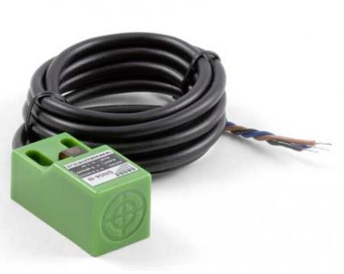
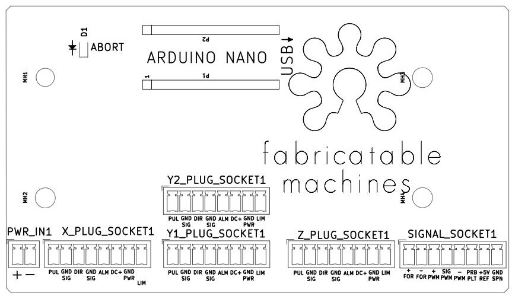
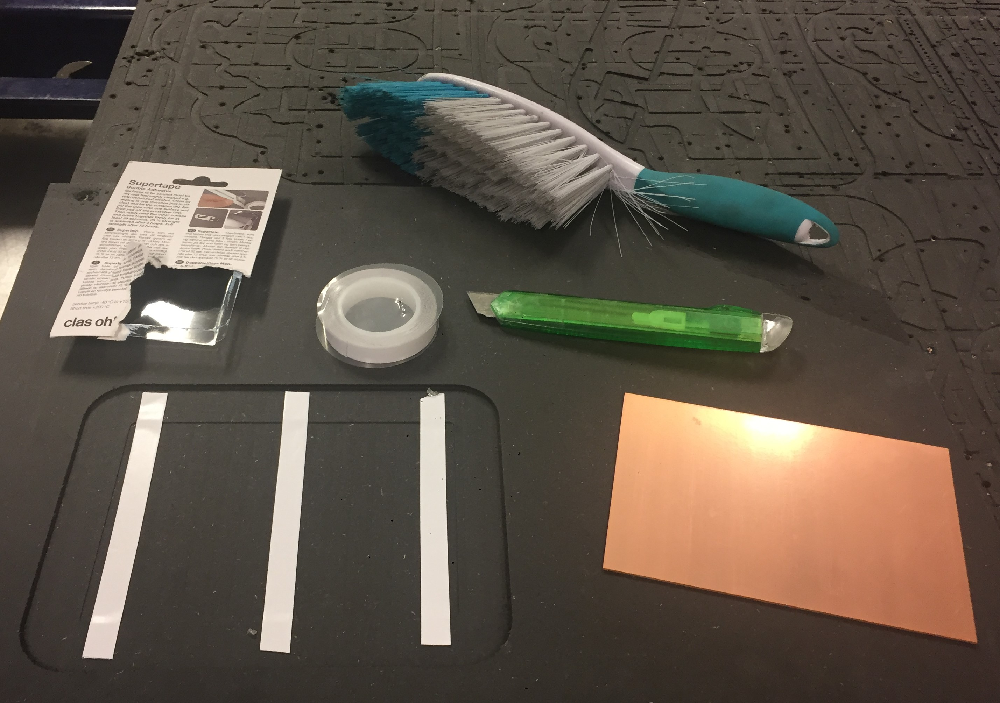
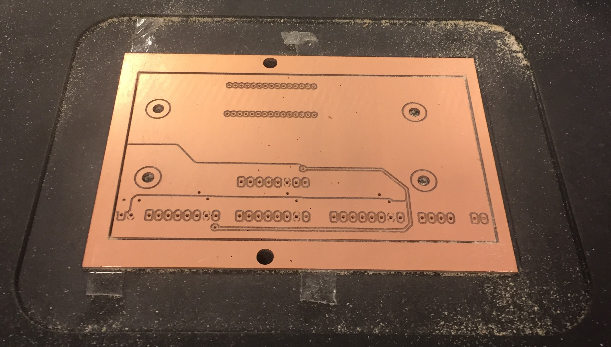
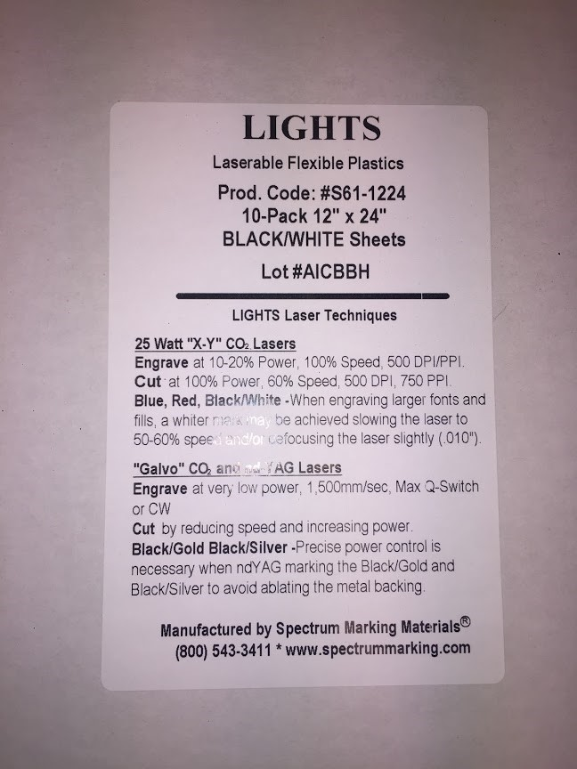

# Hrbl - Grbl shield for integrated motors

## Plug-and-play grbl controller
HRBL is an Arduiono NANO shield aiming to simplify connecting motors, limit switches, safety and spindle to an ardunio board as well as providing high quality electrical noise protection. It's tailor made for fabricatable CNC milling machine needs. Both sides are covered with a [special laser-engraving sicker film](img/laser_sheets_specs.JPG) purchased from [Alvøen](alvoen.no) which protects the card, functions as a solder mask and silkscreen print.

*The goal is give the same super easy connection as when working with RC servos on a breakout shield*

*The shield is deign to work with these ihss57 integrated motors and SN04-N inductive proximity sensors. One cable in each end, thats it!.*

## Connections

*Front of card - Silkscreen layer*

*Back of card - Silkscreen and solder mask layers, here shown mirrored compared to the files*

## Files

Please note that the files are as they come out of KiCAD, that means that the B-side layers are mirrored.

* [DXF](Hrbl_shield_dxf.zip)
* [KiCAD](Hrbl_shield_kicad.zip) 
* [SVG](Hrbl_shield_svg.zip)
* [PDF Schematic](Hrbl_shield_pdf.pdf)

### BOM - Electrical Components you need
* [Google sheet](https://docs.google.com/spreadsheets/d/1vCA67Y1DIPJUeFW0_8VqS5qq00QMX1T2yQB_3mDYkL8)
* [BOM PDF](Hrlb_shield_BOM_pdf.pdf)
* [BOM ODS format](Hrlb_shield_BOM_ods.ods)

## Status
    
HRBL is currently in use in:
* [Hedy v1](https://github.com/fellesverkstedet/fabricatable-machines/blob/master/hedy-pcb-cnc/readme.md) A CNC milling machine made to mill circuit boards like this one.
* [Humphrey, several versions](https://github.com/fellesverkstedet/fabricatable-machines/blob/master/humphrey-large-format-cnc/README.md) A large size CNC milling machine.

## How to make 

### Recommended tools

* C0.4mm 2 flute china endmill, 8 mm/s @18000rpm
* 1 mm flat endmill, for holes and cutout 
* FR1, FR2 or FR3 double sided PCB stock. (NOT FR4, since it has fiberglass in it and wears out your bit fast)
* Ø6mm dowels/pegs for indexing the card when flipping it. Milling bit with Ø6mm shaft can be used.

#### Using Vcarve and a CNC mill

* Download the DXF files
* Unzip the files
* Mill the bed flat or put in a small piece of scrap wood and mill that flat
* Secure the card with double stick tape
* **Side: BACK Load file: B.Cu Use bit: Ø0.4mm** First, **MIRROR THE FILE VERTICALLY** Then use a pocket operation to create insulation between the copper traces. Pocket to 0.1-0.3 mm deep.
* **Side: BACK: Use bit: Ø1**  Mill the (vias) circular holes to Ø1.1 to Ø1.2 mm, no more no less. 
* **Side: BACK: Bit: Ø1mm** Draw two Ø6mm index holes on the stock outside the vectors, they form the mirror line. Pocket mill them down into the material below the card, 4 mm below should be enough. 
* **Side: BACK: Item: Dowel peg** Test the holes with the dowel, they should not be too tight or you might crack the card. Too lose = bad precision.
* **FLIP CARD** Take the card off the tape, add new tape and use the dowels to position the card.
* **Side FRONT: load file: F.Cu Use bit: Ø0.4mm** First, compare the position of the small holes to your CAM view and see that you have the correct orientation of the file. Then pocket the copper to 0.1-0.3 mm deep.
* **Side: FRONT Use bit: Ø1mm** Cut the big mounting holes, then cut out the card, a larger bit can be used if you want too. 

#### Lasercut the soldemask and silkscreen

* Use a lasercutter and move the focus height to the top of th film!

### Production photos

## Notes from previous fabrications 

* Careful with which layer you mirror when you mill it!
* 8mm/s @18000rpm with a Ø0.4mm 2 flute china endmill worked! (did most with 4.5mm/s)
* Attach with double sided skotch tape (Jernia-brand worked well)
* Mill and drill from the side where you will solder the most thorugh hole components first
* Drilled Ø1mm holes were too tight for the contacts, mill them to at least Ø1,2mm next time.
* Don't make the alignment holes for flipping the card too tight.

### Functionality

* 4 x 8 pole pluggable connections that combine all connections needed per axis in one connector per motor
* Dual connections for the y-axis, (if only one is needed this can be skipped.)
* Full optoisolation separates the computer-arduino circuit from all signal and power wires.
* Z axis milling bit probe connection with external pull-up
* Spindle control with start and speed control. Uses optocoupler for safe handling of extrernal start signal
* External power loss detection, keeps the controller in ABORT mode when there is no power to the motors.

### Dependables

* Arduino UNO
* JMC ihss57 clsed loop integrated stepper motors
* 8 pole cable with 0.5mm2 wires
* Power supply and cables
* Control computer or raspberry pi
* Limit switch to place next to motor (optional)
* Spindle and VFD (optinal)

### Future ideas and things to do
* HRBL-shield is potentially great to combine with [Hertz - axis monitoring board](https://github.com/fellesverkstedet/fabricatable-machines/tree/master/hertz-axis-monitor). Optimized for ihss57 integrated closed loop stepper motors.
* Create a version with a onboard 328p microprocessor to be able to skip the arduino uno altogether, remember to breakout programming pins for the MCU
* Consider replacing the 16 single channel SFH6206-3T optocouplers with 4 channel 4TLP291-4(GB) for reduced part count and cheaper BOM. 
* (From [issue 20](https://github.com/fellesverkstedet/fabricatable-machines/issues/20) consider if we should change the 5V voltage regulator.
* Establish a maximum current that we can draw through the card to the motors without overheating the traces (or ribbon cable).

