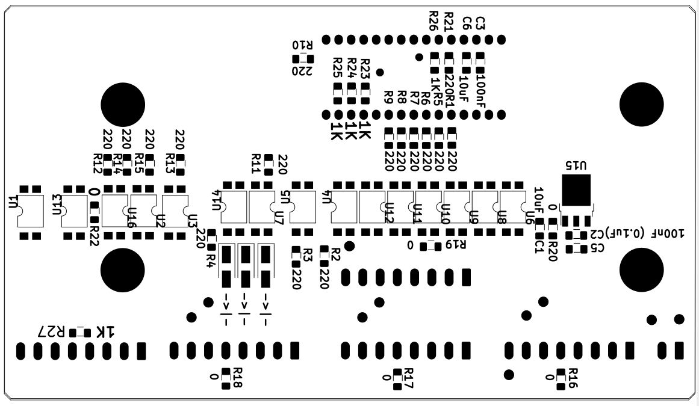
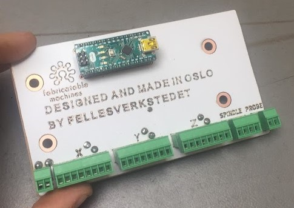
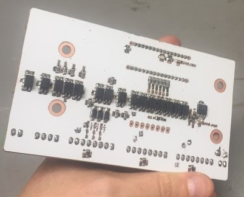
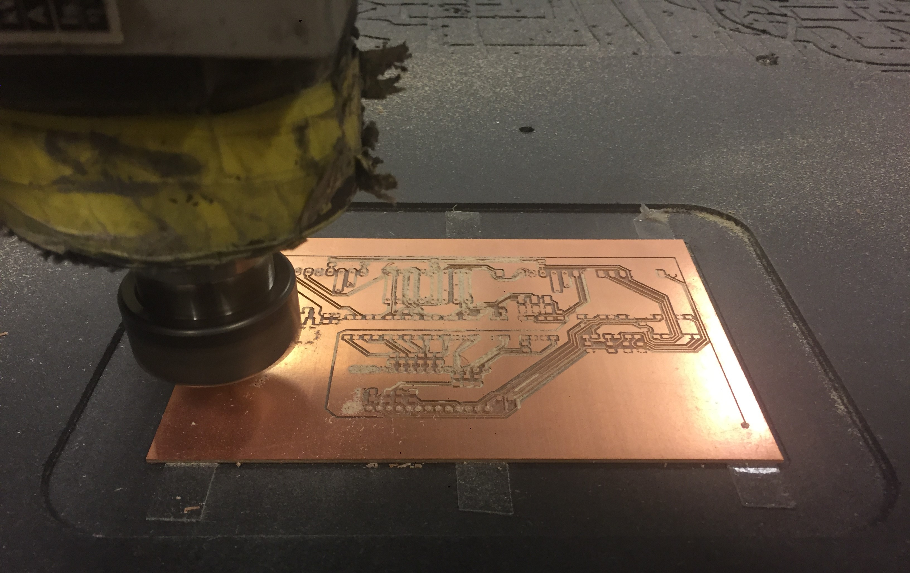
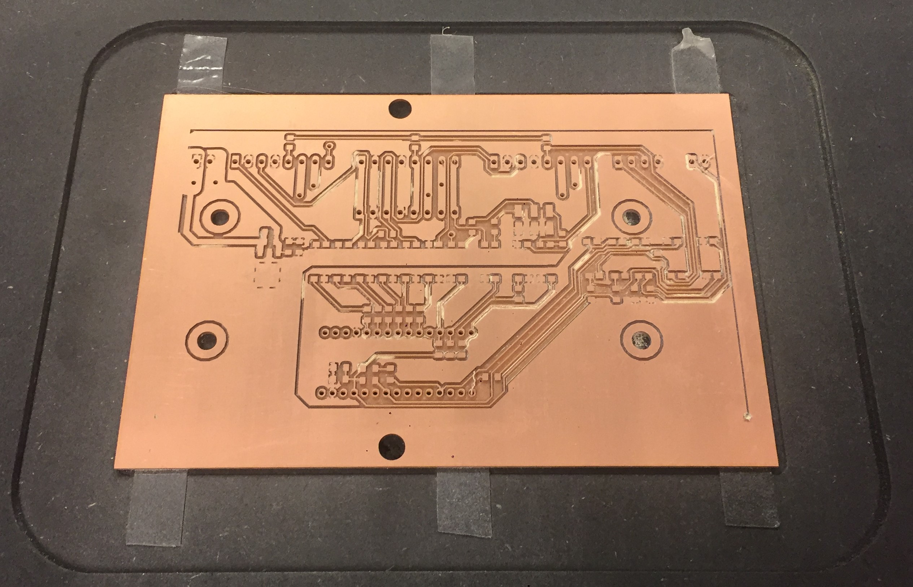
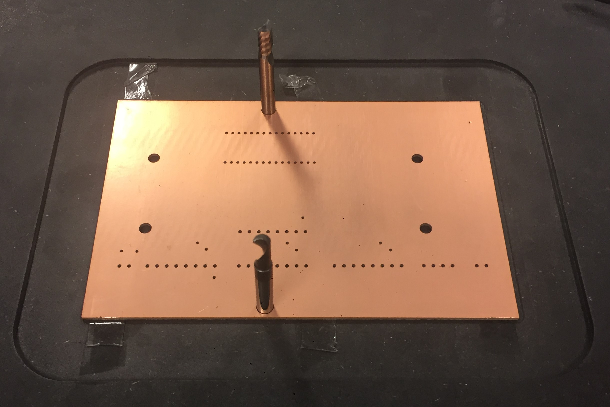
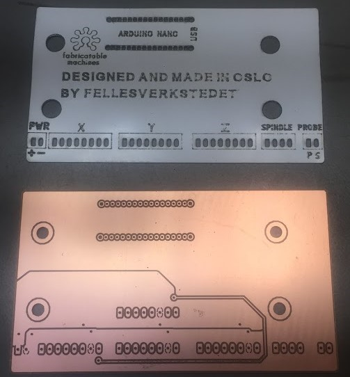
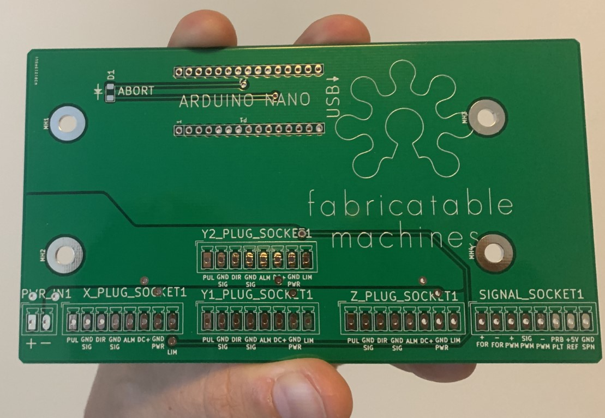
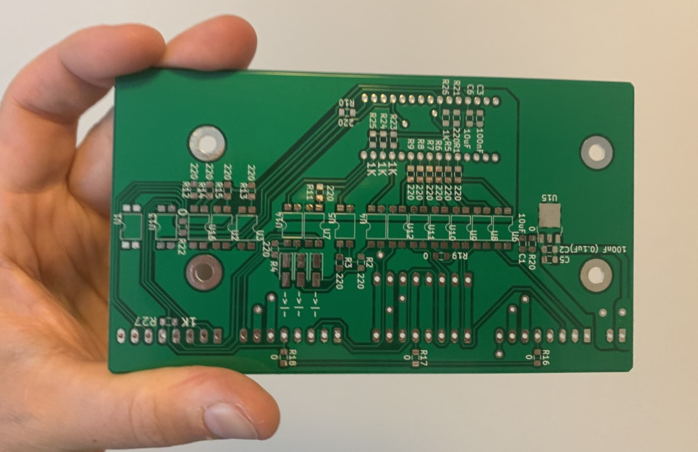

# Hrbl - Grbl shield for integrated motors

## Plug-and-play grbl controller
HRBL is an Arduiono NANO shield aiming to simplify connecting motors, limit switches, safety and spindle to an ardunio board as well as providing high quality electrical noise protection. It's tailor made for fabricatable CNC milling machine needs. 

* [PDF Schematic for JLCPCB version Nov 2019](Hrbl_shield_pdf.pdf)

## Working board with components

*Hand soldedered SMDs, card from PCBWAY*

*Hand soldered pluggable through-hole cable connectors, card from PCBWAY*
# Status
HRBL is currently in use in:
* [Hedy v1](https://github.com/fellesverkstedet/fabricatable-machines/blob/master/hedy-pcb-cnc/readme.md) A CNC milling machine made to mill circuit boards like this one.
* [At least 7 version of Humphrey](https://github.com/fellesverkstedet/fabricatable-machines/blob/master/humphrey-large-format-cnc/README.md) A large size CNC milling machine.
* [Hector](https://github.com/fellesverkstedet/fabricatable-machines/blob/master/hector-medium-format-cnc/README.md)

## Functionality
* 4 x 8 pole pluggable connections that combine all connections needed per axis in one connector per motor
* Dual connections for the y-axis, (if only one is needed this can be skipped.)
* Full optoisolation separates the computer-arduino circuit from all signal and power wires.
* Z axis milling bit probe connection with external pull-up
* Spindle control with start and speed control. Uses optocoupler for safe handling of extrernal start signal
* External power loss detection, keeps the controller in ABORT mode when there is no power to the motors.

### For use with
* Arduino Nano
* JMC ihss57 clsed loop integrated stepper motors
* 8 pole cable with 0.5mm2 wires
* 36V (10A) Power supply and cables
* Control computer or raspberry pi *(ESP8266 support coming)*
* Limit switches (optional)
* Spindle and VFD (optional)

*The shield is deigned to work with these ihss57 integrated motors and SN04-N inductive proximity sensors.*

# How to use

* [PDF Schematic for JLCPCB version Nov 2019](Hrbl_shield_pdf.pdf)

## Program the Arduino
* [Download and install arduino if you don't have it](https://www.arduino.cc/download_handler.php)
* Download the [GRBL files for arduino IDE programming with spindle enable configured](https://github.com/fellesverkstedet/fabricatable-machines/raw/master/humphrey-large-format-cnc/GRBL_Spindle_ENABLE.zip)
* Manually unzip the file in a folder. **Don't skip this step**
* Connect your arduino to your computer
* Make sure your board is set to **Arduino Nano** board in the Tool->Board menu and the serial port is selected correctly in Tool->Serial Port. (If it does not show up, try installing these [Chinese Arduino USB drivers (CH341)](https://github.com/fellesverkstedet/fabricatable-machines/blob/master/hrbl-shield/CH341SER.EXE) )
* Now we need to add the GRBL files as a library to the Arduino program
 * In the menu go to **Sketch > Include Library** and select Add .ZIP Library. (The Add .ZIP Library command supports both a .ZIP file or a folder.) Add the folder that you unzipped.
 * You can confirm that the library has been added. Click the Sketch drop-down menu again, navigate to Include Library, then scroll to the bottom of the list where you should see grbl.
* In the menu click: File > Open, navigate to the folder Examples->Grbl, and select GrblUpload.
**Do not alter this example in any way! Grbl does not use any Arduino code. Altering this example may cause the Arduino IDE to reference Arduino code and compiling will fail.**
* Press the round arrow button to compile and **upload** Grbl to your Arduino.
* *If you can't upload try changing this in the menu: Tools > Processor > Old Bootloader*

More information about GRBL [How to use GRBL](https://github.com/gnea/grbl/wiki)

## Connect the steppers and sensors

* The SN04-N NPN NO sensor cable colors are: Blue = GND, Brown = VCC, BLACK = SIGNAL

## Connect a spindle driver

## Connect extra alarms (OPTIONAL)
There are two pins on the signal connector that can be used to trigger an alarm. Drive them with 5V on one and GND on the other (either direction works). 

## Setup GRBL for your machine
[See the setup guide on our Wiki](https://github.com/fellesverkstedet/fabricatable-machines/wiki/GRBL-and-UGS-setup)

## Use GRBL to run your machine
[See the use guide on our wiki](https://github.com/fellesverkstedet/fabricatable-machines/wiki/How-to-use)

## Optional: HISU settings

[Required product](https://www.aliexpress.com/item/32805819281.html). 
You can also access these setting using a RS232 serial connection but the HISU device is cheap.

Recommended but not required. You can use a special handheld programming device to alter the settings in the motor drivers for the integrated stepper motors. There are two settings that are of special interest.
* P8: Open loop current This parameter affects the static torque of the motor.
* P9: Closed loop current This parameter affects the dynamic torque of the motor. (The actual current = open loop current +
close loop current)
* P16: Position error limit. If the motor detects an error bigger than this setting it will stop trying to recover the lost steps, throw an error and refuse to move until power is cycled. If I remember correctly the factory default setting allowed a full revolution before throwing an error. We recommend something much smaller to detect errors earlier. 
* P19: Speed smoothness. This is a built in acceleration setting. Since we want to control the acceleraton completely this should be set to 0.

[Full motor manual](https://github.com/fellesverkstedet/fabricatable-machines/blob/master/hrbl-shield/dev_files/integrated_stepper/20160528161106_17875.pdf)

# Ways to make the card

* The HRBL card can be ordered with SMDs assembled from [JLCPCB.com](jlcpcb.com) using these [files (previously ordered 19-11-2019)](nano/jlcpcb_order_19112019/Hrbl_grbl_19112019.zip) *Please note that the assembly preview was buggy at the time, might still be. Ignore and proceed.)*
* The plain HRBL card can be [ordered directly without components from PCBWAY using this link](https://www.pcbway.com/project/shareproject/HRBL___grbl_shield_for_Fabricatable_Machines.html)
* The HRBL card can also be [CNC milled from SVG or DXF files](hrbl-shield#files-for-milling-the-card) and the soldermask + silkscreen can be laser cut. 

## Files for milling the card

For milling the early 2019 version, works fine but is not latest version.

KiCAD files. Please note that the B-side layers are mirrored.

* [DXF](Hrbl_shield_dxf.zip)
* [KiCAD](Hrbl_shield_kicad.zip) 
* [SVG](Hrbl_shield_svg.zip)

### BOM - Electrical Components you need
* [Google sheet](https://docs.google.com/spreadsheets/d/1vCA67Y1DIPJUeFW0_8VqS5qq00QMX1T2yQB_3mDYkL8)
* [BOM PDF](Hrlb_shield_BOM_pdf.pdf)
* [BOM ODS format](Hrlb_shield_BOM_ods.ods)

### Recommended tools

* C0.4mm 2 flute china endmill, 8 mm/s @18000rpm
* 1 mm flat endmill, for holes and cutout 
* FR1, FR2 or FR3 double sided PCB stock. (NOT FR4, since it has fiberglass in it and wears out your bit fast)
* Ø6mm dowels/pegs for indexing the card when flipping it. Milling bit with Ø6mm shaft can be used.

#### Using Vcarve and a CNC mill

* Download the DXF files
* Unzip the files
* Mill the bed flat or put in a small piece of scrap wood and mill that flat
* Secure the card with double stick tape
* **Side: BACK Load file: B.Cu Use bit: Ø0.4mm** First, **MIRROR THE FILE VERTICALLY** Then use a pocket operation to create insulation between the copper traces. Pocket to 0.1-0.3 mm deep.
* **Side: BACK: Use bit: Ø1**  Mill the (vias) circular holes to Ø1.1 to Ø1.2 mm, no more no less. 
* **Side: BACK: Bit: Ø1mm** Draw two Ø6mm index holes on the stock outside the vectors, they form the mirror line. Pocket mill them down into the material below the card, 4 mm below should be enough. 
* **Side: BACK: Item: Dowel peg** Test the holes with the dowel, they should not be too tight or you might crack the card. Too lose = bad precision.
* **FLIP CARD** Take the card off the tape, add new tape and use the dowels to position the card.
* **Side FRONT: load file: F.Cu Use bit: Ø0.4mm** First, compare the position of the small holes to your CAM view and see that you have the correct orientation of the file. Then pocket the copper to 0.1-0.3 mm deep.
* **Side: FRONT Use bit: Ø1mm** Cut the big mounting holes, then cut out the card, a larger bit can be used if you want too. 

#### Lasercut the soldemask and silkscreen

*Front of card - Silkscreen layer*

*Back of card - Silkscreen and solder mask layers, here shown mirrored compared to the files*

Both sides are covered with a [special laser-engraving sicker film](img/laser_sheets_specs.JPG) purchased from [Alvøen](alvoen.no) which protects the card, functions as a solder mask and silkscreen print.

* Use a lasercutter and move the focus height to the top of th film!

## Soldering the SMDs
Remember to put the 3 diodes, 1 LED and 15 optocoplers in the correct orientation. Also check print on board for orientation of the green connectors.

### Production photos

## Notes from previous milling 

* Careful with which layer you mirror when you mill it!
* 8mm/s @18000rpm with a Ø0.4mm 2 flute china endmill worked! (did most with 4.5mm/s)
* Attach with double sided skotch tape (Jernia-brand worked well)
* Mill and drill from the side where you will solder the most thorugh hole components first
* Drilled Ø1mm holes were too tight for the contacts, mill them to at least Ø1,2mm next time.
* Don't make the alignment holes for flipping the card too tight.

## Board house PCB

Plain board manufactured by PCB Way from KiCAD gerber files.

* [Gerber files](gerber/nano-hrbl.zip)
* [Order directily on PCB Way](https://www.pcbway.com/project/shareproject/HRBL___grbl_shield_for_Fabricatable_Machines.html)

### Future ideas and things to do
* HRBL-shield is potentially great to combine with [Hertz - axis monitoring board](https://github.com/fellesverkstedet/fabricatable-machines/tree/master/hertz-axis-monitor). Optimized for ihss57 integrated closed loop stepper motors.
* Create a version with a onboard 328p microprocessor to be able to skip the arduino uno altogether, remember to breakout programming pins for the MCU
* Consider replacing the 16 single channel SFH6206-3T optocouplers with 4 channel 4TLP291-4(GB) for reduced part count and cheaper BOM. 
* (From [issue 20](https://github.com/fellesverkstedet/fabricatable-machines/issues/20) consider if we should change the 5V voltage regulator.
* Establish a maximum current that we can draw through the card to the motors without overheating the traces (or ribbon cable).
* Add dual axis squaring
* Change the ZIP filename so that you don't need to unzip GRBL
* Consider 3 pin plugs for sensors
