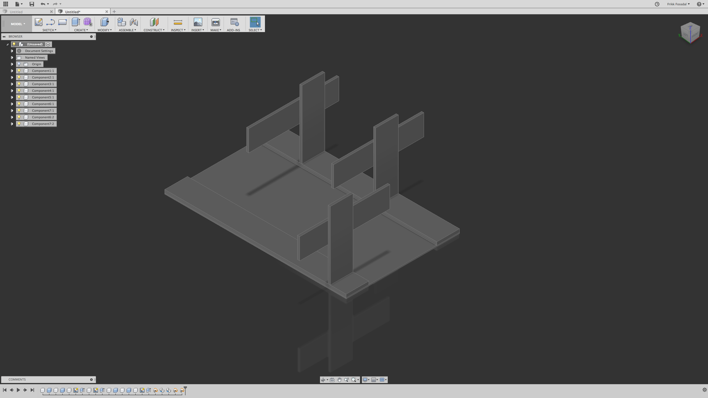

# Hulti - first take on large-format 3D printing 
## This is work in progress. I´ll add stuff as I go along. Currently finishing up CAD. 

Hulti is a prototype of a 3D printer that does parallel processing of layers, meaning instead of having one nozzle extruding plastic we have many. The theory goes something like many workers can do the job quicker 
than one. While most of the research I am conducting is focused on the software and algorithms controlling the system, I wanted to have a physical platform where I can my test my theories. 

First, full disclaimer. You have now stepped into a document that functions both as a way for you to copy and make use of my work,  but also as my own research notes as I build
and prototype the machine. I am no expert when it comes to CAD and CAM, but I figured that if I am researching and diving into the world of fabrication machines, I might as well 
build one. The chamfer rail system seemed as the perfect place to start, mostly because of its simplicity, shareability and cost. 

A prototype of the software controlling Hulti can be found here. 

The machine building is devided into: 

1. Design 
2. CAD 
3. CAM 
4. Assembly
5. Electronics and Control 

Let´s go! 

## Design: 

I explored several diferent options here. 

[SCARA robost](https://en.wikipedia.org/wiki/SCARA)
An interesting concept, but in terms of DIY, expensive and complex. 
[Industrial robots, 6-DOF](http://new.abb.com/products/robotics/industrial-robots/irb-6700)
These are nice, and can in many ways do what I require, but the thing about industrial robots is that they are expensive!  HVL has a really nice robotics lab 
with several robots available, but we seak out to create a tool for people.  
[3-axis gantry](https://www.youtube.com/watch?v=SuOIWfGuqVk)
Here you can se a paralell processing system. The work area of each extruder is divided into sections. 

Ideely we want to create a system where the indevidual extruders can move as freely as possible. A big issue here is crossing. Traditional gantry systems 
are not able to cross each other, and I strongly believe that this is a limiting factor in a parallel processing scheme.  Industrial robots could be a way to solve this problem, but as stated above, they are expensive! 
Trough discussions with Jens we came up with this really nice concept using the chamfer rail system. Instead of the traditional gantry setup, supported on both sides, we went for a "single-side-supported" system alá the RepRap
[Ormerod](https://www.3dhubs.com/3d-printers/ormerod). 3D printing does not require as much stiffness and strength as a CNC, so hopefully this will suffice for our system. The nice thing about this design is that the extruders are able to cross each other. 
This allows for much more finesse when we start optimizing our tool paths.  I let the drawings do the explaining here. 

So, now that we´ve sorted out our design, let´s start blocking everything out in CAD.

## CAD 

I do realize that much of the CAD-work would probably be easier and faster in Rhino, but in the spirit of keeping everything opensource I wanted to do everything in Autodesk´s Fusion360, which is free for all hobbyists and makers. A really nice thing about 
Fusion is that the CAM-module is included, so you can move really fast from your CAD-design to excecution! 

###  Layout 

I like to start out with blocking everything out and getting a feel for the design, before I turn to details. I am aiming for a footprint about 1600 x 1000 mm. This should allow print sizes around 1400 x 600. 

## CAM

## Electronics and Control 

## Assemble 

*Frikk H Fossdal - april 2018*

