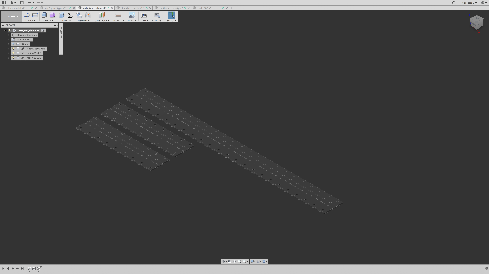
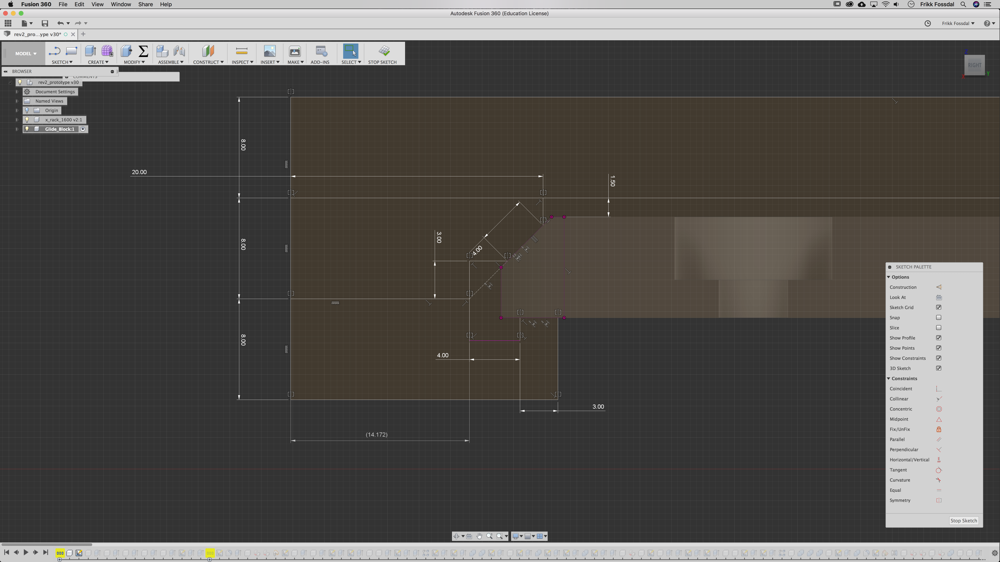
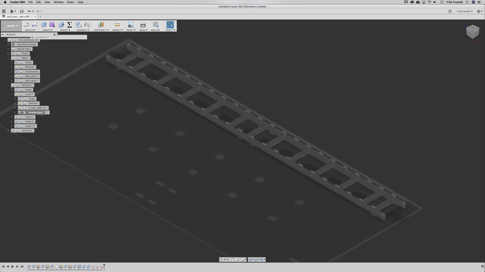
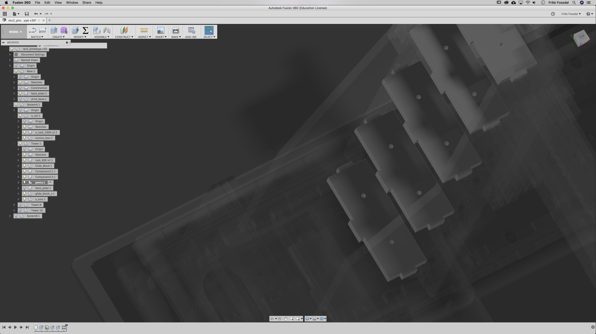
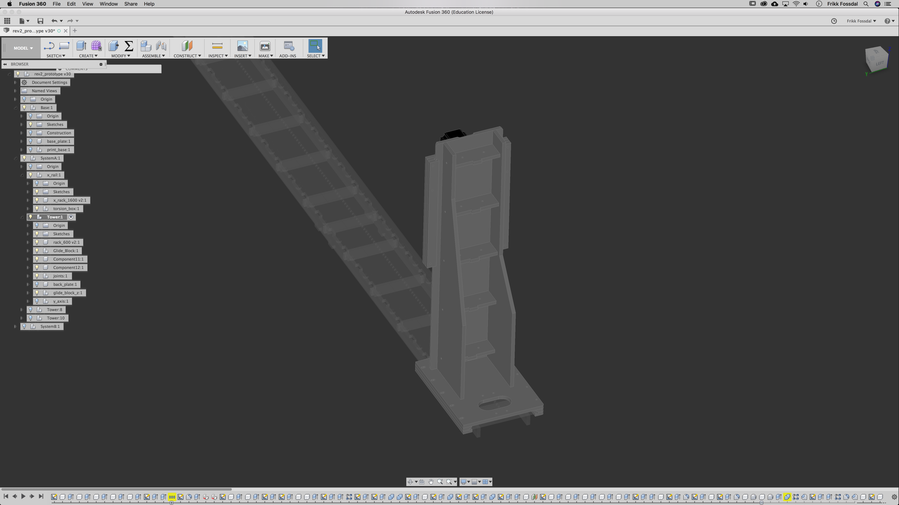
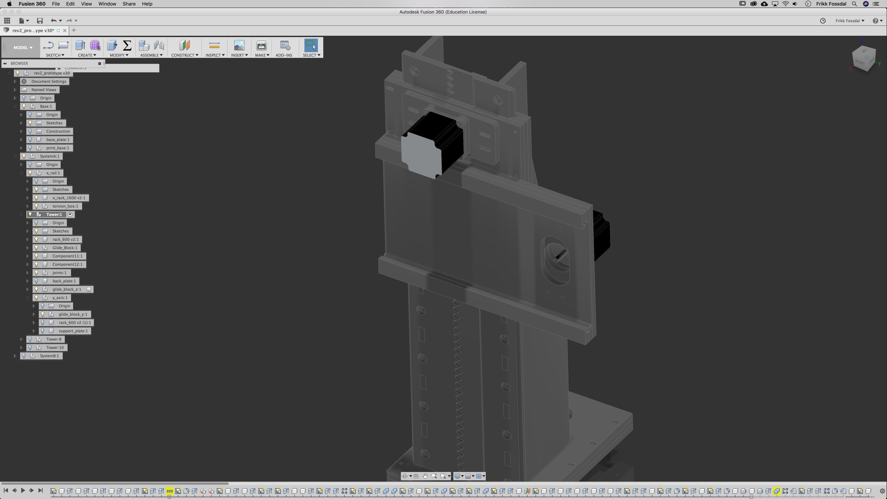
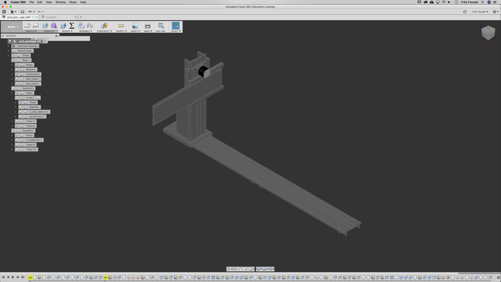
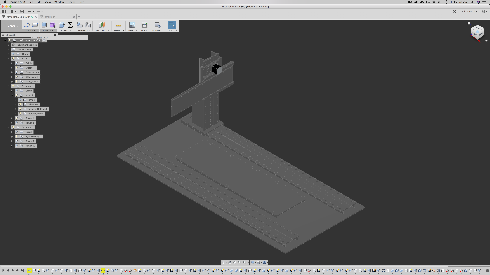
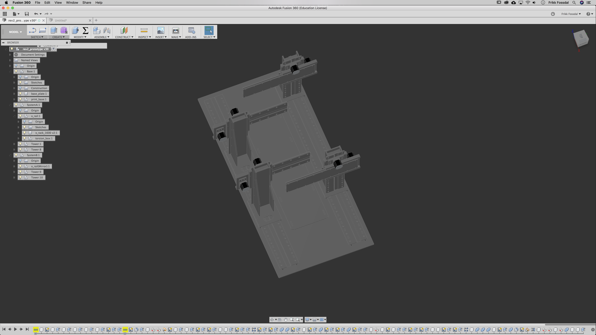

# Hulti - first take on large-format 3D printing 
## This is work in progress. I´ll add stuff as I go along. Currently finishing up CAM.

Hulti is a prototype of a 3D printer that does parallel processing of layers, meaning instead of having one nozzle extruding plastic we have many. The theory goes something like many workers can do the job quicker 
than one. While most of the research I am conducting is focused on the software and algorithms controlling the system, I wanted to have a physical platform where I can my test and visualize my theories. 

First, full disclaimer. You have now stepped into a document that functions both as a way for you to copy and make use of my work,  but also as my own research notes as I build
and prototype the machine. I am no expert when it comes to CAD and CAM, but I figured that if I am researching and diving into the world of fabrication machines, I might as well 
build one. I´ve been trought this process a couple of times before, building a 3D printer with linear shafts and a CNC router using the [v-slot rails](http://openbuildspartstore.com/v-slot-20x80-linear-rail/). The process is a headache everytime but you always end up learning tons of new stuff. Think about it, to complete this project I have to learn or know how to draw a technical 3D model, make it using a big-ass computer controlled milling machine, assemble everything, but a heart and brain in it (electronics and control), communicate with it and learn it how to behave (motion control software). 

NOTE: I am building a slicer and control software for the machine in a separate git. You can find it [here](https://github.com/frikkfossdal/fluffy-octo-potato).

## The Plan

The process goes something like this: 

1. Design 
2. CAD 
3. CAM 
4. Assembly
5. Electronics and Control 

## Design

I explored several diferent options here. 

[SCARA robost](https://en.wikipedia.org/wiki/SCARA).
An interesting concept, but in terms of DIY, expensive and complex. 

[Industrial robots, 6-DOF](http://new.abb.com/products/robotics/industrial-robots/irb-6700)
These are nice, and can in many ways do what I require, but the thing about industrial robots is that they are expensive!  HVL has a really nice robotics lab 
with several robots available, but we seak out to create a tool for people.  

[3-axis gantry](https://www.youtube.com/watch?v=SuOIWfGuqVk).
Here you can se a paralell processing system. The work area of each extruder is divided into sections. 

Ideely we want to create a system where the indevidual extruders can move as freely as possible. A big issue here is crossing. Traditional gantry systems 
are not able to cross each other, and I strongly believe that this is a limiting factor in a parallel processing scheme.  Industrial robots could be a way to solve this problem, but as stated above, they are expensive! 
Trough discussions with Jens we came up with this really nice concept using the chamfer rail system. Instead of the traditional gantry setup, supported on both sides, we went for a "single-side-supported" system alá the RepRap
[Ormerod](https://www.3dhubs.com/3d-printers/ormerod). 3D printing does not require as much stiffness and strength as a CNC, so hopefully this will suffice for our system. The nice thing about this design is that the extruders are able to cross each other. 
This allows for much more finesse when we start optimizing our tool paths.  I let the drawings do the explaining here.

So, I have a rough idea about what I want to build. It´s time to talk about materials. 

## Material

I explored several diferent materials like POM plastics and aluminium, which without a doubt will leave a more solid and stiffer machine.  Again, the main purpose of this machine is more of a proof of concept and a visual statement, then a fully functional super precise 3D printer. I also want to limit my budget at this stage. So in the true spirit of DIY machines and fabrication we are going to build this thing in  [valchromat](http://www.valchromat.pt).  Valchromat is this super dense MDF-ish composite. It is specially made to be easy to machine and give a nice surface finish. I figured that I can always come back to this stage and change the glide blocks, rails or the entire structure to a stiffer material later if I need higher precission or rigidity. 

## CAD 

I do realize that much of the CAD-work would probably be easier and faster in Rhino, but in the spirit of keeping everything open-source I wanted to do everything in Autodesk´s Fusion360, which is free for all hobbyists and makers. A really nice thing about Fusion is that the CAM-module is included, so you can move really fast from your CAD-design to excecution. 

###  Layout 

I like to start out with blocking everything out and getting a feel for the design, before I turn to details. I am aiming for a total footprint about 1600 x 700 mm.  As for the height of the machine, I´ve decided to start of with 600mm axes. This should allow print sizes around 1000 x 300 x 300. Fairly big. I also want to fabricate a solid surface as a fundament for the printer.  I´m thinking to link everything using good old fasion joinery techniques. More about this later. 

To drive the machine I´ve decided to test out a rack&pinion setup. This is not much used in 3D printing applications, mostly because of its cost and lower resolution I believe. However there are some working proofs. Jens 3D printed with his [Hattori](https://github.com/fellesverkstedet/fabricatable-machines/tree/master/hattori-small-format-cnc). Jacob has optimized he´s rack and pinion setup to be milled fast with a 6mm bit. However, the speed comes at a cost. 

TODO: Explain this better. 

### Drawing

To generate the rack&pinion setup, I will be using Jakob Nilssons parameterized [generator](https://github.com/fellesverkstedet/fabricatable-machines/tree/master/chamferrail).  I have to admit that I´m initially quite sceptical about the glide block situation. 3D printing requires fine precision, but the inital testing done by Fellesverkstedet and friends shows promising results so I guess it´s worth a try. Glide blocks without bearings is used in many applications in industry and after some examination of a old lathe at the local makerspace, my scepticism has been put to ease. I really like the idea about not having to source parts like bearings and glide rods. 

I use the generator to make 3 rails, one 1600mm and two 600mm. 

Here I have to mention that I didnt spend a lot of time with tuning the rack&pinion setup. Jacob has created a really nice parameterized model where you can fine tune you setup and teeth resolution. 
NOTE: if youre not happy with the resolution of the machine, go back here. 

Next up I´ve decided to redraw my own glideblocks. It really just comes down to that I want to have full control of the parameters of the model, and I want to be able to finetune my blocks. I also want to add my own joints and mounting pockets. This might be a small waste of time, but to keep the model cleen I feel it´s worth the hazzle. 
 

Now it´s time to talk about joinery. An important aspect to consider in all machine building applications is to stiffen up and flatten all the axes of the machine. Torsion boxes is a oldie but goodie trick that is used alot by both carpenters and machinist that needs a leveled and sturdie structure. It is also a efficient way to save material. 

This feels good. At this points I did a quick test of my design, mostly to get the feel about the stiffnes, resolution and the CAM. More about this later.  I added a Peace Lilly to give it some weight and aesthetics. Nature and robots in perfect harmony!

The rest of the machine is basically just repeating these steps. I use joints to lock everything into place and I add plenty of screwholes all over the place to lock everything together. 

Adding the yaxis. Same principle goes. Draw a gliding block and fit the pre generated rack. 

And boom. I think I have a system I feel good about now. Last thing I want to add is a bottom sheet that alligns and lock everything together using joints.  Now is also a good time to mirror the system I´ve created, so that I have to parallel linear rails that I can play with. I am also adding a heighten base that will work as my print surface. 

Now it´s just a matter of copying and pasting in the towers. I´ll start out with four as a proof of concept. 

I now have a really nice parametized model of my system which is scalable. The rails can simply be extended by changing the parameters in the rack generator, and adding them to the system. Same thing goes if I want to add more print towers. 

## CAM
re

## Assemble 

## Electronics and Control 

*Frikk H Fossdal - april 2018*

