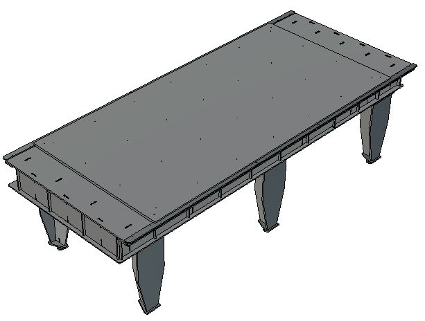
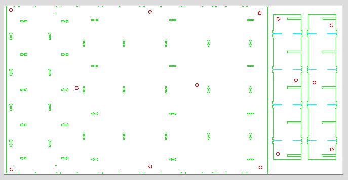
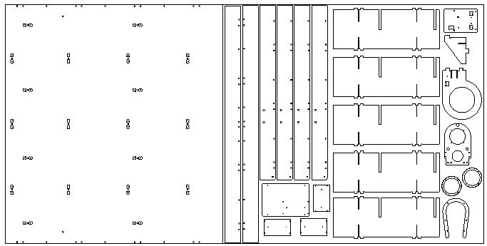
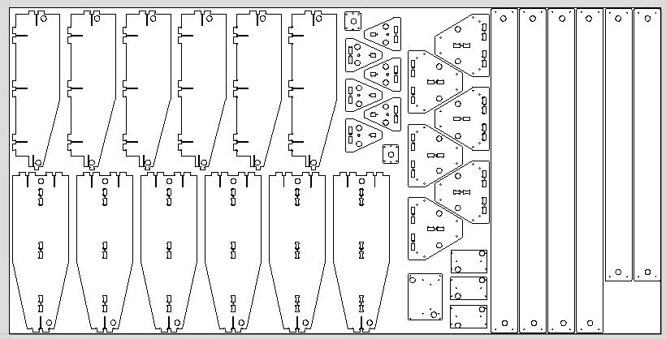
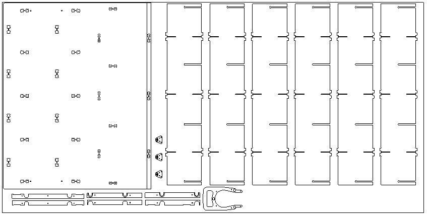
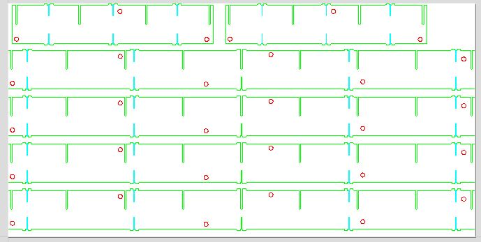
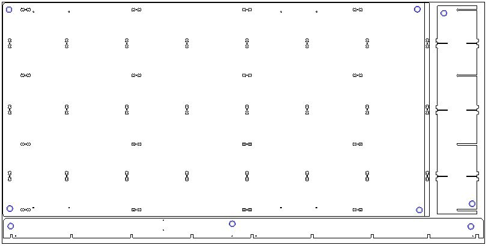
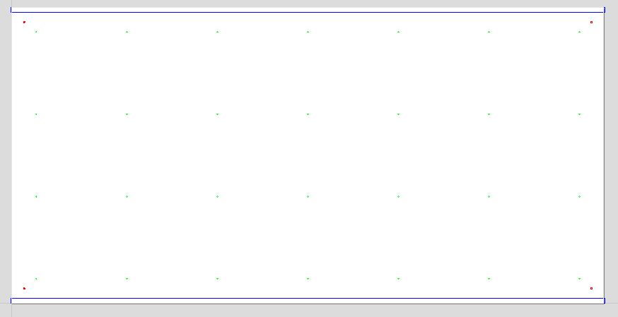

# Milling the valchromat parts for the table

_"A torsion box consists of two thin layers of material (skins) on either side of a lightweight core, usually a grid of beams."_

[Torsion boxes on wikipedia](https://en.wikipedia.org/wiki/Torsion_box)

The purpose of the tosion box is to make a stiff bed for the CNC machine to travel and operate on while keeping the parts easy to transport.

## Materials required

Valchromat sheets 1220X2440 mm

* 1 of 19 mm
* 3 of 8 mm
* 3 of 12 mm

Equipment required

* CNC milling machine
* Holddown screws
* 6 mm milling bits
* 3 mm milling bits

## Files
* [DXF files for milling](DXF_valchromat.zip)
* [Fusion model with layouts and most parts](https://a360.co/2Mzsrp2)
* [Fusion model with the main torsion box core parts](https://a360.co/2OGe8wh)
* [Fusion model with the legs](https://a360.co/2MuRitT)

* [Online 3D model containing all parts](https://a360.co/2AF6yjp) *Currently broken, fix coming*

## General

* The parts are modelled with dogbones for a 6mm bit.
* Additonal holddown screw-holes can and should be be added, also inside parts where needed.
* The 30mm diameter circles are indications of where to put hold downs.

## 12 mm sheets

* Sheet 1: 12 mm torsion box parts 1. The 3mm wide slots are 9 mm deep.

* Sheet 2: 12 mm torsion box parts 2. The 3mm wide slots are 9 mm deep. 12.5 mm pockets are 3.5mm deep. Mill a ledge on the outside of the circular parts to 6mm depth.

* Sheet 3: 6 legs probe and VFD stiffeners. The 3mm wide slots are 9 mm deep. Countersink all 5 mm holes for large wood screw heads.

## 8 mm sheets

* Sheet 1: 8 mm torsion box parts 1. The long pocket along the ledge is 4mm deep. The 3mm wide slots are 6.5 mm deep. 12.5 mm pockets are 3.5mm deep.

* Sheet 2: 8 mm torsion box parts 2. The 3mm wide slots are 6.5 mm deep

* Sheet 3: 8 mm torsion box parts 3. The 3mm wide slots are 6.5 mm deep. The long pocket along the ledge is 4mm deep.

## 19 mm sheet

* Sheet 1: 19mm Spoilboard with alignment holes, glue hold-downs and ledges on the sides. The pockets (ledges) on both long edges are 9.5 mm deep.

[Back to How to make the other parts](Humphrey_how_to_make.md)

[Back to Humphrey overview](README.md)
