# Humphrey - Large format CNC mill
 
 ## What is a Humphrey CNC mill
 
* A "full size", workshop size CNC platform for 3 axis milling
* Fabricatable with a CNC mill
* (UPDATED) Uses the [Roller axis](https://github.com/fellesverkstedet/fabricatable-machines/wiki/Fabricatable-axis#roller-rail) system
* Work area 1220 x 2440 Can be longer
* Traveling gantry with integrated electronics
* Can be made from 200mm x 8mm aluminium flat bar and 8 and 12mm valchromat

## Humphrey v2
*July 2018 Jakob Nilsson*

_Humphrey v2 doing it's first production cuts_

For updated how to make see [Humphrey v3](https://github.com/fellesverkstedet/fabricatable-machines/tree/master/humphrey-large-format-cnc/humphrey_v3#how-to-make-humphrey-v3)

### Summary 

Humphrey v2 was comissioned by [Newtone](https://newtone.no/), which is a joint venture and shared creative workspace for recording, mixing and making music, they also build, repair and restore stuff need to create music. They have used it to build all the custom acustic wall elements they needed to build Norways biggest professional recording studio on their premisies. 

The design of Humphrey v2 was based on the lessons learned from Humphrey v1 (documented below) and upgraded with some additional request for new features. It was modeled from the base up in [Fusion360](https://www.autodesk.com/products/fusion-360/overview) [(3D model cloud link](https://a360.co/2Okah8P) using [cycloid rack and pinion](https://github.com/fellesverkstedet/fabricatable-machines/wiki/Fabricatable-axis#rack-and-pinion) to drive the motion and (initially) [Chamfer rails](https://github.com/fellesverkstedet/fabricatable-machines/wiki/Fabricatable-axis#chamfer-rail) as linear guides. All machined parts were produced at [Fellesverkstedet's](https://www.fellesverkstedet.no/) old facilites in [Urtegata, Olso.](https://goo.gl/maps/r2fua3EC7Hw). Fellesverkstedet is a shared workshop open for everyone who has and idea that they wants to make themselves.  

Humhprey v2 was modeled, produced and installed by Jakob Nilsson, a [Fab Academy](http://fabacademy.org/about/) 2017 [graduate](http://archive.fabacademy.org/archives/2017/fablabverket/students/100/), mechanical design engineer and "maker freelancer". He makes a  living creating open hardware machines using the fabricatable machines project as a working team and rents commercial access to open workspaces in the Oslo region. You can read more about [Making Money with Fabricatable Machines](https://github.com/fellesverkstedet/fabricatable-machines/wiki/Making-money) of if you want to you can [contact Jakob directly](mailto:jakob.a.nilsson@gmail.com) or see his webpage [here](norlinkmakes.com).

After some [substantial updgrades](https://github.com/fellesverkstedet/fabricatable-machines/tree/master/humphrey-large-format-cnc#initial-backlash-and-tuning-issues) Humphrey v2 is currently operational and performing very well at Newtones facilities i [Kalbakkveien, Oslo](https://goo.gl/maps/iQA1DNBF3Ak). It has an "hand measured" backlash of less than 0.1 mm and feels very solid. During testing it milled aluminium with a 6mm single flute upcut carbide bit at 24000 rpm speed and 16 mm/s (960mm/min) feed at 2.6mm pass depth with very little chatter. [Aluminium milling picture](https://github.com/fellesverkstedet/fabricatable-machines/raw/master/humphrey-large-format-cnc/humphrey_v2/img/alu-milling_still.JPG)  and [Aluminium milling video [2:41]](https://photos.app.goo.gl/FRxFFRnpFdPw9nKu7). More pictures [below](https://github.com/fellesverkstedet/fabricatable-machines/tree/master/humphrey-large-format-cnc#pictures).

### Changes from v1
The most notable planned changes from v1 were:

* Longer 3.1 m * 1.22 m work area (v1 had 2.44m * 1.22 m)
* 4 of Nema24 closed loop stepper motors, 3Nm
* 2,2 kW 24000 RPM aircooled spindle (v1 had 800w which was considerably lighter weight)
* Torsion box bed
* Prefabricated steel legs (v1 made it's own legs after temporary assembly)
* Square cross-section aluminium gantry with place for all electronics and cable drag-chains (v1 had a lighter triangular gantry profile)
* CNC cut slots for easy screwing during torsion box assembly
* Full auto homing using inductive limit switches and Z-plate on gantry "foot"
* Pre milled marks and reliefs for easier sideways threading of aluminium parts
* Larger rack and pinion teeth for faster milling 
* CNC threading of vertical holes
* Split glide blocks to aviod warping, made from [Ertalyte TX](http://www.boedeker.com/ertaly_p.htm?utm_source=google&utm_medium=cpc&utm_campaign=Ertalyte&utm_content=ertalyte&utm_term=ertalyte&gclid=Cj0KCQjwu_jYBRD8ARIsAC3EGCJTTdM0VmiQMfy559bWI8msx-GFd42NzXiWPIiUJrVDcyjbf4ZEix4aArsJEALw_wcB) a low friction plastic, with compressing screws.
* Y-axis glide blocks placed so that the machine rest on the glide block instead of hanging from it.
* Dust vipers integrated into the glide blocks
* Metal links to simplify positioning the split y-rails
* Custom GRBL connection shield with full opto-insulation

### Initial backlash and tuning issues 

Humphrey v2 is slightly heavier than v1. We think that this caused too high friction forces between the plastic glide blocks and the rails. What happened was that the glide block surfaces within a days use would be covered in a layer of aluminium oxide, which would dramatically increase the friction and make the machine underperform. We measured that [it took 16 kg pull on a luggage scale to move the X-carriage](https://github.com/fellesverkstedet/fabricatable-machines/raw/master/humphrey-large-format-cnc/humphrey_v2/img/pull_test.jpg). This caused backlash of 1-2 mm (without any extra milling load) and caused the motors to jerk and sometimes stall. This also made tuning the chamfered glide blocks very challanging since the margins were so small between too loose and too tight to move. 

[See issue 14 for more in depth discussion and pictures of the problem](https://github.com/fellesverkstedet/fabricatable-machines/issues/14)

**Log of attempted fixes and upgrades:**

* Endless and recurring tuning of the glide blocks and motor positons

  Result: Slight tempoprary improvement but the glide blocks shifted from the load and this quickly loosened the tuning.
  
* Increasing the [motor](https://www.aliexpress.com/item/NEMA-23-2N-m-283ozf-in-Integrated-Closed-Loop-Stepper-motor-36VDC-JMC-iHSS57-36-20/32712473144.html) torque by reprogramming their firmware using a [HISU adjuster with RS232 cable for JMC driver](https://www.aliexpress.com/item/HISU-for-Andriy-Kyrychenko/32805819281.html?spm=2114.search0204.3.1.2e5f22b096LPf6&ws_ab_test=searchweb0_0,searchweb201602_3_10152_10065_10151_10344_10068_10869_10342_10868_10343_10340_10059_10341_10696_100031_10084_10083_10103_10618_10624_10307_10623_10622_10621_10620,searchweb201603_6,ppcSwitch_5_ppcChannel&algo_expid=75d93e7b-17cd-46cd-bf5e-ac884c644ff8-0&algo_pvid=75d93e7b-17cd-46cd-bf5e-ac884c644ff8&priceBeautifyAB=0)

  Result: Slight improvement, less stalling, increased shifting of the glide blocks.

* Roughing the surface under the glide blocks to make tuning last longer

  Result: Tuning lasted longer but backlash and reliability was still not good enough.

* The X-rail was removed and all precision surfaces were remachined to remove small imprefections

  Result: Tuning and backlash in X got improved but the machine still jerked and had >1 mm backlash.
  
* All rails and pinions were replaced with new smaller rack and pinon tooth size versions to [increase the gearing ratio](https://github.com/fellesverkstedet/fabricatable-machines/wiki/Fabricatable-axis#pinion-size-and-maximum-rack-pushing-force)

  Result: Smoother motions and less stalling but backlash in X was still around 1 mm. However the motors are now strong enough to damage the pinon teeth. 
  
* All aluminium glide surfaces were treated with PTFE dry film lubrication spray
  
  Result: Any benefit wore off quickly, the vipers might be partly to blame for rubbing it off.

* All glide blocks were replaces with aluminium glide blocks covered in UHMW-low-friction-tape
  
  Result: Tuning got easier and backlash seemed better(?) but they had even quicker oxide buildup(?) and no clear improvement in friction forces. (This was not tested for long.)

* [Roller axis developed and tested](https://github.com/fellesverkstedet/fabricatable-machines/wiki/Fabricatable-axis#roller-rail), all axis plates and glide blocks replaced, now using ball bearings and needing [dust covers](https://github.com/fellesverkstedet/fabricatable-machines/blob/master/humphrey-large-format-cnc/humphrey_v2/3d_prints/).

  Result: Incredible reduction in friction, all three axis can be moved at the same time using two fingers. Backlash seems to be <0.1mm. Smooth running so far. [Test](https://github.com/fellesverkstedet/fabricatable-machines/wiki/Fabricatable-axis#roller-rail) indicate that the roller-axis is vounerable to dust. (Currently being evaluated.)

### Fails

* We think that the chamfer rail gets in a self-reinforcing spiral of increasing friction when it is over-loaded. This made it impossible to reach good performace on Humphrey v2 with chamfer rail.
* Compressing plastic glide block screws made glide block tuning difficult.
* Fixing the performance problems took lots of unforseen effort.
* The gantry feet often clashed with the Z-rail and dust skirt, it's inner sides should be lower to avoid this.
* The steel legs were welded together and could therefore not be adjusted to be level with each other, after some time the torsion box sank down to match the lower legs, this caused it to stretch in the top and deform the links keeping the y-rails together. It was solved by bolting long horizontal wooden beams to the sides of the legs, supporting the torsion box evenly.
* Electrical noise from the unshielded spindle triggered the alarm pin on the Arduino-GRBL controller. 
* The Arduino-GRBL controller is not effected by cutting power with the emergency stop button and can start the machine when power is restored.

### Wins 

* Humphrey v2 has the highest precison, is most powerfull and is the biggest machine we have made with the fabricatable machines system.
* Using a special linking part to align the Y-rails worked well. 
* Using the CNC to mark all spots that should be manually drilled with a notch and step prevented the drill bit to slip and made it easy to see where to drill.
* Milling a [relief pocket](https://github.com/fellesverkstedet/fabricatable-machines/raw/master/Module%20development/Thread%20test/thread_test.png) for all the hand drilled holes saved lots of time drilling (clamp to a fixed table and drill horizontally!)
* Threading holes in aluminium with a [spiral fluted threading drill bit](https://nettbutikk.wuerth.no/boring-gjenging-kapping-og-sliping/gjenging/maskingjengetapp-hss-e-din-for-staal-bunnhull) and power drill worked great (Always use oil!!) This and the above tricks made it possible to thread 40 holes / h for one person.
* The torsion box bed was easy to assemble and glue together thanks to [pre-milled slots for screws](https://github.com/fellesverkstedet/fabricatable-machines/tree/master/humphrito-medium-format-cnc#screw-and-glue-joints-for-valchromat) and loose tolerances.
* Extending the split glide blocks and adding cloth vipers to them worked well as dust protection for glide blocks. [Model files](https://github.com/fellesverkstedet/fabricatable-machines/wiki/Fabricatable-axis#soft-rack-material---large-teeth). (They vere later changed to roller axis with [different 3D-printed dust protection](https://github.com/fellesverkstedet/fabricatable-machines/tree/master/humphrey-large-format-cnc/humphrey_v2/3d_prints).
* Newtone developed a opto-isolated connection board with headers for an arduino Nano (link coming!)

### Files

Humphrey v3 is being developed right as a kit so it will have more detailed assembly instructions. 

[Components BOM with supplier links and prices](https://github.com/fellesverkstedet/fabricatable-machines/raw/master/humphrey-large-format-cnc/humphrey_v2/BOM.pdf)

#### 3D models using glide blocks - OLD!

[STEP model assembled machine](https://github.com/fellesverkstedet/fabricatable-machines/raw/master/humphrey-large-format-cnc/humphrey_v2/humphrey%20v2_with_glide_blocks.zip)

[Fusion360 cloud link, full assembly](http://a360.co/2GzDQQc) 

#### 3D models using roller axis - LATEST! 

[Fusion360 cloud link, full assembly](https://a360.co/2Okah8P) 

[STEP model assembled machine](./humphrey_v2/Assembled_with_rollers-step.zip)

### Pictures

_Humphrey v2 Torsion box cut patterns_

.jpeg)

_Assembly of the torsion box_

.jpeg)

_Assembly of the gantry_

.jpeg)

_Mounting of all axis together_

_First tests_

_First cuts_

_Milled test pockets that shows typical imperfections from backlash_

_New aluminium glide blocks being produced_

_Comparission of the rack and pinion sizes during the upgrade to higher gear ratio_

_Machining of 40 excenters for the roller axis conversion_

_Test fitting the Roller-axis X-carriage aluminium parts_

_Humphrey v2 being upgraded to use rollers instead of glide blocks_

_All 3D printed components for the dust protection of the roller axis_

.JPG)

_All the aluminium in the original delivery_

_New aluminium parts for the gearing upgrade_

_New aluminium parts for the roller axis upgrade_

_Humphrey v2 after the roller axis upgrade_

_Aluminium milling on Humphrey v2!_

_Aluminium milling on Humphrey v2 video_

_Humphrey v2 roller axis first test results, check out those circles!_

## Humphrey v1
*June-July 2017, by Jens Dyvik and Alex Schaub*
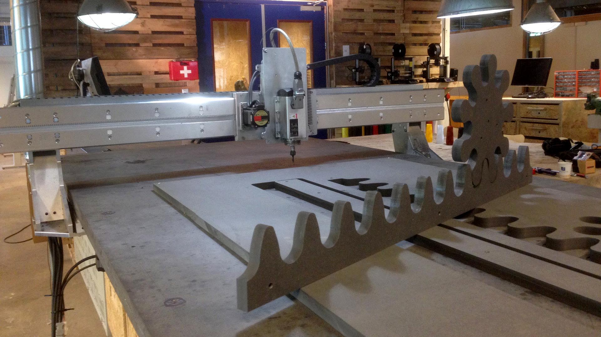
*Humphrey with first cuting job, a mega rack and pinion*

*The two pice rail on the Y axis is what made it possible to make an equally large machine as the shopbot mother. Mounting them upside down protects from dust and makes the machine super compact*

* A gantry based cnc milling machine capable of cutting standard size sheet material (2440mm x 1220mm).
* Based upon the [chamfer rail](https://github.com/fellesverkstedet/fabricatable-machines/tree/master/chamferrail) system.
* [Videos](https://vimeo.com/album/4881878) from the making of and [hello world first cuts](https://vimeo.com/album/4881878/video/225453047)

**Design wins**
* Spitting rails to make an axis as large as or larger than the mother machine works with our chamfer rail system
* The chamfer rail system performs decent with long axes
* Placing the Y axes upside down underneath the machine beds works very well for gantry type machines
* The torsion box based gantry became super stiff and quite light
* The machine was used to mill its own legs and physical end stops
* Milling the parts in Oslo,Norway(at Fellesverkstedet Fab Lab) and assembling the machine and fabricating the bed locally in Amsterdam, the Netherlands (at Contact Amsterdam) worked well
* We have managed to make a large CNC machine with high enough performance for small business and open workspaces!

**Design fails**
* The one sided and easy milling of the chamfer rails lead to a small varaition in axis thickness. This gave a small amount of backlash in certain places on the X and Y axes (0.1-0.3mm)
* It takes a long time to drill and tap all the holes in the assembly
* Gluing up the machine bed sandwhich requires some skill and good preperation
* The glide blocks warped a little (solved by split block design in latest generation [chamfer rail](https://github.com/fellesverkstedet/fabricatable-machines/tree/master/chamferrail))
* Tuning the postion off the glide blocks and motor plates requires patience and determination
* Aligning the split Y axes is tricky. (can be solved by milling helper tools, or helper geometry in bed sandwhich)

### Status

**In operation at Contact Amsterdam**

### Source files

* [3D assembly, Fusion360 - In work](http://a360.co/2GzDQQc)
* [3D assembly, Rhino source](./humphrey-3d-model.zip)
* [3D assembly, STEP](./humphrey-3d-model-stp.zip)

* [Cutsheet 10mm aluminium, Rhino source](./Humphrey-CNC_layout%-10mm_aluminium.zip)
* [Cutsheet 12.7mm POM, Rhino source](./Humphrey-CNC_layout%-12.7mm_POM.3dm)
* [Cutsheet 25mm Ertalyte-TX, Rhino source](./Humphrey-CNC_layout%-25mm_Ertalyte_TX.3dm)

### To do
* Document final installation
* Document safety front wall
* Document the wiring and autohome system with the Oriental motor drivers
* Update BOM in general(and include link to cheap JMC ihss57 motor alterntive to the luxury Oriental motor option)
* Update axes to latest rack and pinion geometry and glideblock design
* Incorporate electronics enclosure in design
* Incorporate e-chain mangagement in design
* Upload leg design
* Design helper-tools and helper-geometry in bed sandwhich for easier alignment of the split Y axes

### The making of
For feeds and speeds and how to make chamfer rail parts in aluminium see the [chamfer rail documentation](https://github.com/fellesverkstedet/fabricatable-machines/blob/master/chamferrail/README.md)

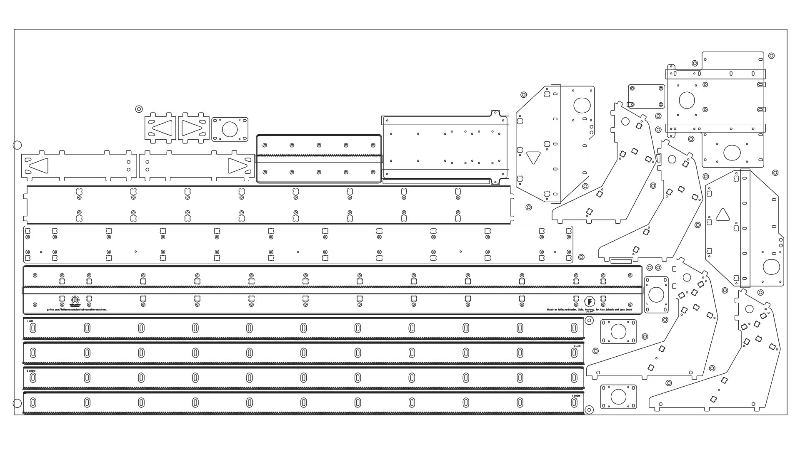
*All the aluminum parts fit inside a 2m x 1m sheet. We used 10mm material, but the gantry became so stiff that we have shifted to 8mm as standard*

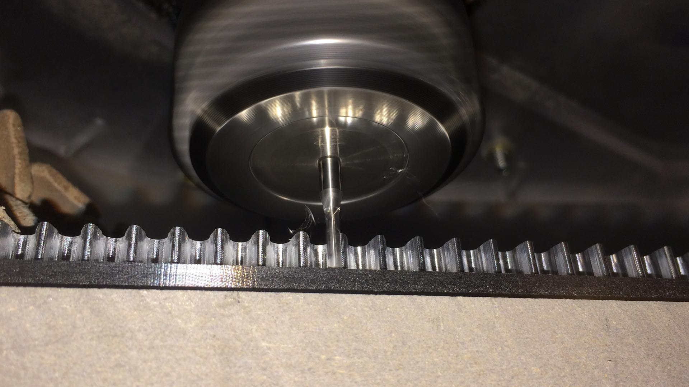
*Milling of the rack teeth with a 2mm bit. The cnc friendly rack and pinion design on the chamfer rail has given such good performance, our new standard is now optimized for milling with a 6mm bit*

*The Y axes are complete. Note that each axis has been split into two pieces in order to make a long enough axis (2.9m) with a work area of 2.5m. We oriented the parts in opposing directions when we milled them, which gave offset erros after homing. We reccomed milling them with all the rack sides pointing in the same direction. The cutsheet has been updated with this orientation*

*Close-up of the rack teeth. Note the small chamfer to reduce wear on the POM pinion*

*Gantry feet parts and motor plates. Note how we have milled all the internal holes first, placed screws with washers and then milled the cutout last with the parts securely held down by the screws*

*Shiny! All the axes and gantry parts ready for transport*

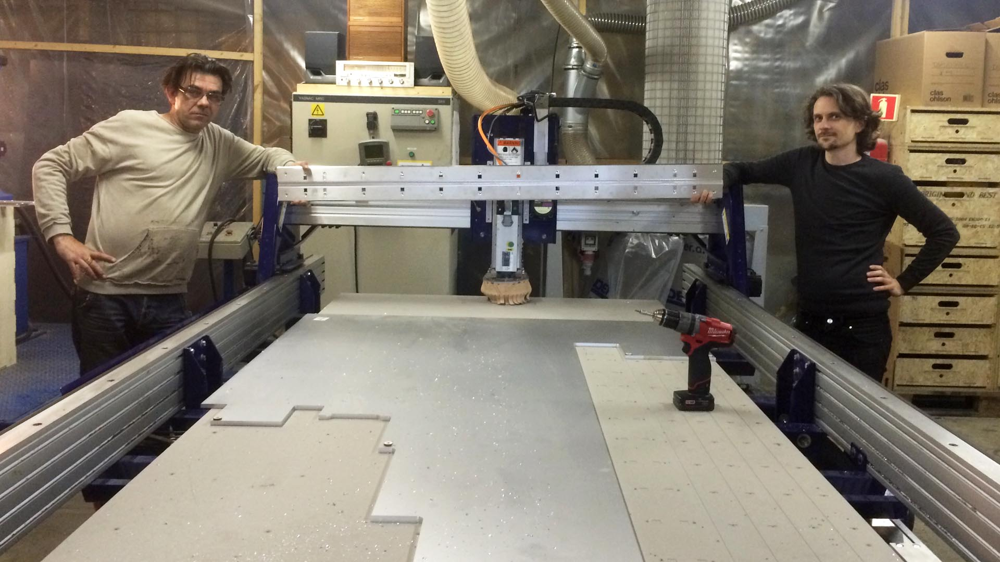
*The machine builders pose with the gantry axis in front of the gantry of the mother-machine. The machine was designed by Jens Dyvik and made by Jens Dyvik and Alex Schaub*

*Milling the glide blocks from Ertalyte-TX, a super smooth a wear resistant bearing grade plastic. We had some problems with the glideblocks warping due to the one sided milling and material surface tension. So our new improved design has split glideblocks. Check the [chamfer rail repo folder](https://github.com/fellesverkstedet/fabricatable-machines/tree/master/chamferrail) for the latest glideblock design*

*Milling the pinions. Our motor shaft diameter was 10mm, while this design was optimized for 8mm shafts (a smaler pinion circumference gives higher torque and resolution). So we went fancy with a two-sided milling job*

*Placing the pinions in the jig. Note how the pinions are attached only in rows, and not in a grid. This is to minimize the imprecisions caused by a potentially non-square gantry*

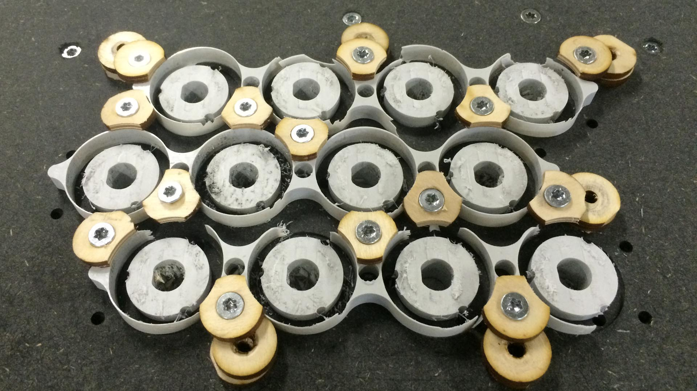
*Milling the backside of the pinoins. This layout got a little tight, but we managed*

*Comparision of pinions. Our regular nema23 size motor pinon on the left, the Oriental motor with 10mm shaft adapted pinion center and a standard ShopBot pinion on the right. Note that the ShopBot pinion has a circumference that is 2.5 times as large as on our design. This gives the shopbot smooth movement with traditional involute gears, but also necitates a gearbox with backlash. Our cnc friendly pinion design gives reasonably smooth movemnt, and needs no gearbox*

*All the aluminium and plastic parts fit in one suitcase and a ski-sized package. The parts where actually checked in as ski-luggage from Oslo to Amsterdam for no extra cost*

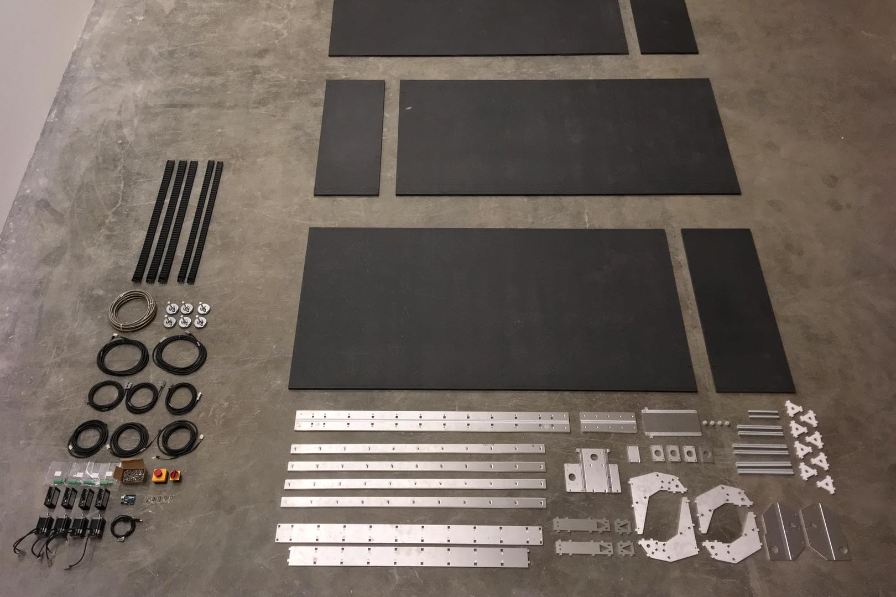
*Purchased parts on the left, self-fabricated parts on the right*

*The machine bed was made locally in Amsterdam with hand tools. It is a brutal sandwhich from three layers of 19mm HDF plates, pluss a fourth 19mm HDF plate as a sacraficial layer. If the machine is to be CNC milled and assembled in the same city, we reccomend CNC milling a torsion box design from thinner materials*

*Assembling the gantry feet*

*Gantry feet ready assembled, with gantry assembly in progress in the background*

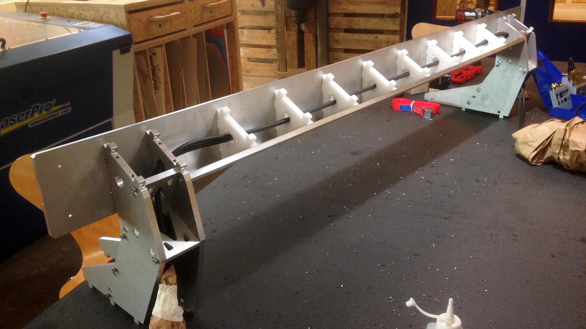
*Gantry alomst done. Note the torsion box design, this gives great stiffness to the gantry*

*Gantry assembled*

*Drilling and tapping all the holes in this design took a long time. It is durable and reliable method, but we are exploring alternatives like wedges or pockets that a machine screw can self tap into*

*Glide block and pinion in place. Note that the only thing we don't fabricate ourself in this drive system is the motor and the screws*

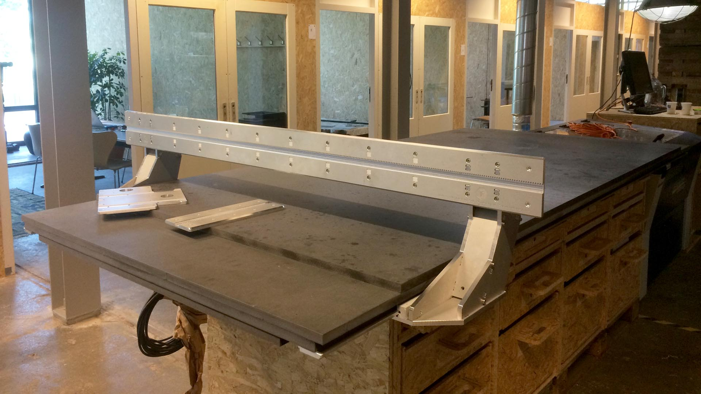
*Gantry and machine bed complete. The XZ axis plate and Z axis are lying in the bed awaiting assembly. Note how the the machine is temporaily resting on a [Hat systems module](https://github.com/fellesverkstedet/hat-systems/blob/master/README.md) awaiting to make its  own legs.*

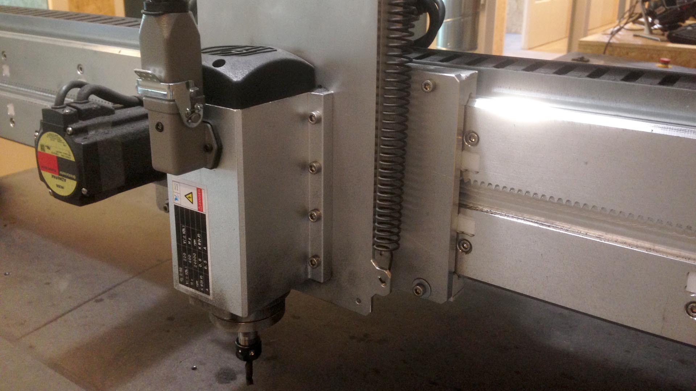
*The completed Z axis. Note the spring to keep the axis up when power is out.*

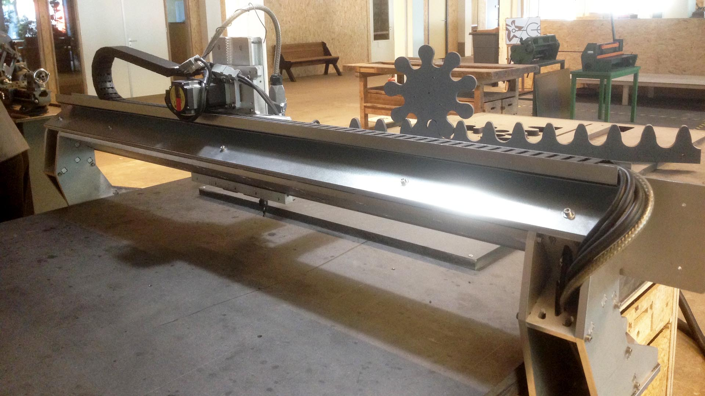
*The gantry backside with e-chain. The bed for the e-chain was freestyled with a pressbrake, and should be refined and included in future iterations*

*One of the first things Humprhey did once operational was to mill its own legs. Such a clever little child... ehm, I mean machine*

*One of Humphreys first batch productions. Six sound absorber frames designed and produced by Alex Schaub*

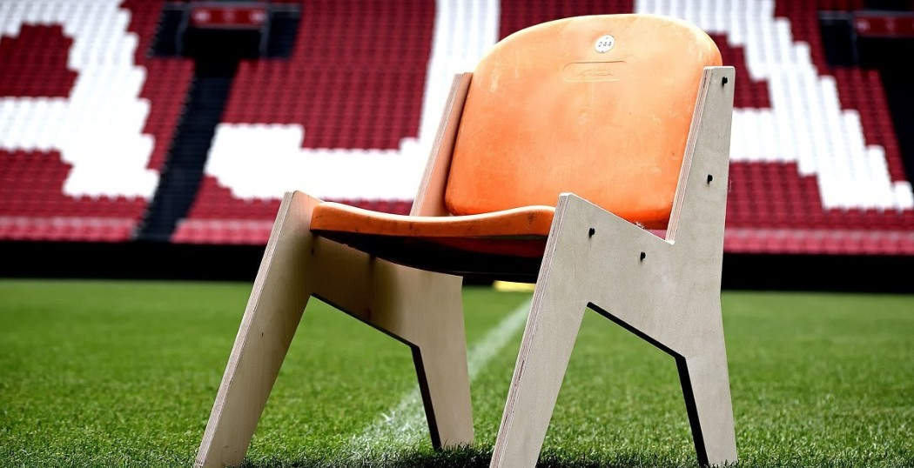
*Birch plywood chair parts milled by Alex Schaub on Humphrey. The design is based on a re-used Ajax stadium seat*

### Development log

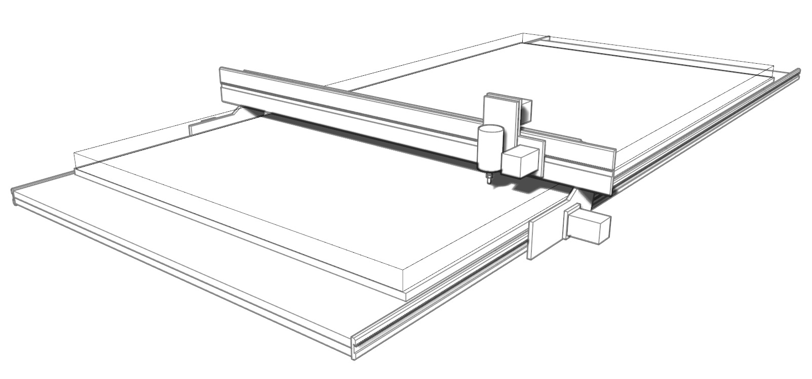
*Early sketch of basic design principle, note the sideways Y rails like on Hank. Swapping to upside down Y axes was a huge success*

### Original requirements:
* all structural parts machinable on a Shopbot PRS Standard or alpha 96 x 48" model
* all linnear rails and drive systems machinable on a Shopbot PRS Standard or alpha 96 x 48" model
* racks from aluminium
* pinions and plain bearings from POM plastic (acetal/delrin)
* torsionbox systems for table made from HDF?
* torsionbox systems for gantry made from aluminum and POM
* Z axis <5cm
* high prescision stepper motors: closed loop stpper motors 0,36deg >2Nm (85mm housing), or open loop stepper motors 0,36deg >2.3Nm (60mm housing)
* should also be compatible with regular NEMA23 1.8deg steppers
* air-cooling 800w 4bearing cnc spindle motor and matching vfd
* end stops xyz axis
* hot swappable Z axis for fast and easy toolchange
* auto z zeroing?
* protective bellows for all axis?
* touchscreen operation with tablet or laptop?
* it shold look good!

### Sketches

*sketch of casette concept, compact and suitable for meeting health and safety standards*

*Alex's sturdy full frame sketch*

*Jens's skexth of updside down axis principle*

*Refined sketch*

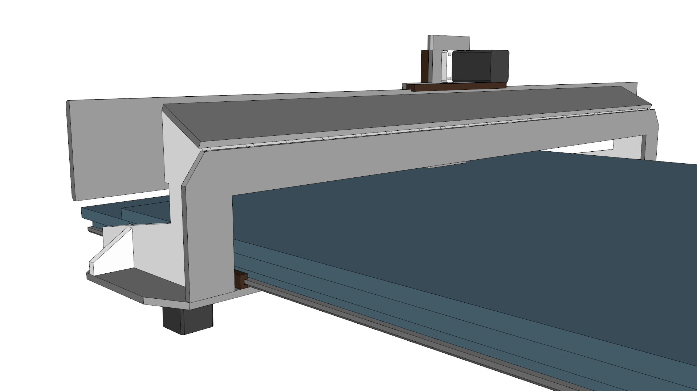
*Backside of gantry*

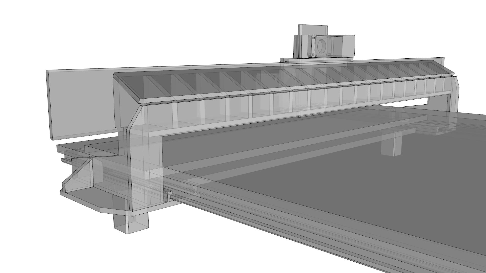
*Ghosted view showing alu and pom torsion box. Finger tabs and bolts not yet drawn*

*Front view. Not the the Valchromat be dparts *(blue)* can be fabricated with regualar woodworking tools*

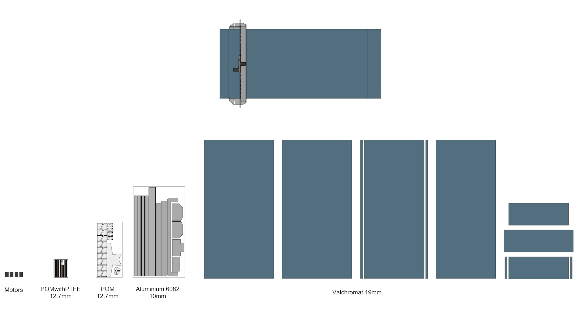
*Part overview*

### Bill of materials *(BOM)*

**
