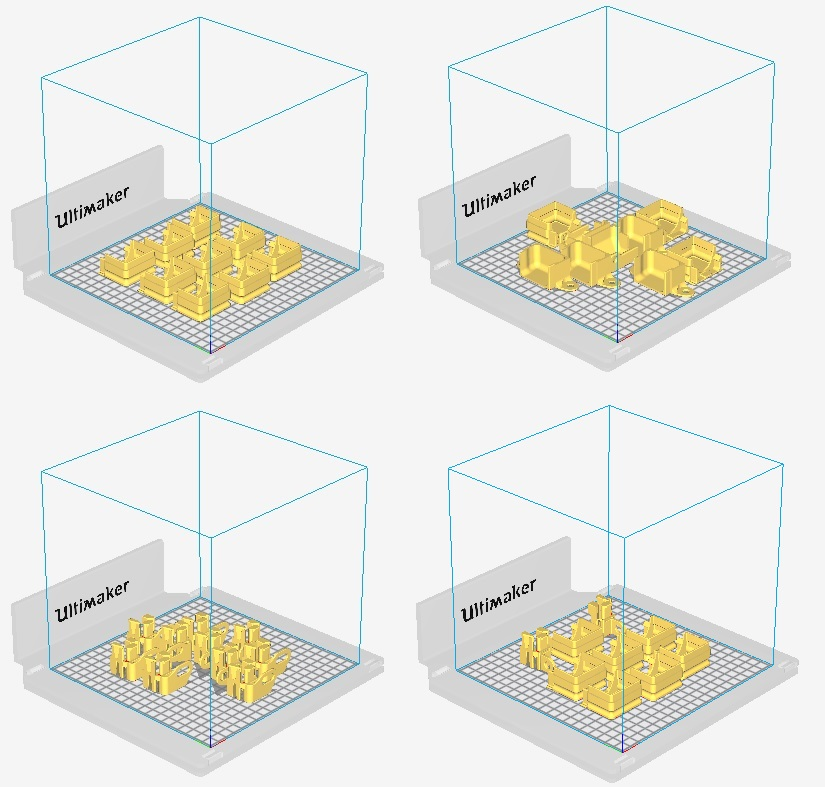

# 3D prints for Humphrey 

These are the 3D prints for the dust protection of the rollers and for the dust extraction.

[Jump to Dust skirt](https://github.com/fellesverkstedet/fabricatable-machines/tree/master/humphrey-large-format-cnc/humphrey_v2/3d_prints#dust-skirt)

# Dust protection of roller axis

These are all the 3D prints needed for Humphrey with roller axis (currently v2 and v3.)

## Instructions

You need a 3D printer and some patience, any FDM-3d-printer will do. PETG and PLA seems to work fine.

Start with printing a copy of the cover "test platform" (see filename) and a "Roller_cover" to see if they fit.

Download the zip-files, unzip. Print the 33 parts in the quantities listed below, the quantiy is also written in each filename.

### Print settings

I recommend PLA or PETG with double or triple wall thickness using a 0.4mm nozzle and 20% infill but feel free to experiment with other settings. If you want to modify the parts, you can fish out the originals from the [assembly files here](https://a360.co/2NBCXcX). 

### Covers

[Zip file](https://github.com/fellesverkstedet/fabricatable-machines/raw/master/humphrey-large-format-cnc/humphrey_v2/3d_prints/Roller_covers-stl.zip)

* Roller_cover 16st
* Roller_cover_no_snap_x_lower 1st
* Roller_cover_no_snap_x_lower_mirrored 1st
* Roller_cover_y_axis 4st

22 prints, 4 models. 

### Vipers

[Zip file](https://github.com/fellesverkstedet/fabricatable-machines/raw/master/humphrey-large-format-cnc/humphrey_v2/3d_prints/Vipers-stl.zip)

* viper_xlower 1st
* viper_xlower_mirror 1st
* Viper_xtop_and_z-axis 6st
* Viper_y-axis 4st

12 prints, 4 models. 

### Pre set plates for Cura

These are four pre set plates of parts to be sliced in [Cura](https://ultimaker.com/en/products/ultimaker-cura-software), they take between 7-8 h each to print using standard draft settings so in total 30h to make all parts.

[CURA plates.zip](https://github.com/fellesverkstedet/fabricatable-machines/raw/master/humphrey-large-format-cnc/humphrey_v2/3d_prints/CURA_plates.zip)

#### Plate1
* Roller_cover 9/16st

#### Plate2
* Roller_cover 3/16st
* Roller_cover_no_snap_x_lower 1/1st
* Roller_cover_no_snap_x_lower_mirrored 1/1st
* Roller_cover_y_axis 4/4st

#### Plate3
* Viper_xtop_and_z-axis 6/6st
* Viper_y-axis 4/4st

#### Plate4
* Roller_cover 7/16st
* viper_xlower 1/1st
* viper_xlower_mirror 1/1st

### Pictures

_All the dust covers and vipers freshly printed_

# Dust skirt

A 3D-printed dust skirt system that is held on by magnets.

[STL files](https://github.com/fellesverkstedet/fabricatable-machines/raw/master/humphrey-large-format-cnc/humphrey_v2/3d_prints/dust_skirt_prints.zip)

## Top part

This is a hose adapter for a 100 mm dust extraction hose.

## Lower part

_Print with this side up and supports on_

 
 (It doesn't currently fit on an ultimaker. The picture is trickery.)

