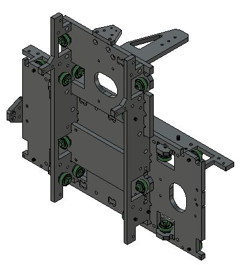
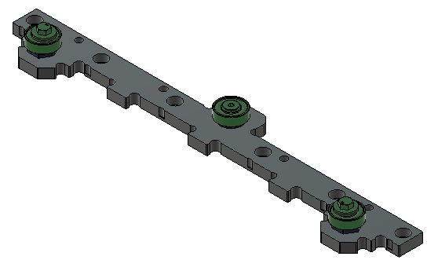
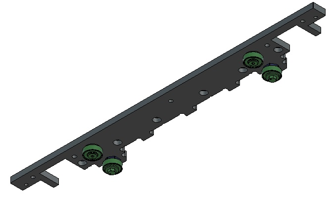

# Carriage assembly

## X axis carriage

* Find these parts:

* Find bearings and the *fixed* bearing cores. They are as default assembled without washers.

* Find the bearings, large washers and the *excentric* bearing cores. Note that the excenters always should have two washers on top of the bearing and as default one washer below the excenter. 

* NOTE: Immedietly tighten the screws holding *fixed* bearings and leave the screws holding the *excenters* loose.

*  Arrange them bearings like this: (Shown with the bearings hidden for visibillity)

* It should look like this when done:

