# Carriage assembly

## X axis carriage

* Find these parts:

*NOTE!* Humphrey v4 is updated to use two identical bearing holders here, they both look like the top one.

* Find bearings and the *fixed* bearing cores. They are as default assembled without washers.

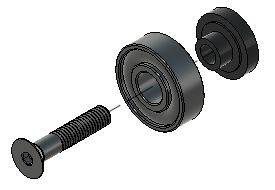

* Find the bearings, large washers and the *excentric* bearing cores. Note that the excenters always should have two washers on top of the bearing and as default one washer below the excenter. 

* NOTE: Immedietly tighten the screws holding *fixed* bearings and leave the screws holding the *excenters* loose.

### Top and bottom parts

*  Build two of these: (Shown with the bearings hidden for visibillity)

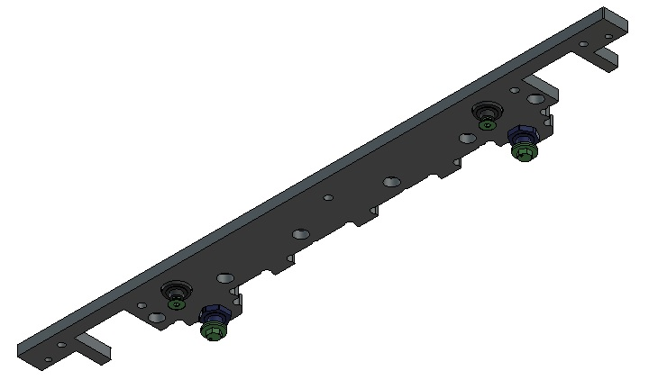

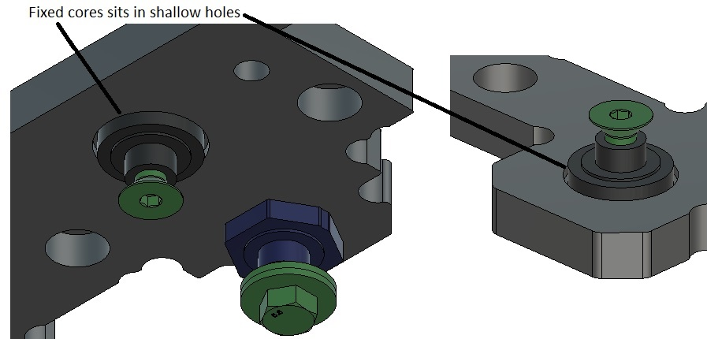

* It should look like this when done:

* REMINDER: Tighten the screws holding *fixed* bearings and leave the screws holding the *excenters* loose.

### X-axis plate
*  Arrange the bearings like this: (Shown with the bearings hidden for visibillity)

* It should look like this when done:

* REMINDER: Tighten the screws holding *fixed* bearings and leave the screws holding the *excenters* loose.

### Putting the X-axis carriage together

* Screw the x-carriage together but don't tighten the screws for the lower part it needs to come off to mount the carriage on the gantry.

## The Z axis carriage

*  Arrange the bearings like this: (Shown with the bearings hidden for visibillity)

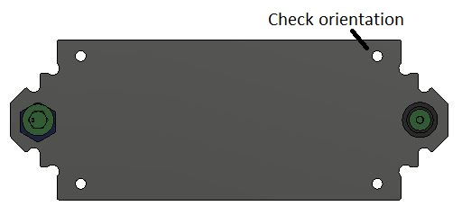

* Screw the lower part to the sides first. All bearings facing inwards. Don't tighten the screws yet.

* Then screw on the Z-axis plate AND tigthen its mounting screws.

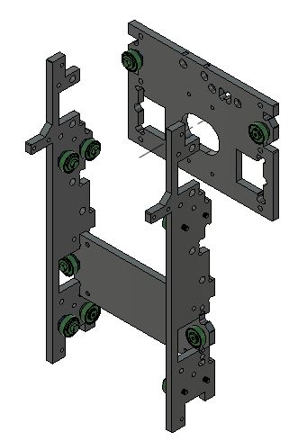

## Combine the carriages

* Screw the carriages together and tighten the screws holding them to each other.

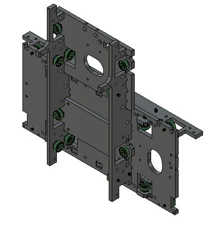

## Add drag chain mount and sensor mounts

* Find these parts

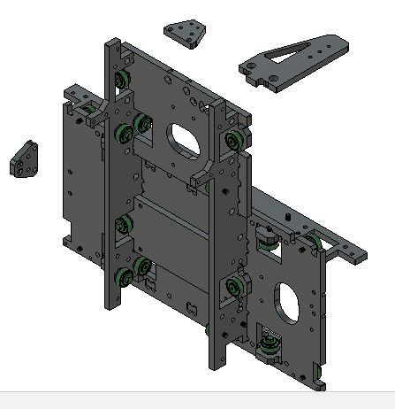

* Screw them to the carriage and tighten those screws.

# Mounting the carriage on the gantry

* In order to mount the completed carriage on the gantry you need to take off the lower plate like this:

* Then you should be able to hang the carriage on the gantry

* And reattach the lower plate. Now tighten the screws and double check that the screws holding the upper is tight as well.

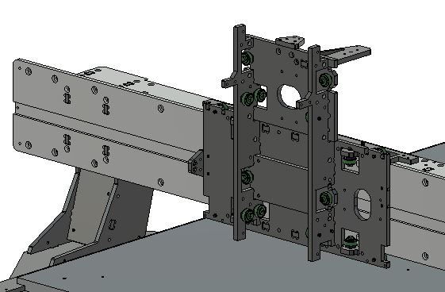

# Mounting the spindle on the Z-axis

When mounting the spindle to the z-axis. Measure it so that it gets paralell with the sides of the Z-axis. 

* Find these parts:

* Assemble them like this, glue the wood pieces together using screws as guides in the holes.

* Attach a thick rubber string from the protruding mounts on the front of the X-carriage using two small aluminium clips. Thread the string down behind, below the spindle.

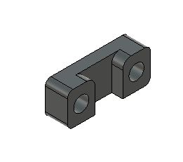

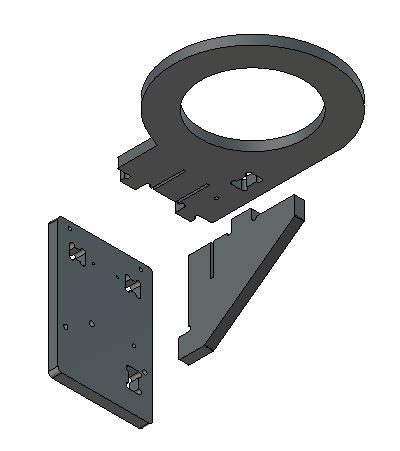
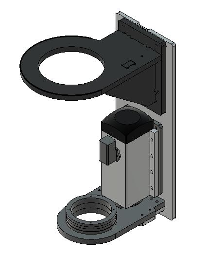

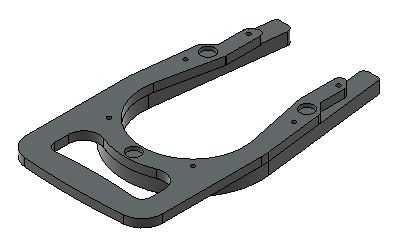
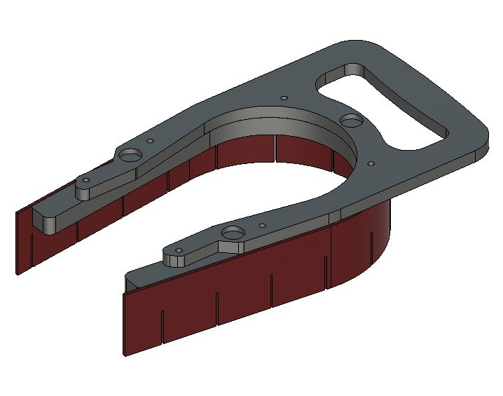
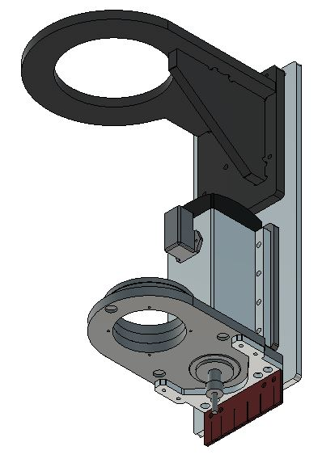
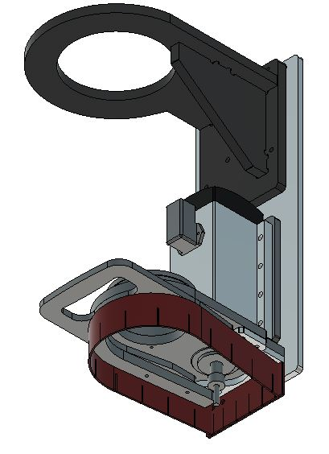

_CONGRATULATIONS! THAT CONCLUDES THE CARRIAGE ASSEMBLY_

[Instructions continues in: Tuning the motion system](https://github.com/fellesverkstedet/fabricatable-machines/tree/master/humphrey-large-format-cnc/humphrey_v3/tuning.md)

[Back to assembly main page](https://github.com/fellesverkstedet/fabricatable-machines/tree/master/humphrey-large-format-cnc/humphrey_v3#how-to-make-humphrey-v3)

