# Gantry assembly

These are instructions on how to assemble the gantry from a kit of parts.

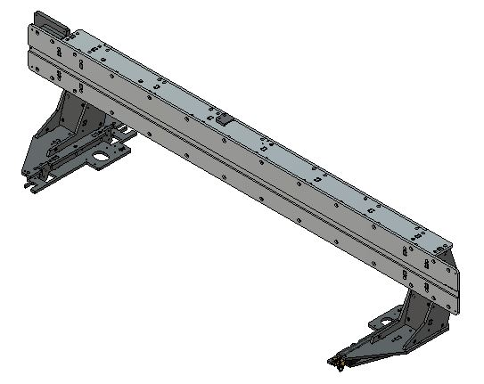

[View online 3D model of the gantry bridge](https://a360.co/2Mpi5Ib)

[View online 3D model of the gantry foot sole](https://a360.co/2MvIG6q)

## General assembly advice

* M5x16 mm screws with cylinder head are used for 95% of all parts. Use these if nothing else is stated. They use a 4 mm hex bit.
* Do not tighten screws before instructed to do so. This is to make it easier to fit parts together and for them to find their correct positions.
* Washers are rarely needed and may interfear with fitting of parts, don't add washers unless asked to.
* Using a power drill with a 4 mm hex bit can shorten the assembly time
* DO NOT USE LARGE TOOLS, if you use a big ratchet wrench with a bit insert you will most likely not feel when you have reached the correct torque. This is the reason why small screws and have smaller tools.

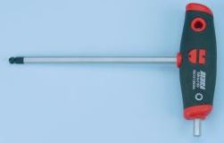 [buy here](https://nettbutikk.wuerth.no/haandverktoy/skrutrekkere-og-sekskantnokler/skrutrekkere-hex-for-innvendig-6-kt/t-haandtak-hex-skrutrekker)

## Before assembly: Threading the parts

In order to assemble the gantry you will first need to drill and thread the M5 sideways holes into the aluminium parts. 
Using a proper setup and good tools for the work makes it much easier and reduces risks of injuries or damages.

There are 150 holes in total on the whole machine that needs drilling and threading and one person can drill and thread 40 holes per hour if they work efficently.

NOTE: If you are multiple people helping with the assembly, thread the parts as you go, starting with the ones needed for the first steps.

* Always keep the bits lubricated (or it will break, trust me). Wd-40, vaseline, oil... anytyhing goes. Using a dipping cup speeds things up.
* Use a power drill and a sharp spiral fluted bit.
* Drill horizontally, in hip height. (Vertical = no pushing power and hard to hold steady)
* Clamp the piece to a secure table so well that you can guide and press the drill with both hands. (To litte pressure = takes forever and everything gets hotter) 
* You can save some time by using a combination drilling and threading bit, just make sure to lubricate both parts of the bit.
* Dry chips = not enough lubrication.
* Use safety googles, sharp aluminium chips come flying off the bit, especially when reversing out.
* Double check parts for missed drill holes, some are impossible to access without dissassembly later. Which is inconvenient but completely possible.

# Gantry feet

* Find two sets of these parts

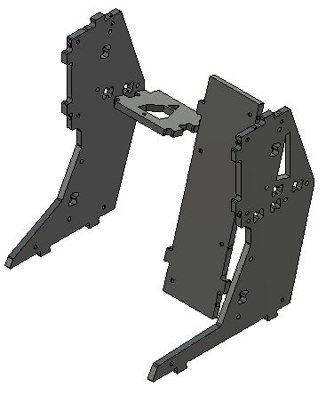

* Make two mirrored copies of the gantry feet, like this.

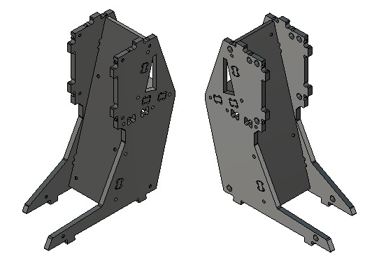

* Screw then together using the default M5x16 screws, do not tighten them yet.

# Bridge core

* Find these parts:

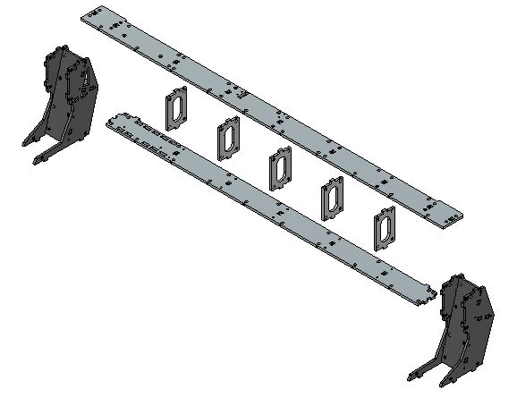

* Screw the feet to the bridge bottom,do not tighten the screws yet.

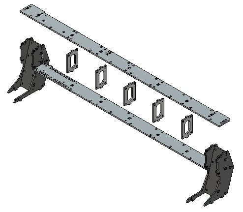

* Screw the ribs to the bottom, do not tighten the screws yet.

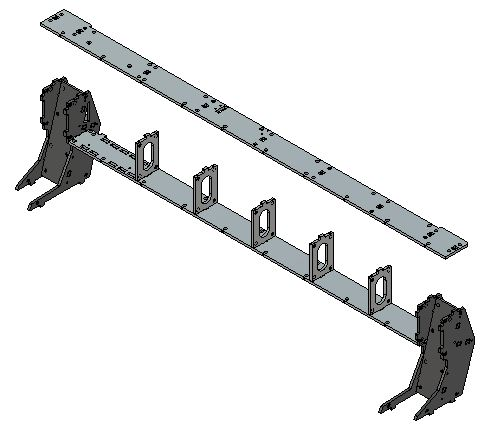

* Screw the top to the ribs and the gantry feet, do not tighten the screws yet.

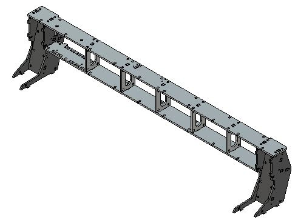

* Do not tighten the screws yet.

# X-rail and backside

* Find these parts:

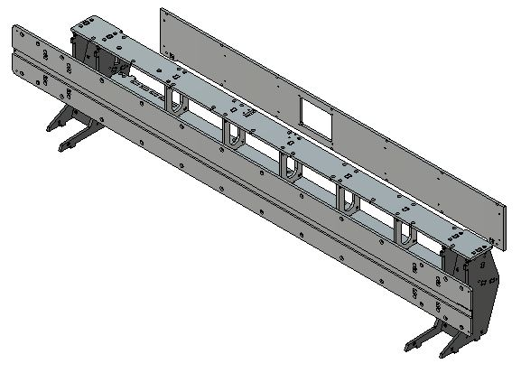

* Mount the X-rail onto the gantry, do not tighten the screws yet.

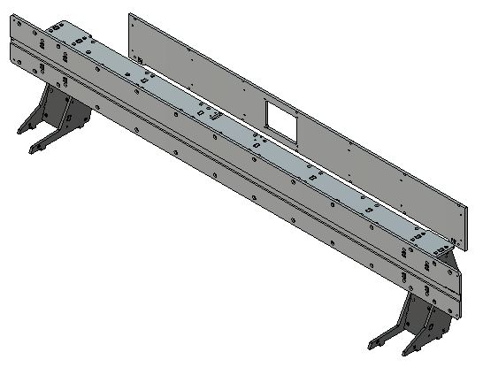

* Make sure that the rack teeth are pointing down (to aviod them collecting dust)

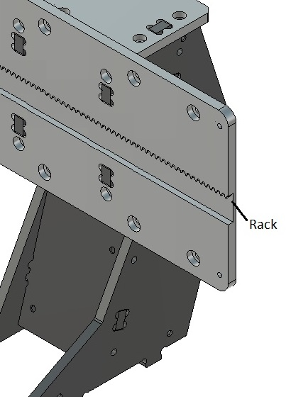

* Screw on the backside, no need to use all screws yet, this needs to come off later when we are installing the wires later.

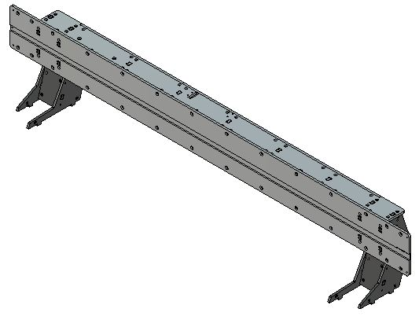

* You can now tighten the screws. Start with the X-rail. 

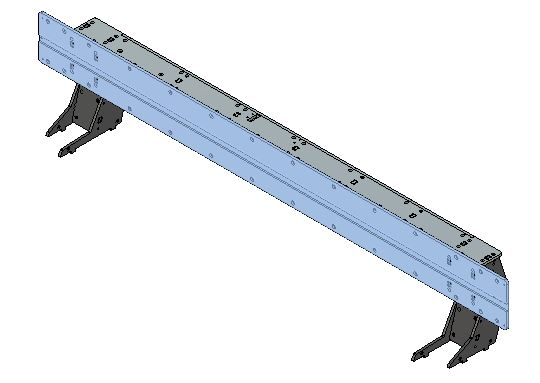

# Gantry feet soles

* Find two sets of these parts, we will assemble them one at a time since they have different bearing configurations.

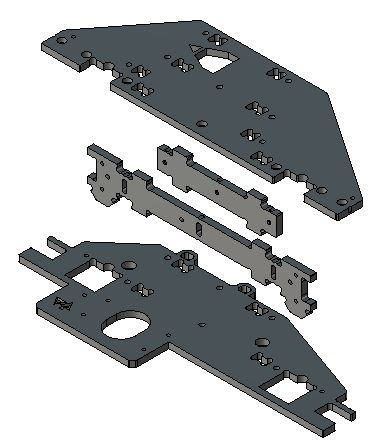

(Check for missed drilling in the ends, they easy to miss.)

* Find bearings and the *fixed* bearing cores. They are as default assembled without washers.

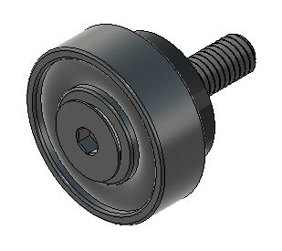

* Find the bearings, large washers and the *excentric* bearing cores. Note that the excenters always should have two washers on top of the bearing and as default one washer below the excenter. 

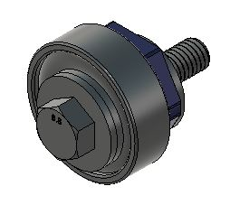

* NOTE: Immedietly tighten the screws holding *fixed* bearings and leave the screws holding the *excenters* loose.

## The right sole

* Mounting the bearings before screwing the parts together makes it MUCH easier.

*  Arrange them like this: (Shown with the bearings hidden for visibillity)

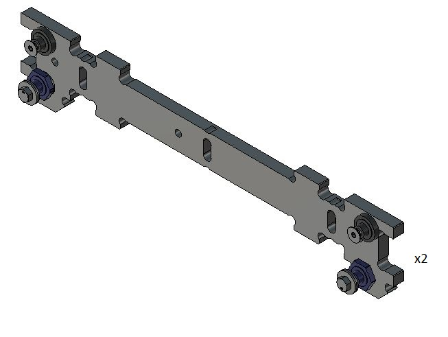

* It should look like this when done:

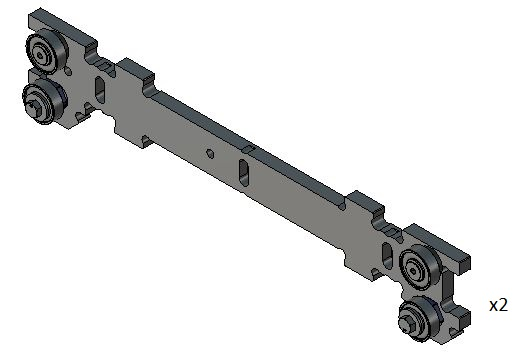

* And for the bottom layer mount them like this. IMPORTANT exception, use two washers below both of these: (Shown with the bearings hidden for visibillity)
 

* Two washers for both of these excenters. 

* It should look like this when done:

 

* REMINDER: Tighten the screws holding *fixed* bearings and leave the screws holding the *excenters* loose.

* Screw on the ribs to the bottom layer and tighten the screws.

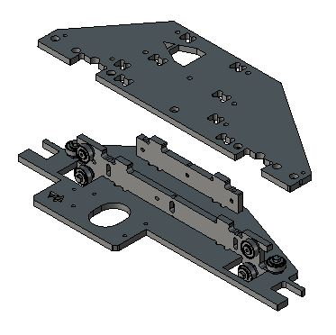 

* Screw on the top layer and tighten the screws.

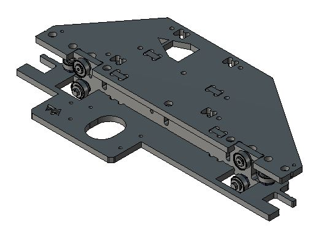 

## The left sole

*  Arrange the bearings like this: (Shown with the bearings hidden for visibillity)

* It should look like this when done:

* And for the bottom layer mount them like this. IMPORTANT exception, use two washers below these: (Shown with the bearings hidden for visibillity)

* Two washers for both the excenter and the fixed core. 

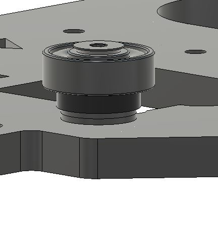

* It should look like this when done:

 

* REMINDER: Tighten the screws holding *fixed* bearings and leave the screws holding the *excenters* loose.

* Screw on the ribs to the bottom layer and tighten the screws.

 

* Screw on the top layer and tighten the screws.

 

* Now you have made the two ganty feet soles

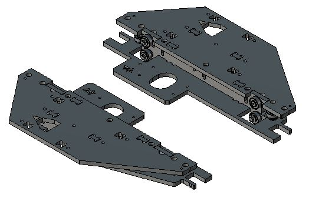 

# Attaching the gantry feet soles

* Screw the gantry soles to the gantry feet, do not tighten the screws yet.

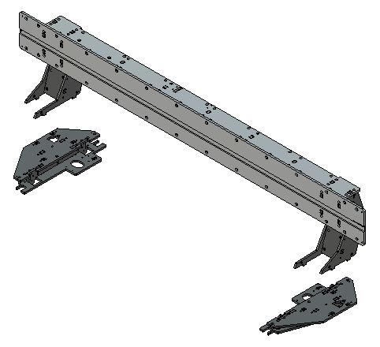 

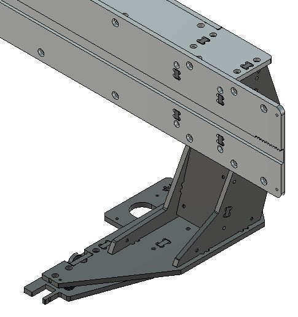 

* It takes 4 screws to attach each sole, use the access holes in the bottom to reach them, do not tighten the screws yet.

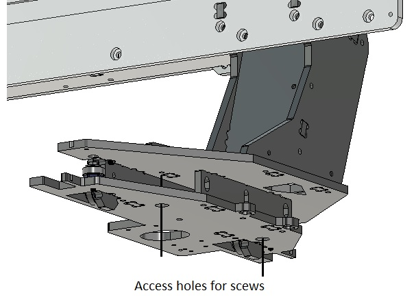 

## Test measurement

Before we can tighten the last screws we want to make sure the feet are paralell within a 1mm, that is +/- 0,5 mm. Otherwise we might struggle to tune the bearings later.

* Check this measurement in the front and in the back.

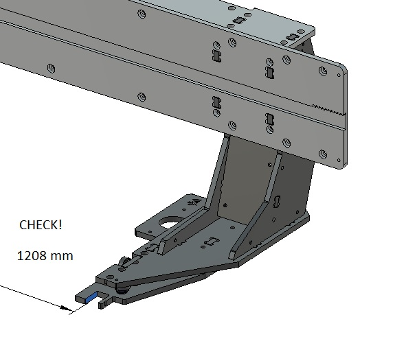 

* If it looks good, tighten the screws. If not, try to adjust it first.
* Doublecheck the paralellity-measurement in the front and in the back.

# Mounting the gantry on the table

* You should now be able to lift and ease the gantry onto the Y-rails. Be at least two people before attempting this. No force should be needed to roll the gantry in place.

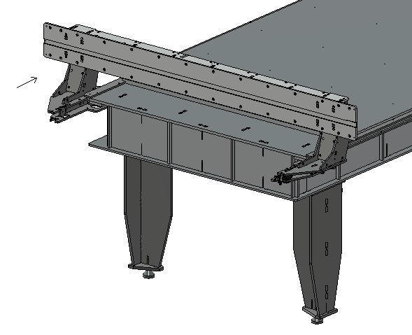 

_CONGRATULATIONS THAT CONCLUDES THE GANTRY ASSEMBLY_

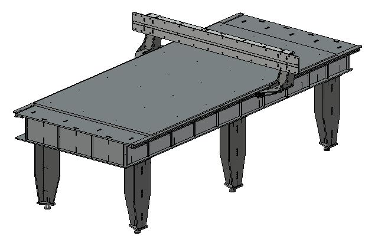 

Continued in The Carriage.

[Back to Assemby main page](assembly.md)
