# Making the aluminium parts

These parts are milled from 200x8mm flat bar aluminium 6082-T6 grade. We buy them from [Astrup AS](https://astrup.no/).

Total needed aluminium stock is five 3 m long pieces, but we strongly recommend buying an extra piece, then the total is 18 meters of 200x8mm aluminum flat bar, cut into six 3 m long pieces. 

The CNC we used for manufacturing has a 2440 mm long work area, show here in relation to the CAM layout for all parts:

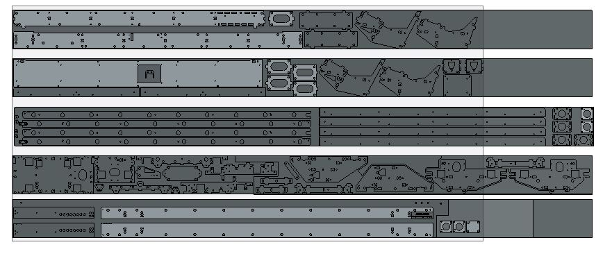

Practically the work will be split up into one piece per session since they take many hours per stock.

## Files

* Full 3D model files online view [(Fusion)](https://a360.co/2AF6yjp) 
* [Full step model](https://github.com/fellesverkstedet/fabricatable-machines/raw/master/humphrey-large-format-cnc/humphrey_v3/Assembly_h3%20v5_step.zip) 
* [All step files with the aluminium layouts](./parts/alu_parts_STEP.zip)

## Recommend milling sections:

* Y_rail_holder_alu [Fusion CAM](https://a360.co/2PiNYRo)

* Gantry bridge [Fusion CAM](https://a360.co/2PliVEu)

* Y-rails [Fusion CAM](https://a360.co/2MhuMFD)

* **ON HOLD** Being updated. Roller axis plates [Fusion CAM](https://a360.co/2Bg37jq)

* x-z rail [Fusion CAM](https://a360.co/2PhWqAk)

* Missed parts [Fusion CAM](https://a360.co/2SJKKvD)

## How to mill aluminium parts

We use VHF single flute milling bits for milling aluminium dry, that is without cooling. Always use new bits or bits that are only used in aluminium.

* [Aluminium milling advice in the wiki](https://github.com/fellesverkstedet/fabricatable-machines/wiki/Fabricatable-axis#how-to-fabricate) Get the feeds and speeds here. (These instructions are for an older version.)

* [Make sure the CNC machine is well tuned and that the bed is leveled](https://github.com/fellesverkstedet/fabricatable-machines/wiki/Theory#cnc-mill-machine-preparation). A loose machine vibrates and the chatter will damage the cutting edge of your bits which in turn might suddenly break them without warning.

* Make yourself a favour and lasercut fresh wooden washers (4 mm inner diameter, 15-18 mm outer diameter) from some 3-4mm high quality plywood. It takes almost no time, do it! 

### Worn bits = sticky chips

Provided that you are using the correct feeds and speeds and a tight machine you can easily see on the chips if your bit is still nice and sharp. You will wear out one bit at some point while milling this project so this is something you NEED to keep an eye on. 

* Fresh bit = The chips do not stick together or to the stock
* Used bit = the chips stick together in slots but can be brushed away
* Worn bit = The chips stick together in slots and can not be brushed away, this bit will break if you go on.

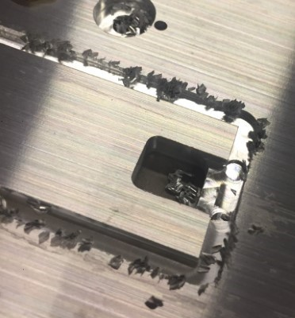

*These chips indicate a ligthly used bit, chips are just starting to stick slightly*

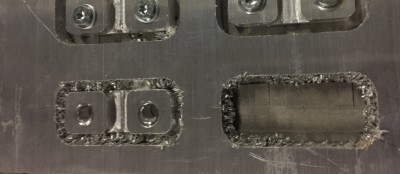

*These chips indicate a dangerously worn bit, the chips fuse together forming hard bristles. It will break if used much further.*

Chip re-cutting also wears out your bit faster. To reduce bit wear it is smart to use good dust extraction to avoid leaving loose chips on the part being milled.

### Hold down of stock

When milling aluminium it's very important that the stock does not vibrate or slide around during milling. We like to avoid using clamps or having to hand drill hold-down holes since that can lead to uncessecarry collissions.

Instead we use a few pieces of valchromat to make a quick jig and to clamp down the aluminium pieces with. This way we know exactly where it is and that it is safely secured with minimal risk of collissions.

**Hold down steps:**

* Make holddown pieces

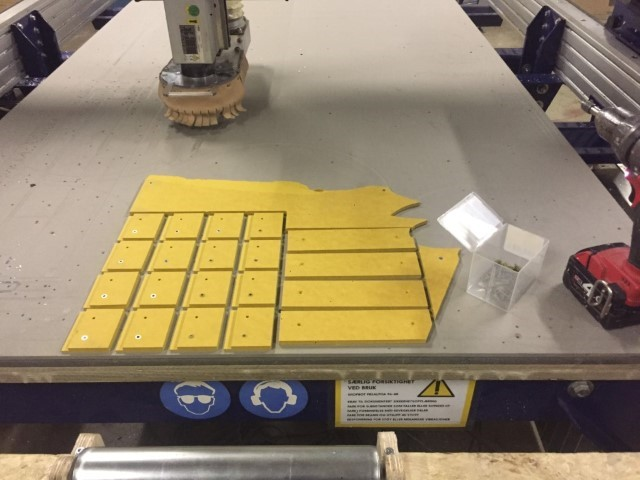

* Mark the table by milling 0.2 mm into it where the stock should go. **NOTE!** Make extra sure the cut runs on the inside of the stock profile!

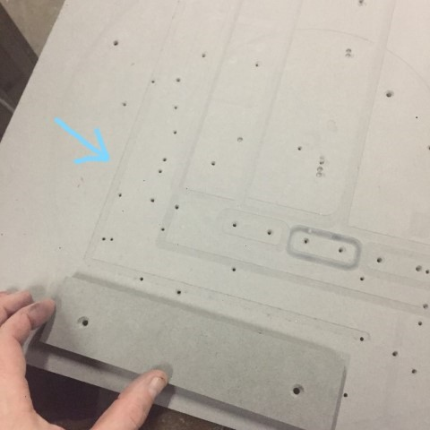

* Screw the jig pieces to the table so that they overlap the milled line a few millimeters.

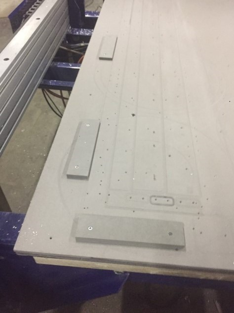

* Run the marking milling job again, use the same gcode file, this trims the jig pieces.

* Check the area for "screw volcanos"-bumps from previous jobs and hand sand them off if you find any. 
* Vaccum of the dust so that the piece can lie flat.

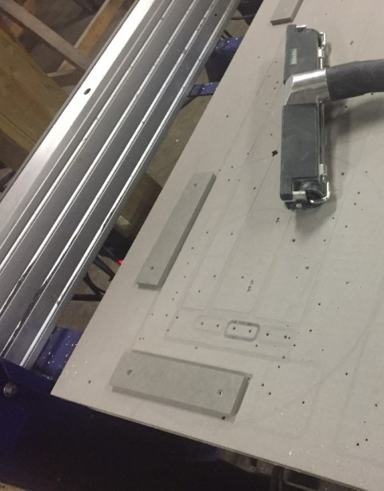

* Position the aluminium up against the jig pieces

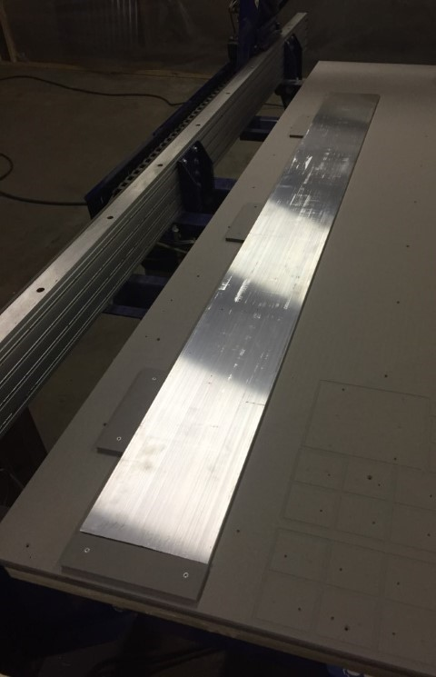

* Use the valchromat clamp pieces to clamp down the aluminium against the table. 

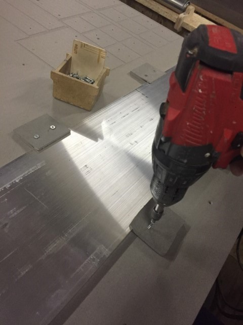

* The alumium is now clamped to the table in a known position without any screws in the work area!

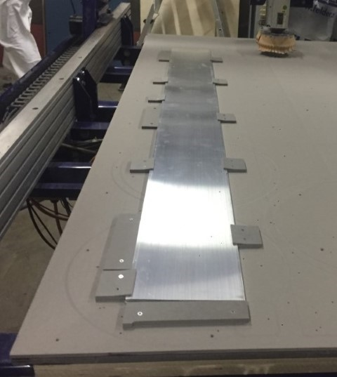

**Milling steps:**

Having a good sequence for milling aluminium helps keeping track of holddowns and avoids loose pieces, saving you from unecessary broken bits or parts flying away. It can also save time since it reduces tool changes. 

We strongly recommend planning out the whole job before starting to mill since it otherwise is easy to get "lost" trying to see what is what when you are halfway through a job.

* First run a drilling job with a 4 mm bit for all holddown holes that are there to secure loose scrap pieces and the scrap "skeleton". Make sure to have minimum two holes in all parts that will be loose. (Helical drill operation to 5 mm diameter works great in Fusion360).  
* Now put screws in ALL the holes you just drilled. No washers needed. Do this before drilling other holes that you WILL confuse them with.

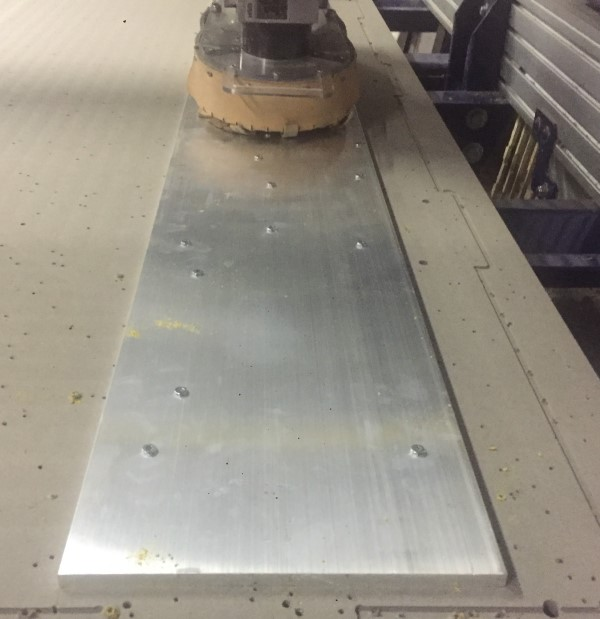

*The valchromat clamps are removed in this picture, it's safer to leave them on longer.*

* Now the aluminium is firmly secured and you can run all small hole operations that require the 4 mm bit. All pockets that can be, should be done with the 6 mm bit.
* When that is done you can change the bit to 6 mm and probe the height.
* Start with milling away all small scrap pieces that were to small to secure with two screws. These can be <10 mm small and still ruin your day (break your bit when they come loose) so look extra carefully for them in the CAM simulation.
* Mill pockets with a positive tolerance to make assembly easier fit. 0.1 mm should be enough.
* Test the fit of the holes using a loose part. 
* Now you can remove the clamps. But look out for areas without hold downs and leave the clamps there.

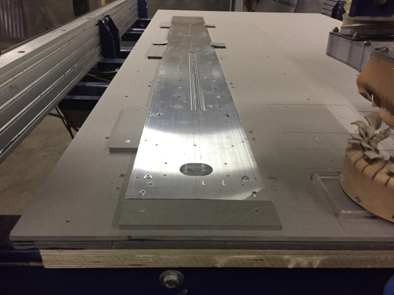

* Time to mark the part outlines! We do this to give a visual indication on the part were the cuts will go, this way it is MUCH simpler to see where to put hold down screws before cuttining loose all the parts. This takes no extra time since we will do 4 passes + finish pass anyway. Practically this will just add a pause after the first pass. 

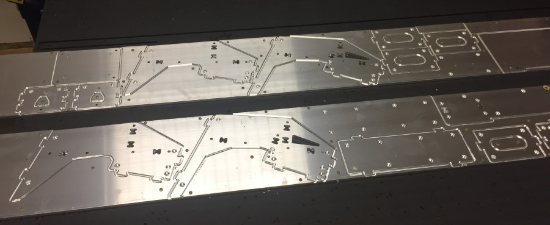

* Screw down all the parts using screws with wooden washers. Be generous and rather use more screws than less. Thanks to marking the part outlines in the previous steps you can see exactly where the mill will go. Remember that the goal is to reduce vibrations, not just to keep the part from flying away.

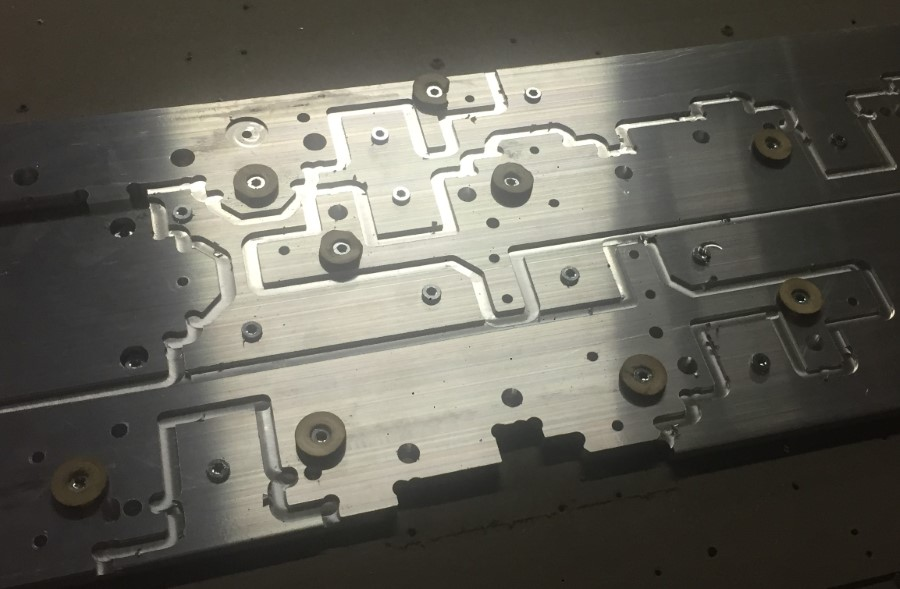

*Note the areas where we have milled away aluminium scrap that is too small to screw down. Some scrap pieces shown here have only one holddown screw and therefore are risking twisting when they get cut loose, this is not good. Use two screw holes, even tightly spaced ones are OK.*

* Run the remaining cutout passes and a 0.1mm finishing pass. This together is the longest milling operation and might take hours. Check the simulation time before starting and consider if you need to split the job to fit you workday. 
* While milling, listen for dramatic changes in the sound, it hearals trouble! 

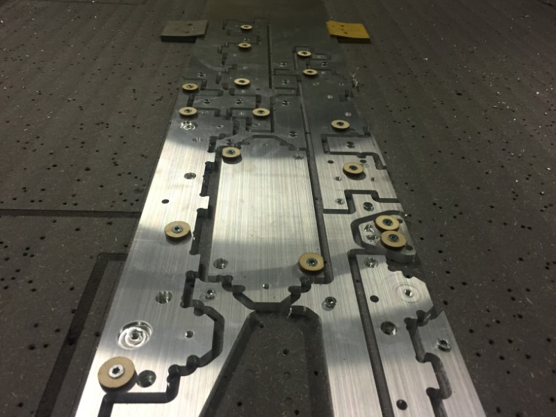

* Run any tolerance adjustment operations if necessary.
* Do a visual check if everything is done and got milled. Think twice before starting to loosen screws!
* Change to a V bit (single flute if available) and break the top edges to reduce the manual edge sanding labour and to make the rack teeth nicer to the pinions.

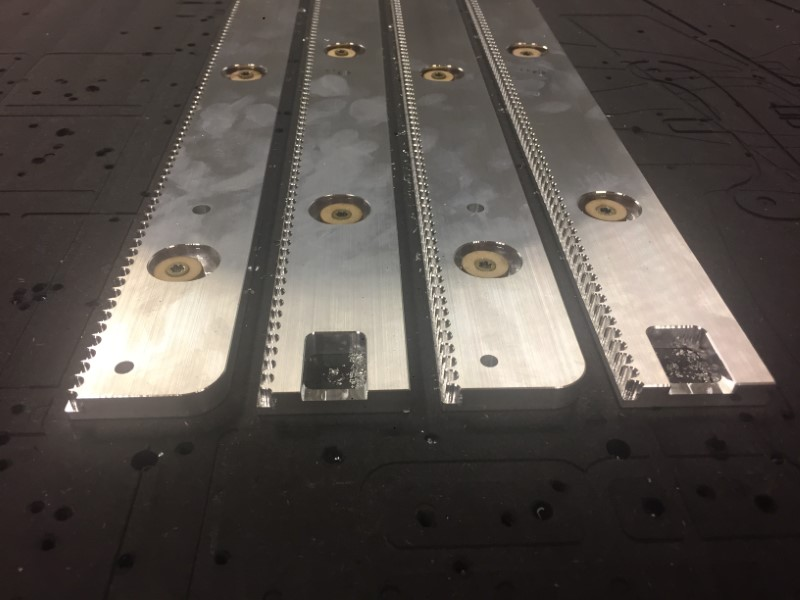

* **Optional!** Engrave the parts. It looks professional! **BUT!** Test your V bit on some scrap area to make sure it will look good. A wood-worn V bit will leave ugly edges in aluminium.

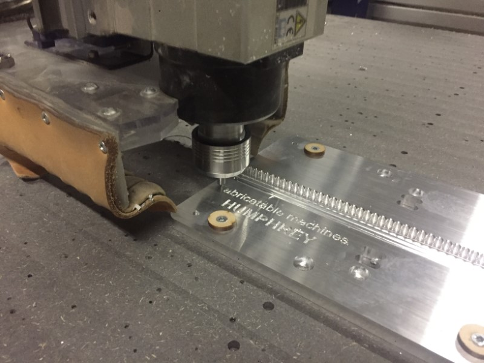

* Remove all parts and test assemble them for your pleasure and to check that they fit.

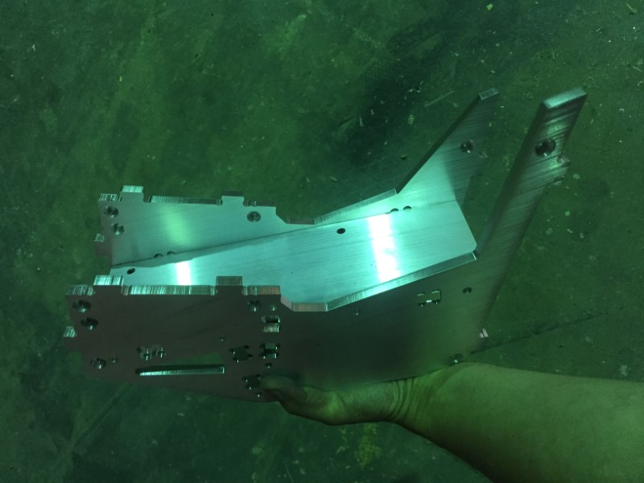

* **IF YOU MISSED SOMETHING** It is possible to screw a piece back into place and orient it using the "shadow" left behind on the spoilboard when you cut it out.

[Back to assembly main page](https://github.com/fellesverkstedet/fabricatable-machines/tree/master/humphrey-large-format-cnc/humphrey_v3#how-to-make-humphrey-v3)
