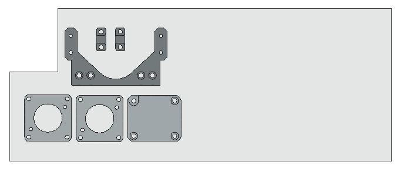

# Making the aluminium parts

These parts are milled from 200x8mm flat bar aluminium 6082-T6 grade. We buy them in 6 m lengths and cut them in half before milling.

The CNC we used for manufacturing has a 2440 mm long work area.

## Files

* Full 3D model files online view [(Fusion)](https://a360.co/2AF6yjp) 
* [Full step model)](https://github.com/fellesverkstedet/fabricatable-machines/raw/master/humphrey-large-format-cnc/humphrey_v3/Assembly_h3%20v5_step.zip) 
* [All step files with the aluminium layouts](./parts/alu_parts_STEP.zip)

* Mega_nuts_long_motor_plates_2_motor_spacers [Fusion CAM](https://a360.co/2PiNYRo)

* Gantry bridge [Fusion CAM](https://a360.co/2PliVEu)

* Y-rails [Fusion CAM](https://a360.co/2MhuMFD)

* Roller axis plates [Fusion CAM](https://a360.co/2Bg37jq)

* X_Z_rails_cores [Fusion CAM](https://a360.co/2PhWqAk)

* 2_motor_plates_z_homeing_plate [Fusion CAM](https://a360.co/2PiNYRo)

## How to mill

* [Aluminium milling advice in the wiki](https://github.com/fellesverkstedet/fabricatable-machines/wiki/Fabricatable-axis#how-to-fabricate) 
