# Tuning the motion system

Humphrey has a three axis linear motion system, the axis are named X, Y and Z. These names are the same ones later used when communicating the machine. 

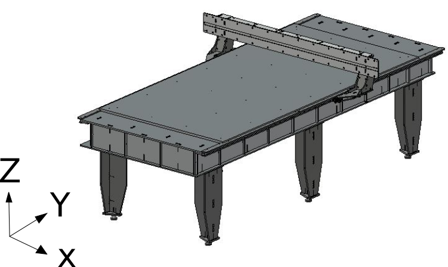

Each linear axis is guided by rollers that roll on a rail, the axis are driven by a pinion cog-wheel on a motor which drives against the rack teeth. 

In order for the machine to work well both the guiding parts and the driving parts of the machine needs to be tuned. We always tune the guides first, then the motors with the pinions.

# Aligning the Y-rails - The first rail

The Y-rails are the "train tracks" under the long sides of the machine. We first need to make sure that they are paralell to each other if we want to be able to tune them.

Having a long straight guide tool is very helpful for this step! (Or, even better, you could use a laser.)

The Y-rails are each split in two pieces that are joined in the middle. They are fixed where they meet in the middle of the machine but the rest of them can be adjusted sideways.

_There are Ø6mm holes drilled through the aluminium Y-rails upp through the two 12mm valchromat layers. They are there to give a good starting position. They are mentioned in the Table assembly chapter so these instructions assume that you have used them already._

* Use the straight guide to check if the Y-rail on the side with the ledge is straight. If it isn't release screws and adjust as neccessary. 

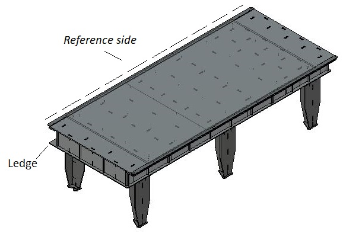

One side is now straight and will be our reference for the second one. 

* Find two M6 screws (any length) or Ø6mm wooden dowels. We will used them to create temporarily "stoppers" to set the gantry perpendicular to the rails while we tune them. 

* Insert the Ø6mm stopper screws or dowels into both sides of aluminum Y-rails to form stopping referenses for the gantry. Put them in the Ø6mm holes that are closest to the middle of the machine, and behind the gantry. They don't have to go in further than the aluminium, we just want them to stop the gantry from rolling past.

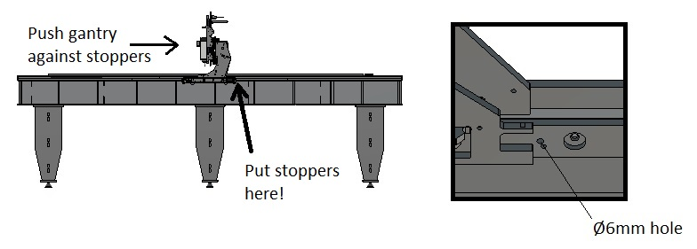

* Now we know that the gantry is "square" to the rails. Now we will set the rollers of the gantry feet to the width between the Y-rails. We do it here in the middle of the machine since the rails are at a fixed distance here.

## Tuning rollers

**IMPORTANT!** It's extremely easy to overtighten the excenters, you have 10x times more power compared to tightening a screw, you will **NOT** feel it going tight with the tool, you need to test if it spins with your finger.

* To tune the rollers you will need a 8mm (steel) and a 17 mm wrench (it's part of the aluminium milling cut-sheets so you should have one).

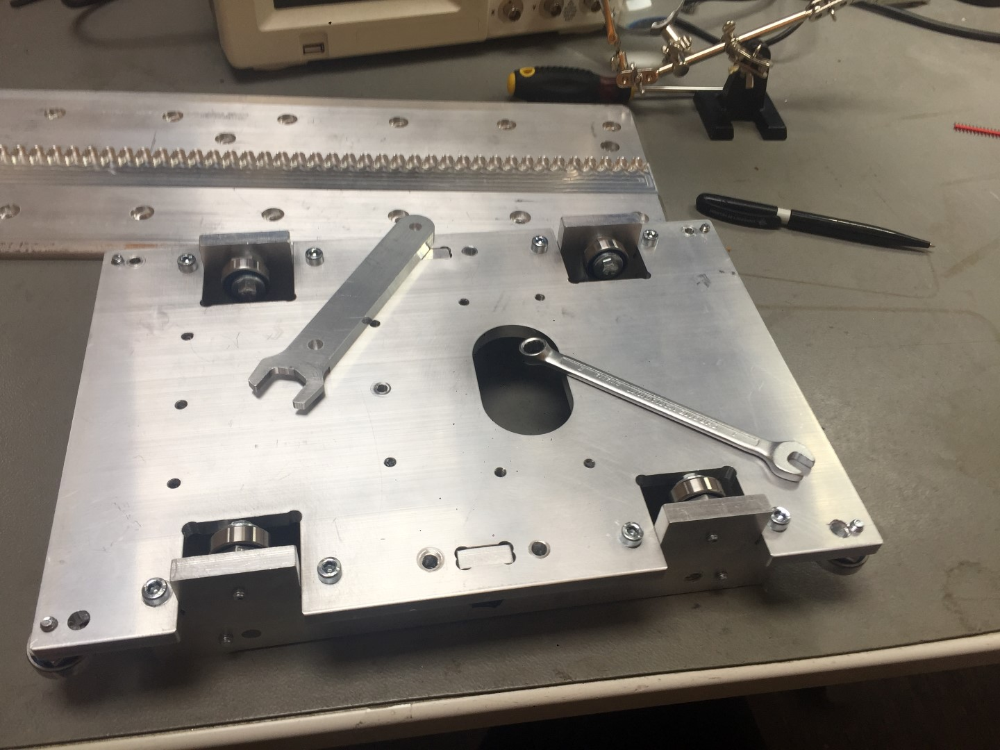

* Not all rollers can or should be tuned. The ones you need to tune have an aluminum 6-side "nut" shape under the bearing and a hex-head bolt. The fixed rollers have a countersunk internal hex head and a round spacer, they should be nice and tight and will always be the fixed references we tune towards.

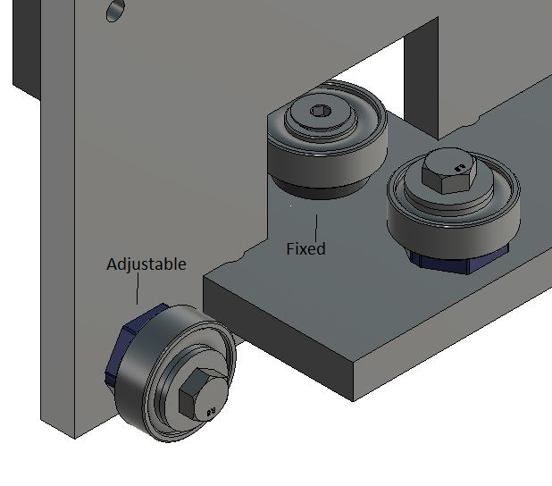

* Always tighten the excenters in the counter-clockwise direction, this way it will not move when the bolt is tighened. (The adjustable rollers cosist of an exceter with 1,5mm travel in each direction when turned a full turn. This means that it can be tighened either direction, clockwise or counter-clockwise.)

* Check the tightness by spinning the bearing with your finger. MAKE SURE that you still can spin the bearing in place without rolling it along the rail. If you can't, it means that you have overtighened it, and you can't know by how much.

### Y axis outside rollers

We will start with the outside excenters that stop the gantry from moveing sideways.

* Tighten the excenters in this order, while making sure that the gantry is perpendicular to the table by pushing it aginst the stopper screws. It helps being two but can be done alone.

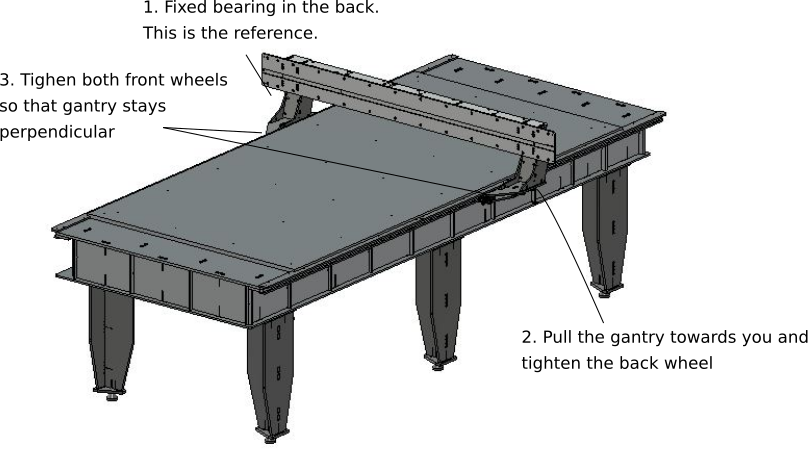

### Fastening the second Y rail

* First make sure the screws holding the second y rail is screwed in, they don't need to be tight but they should hold the rail steady when we roll the gantry along them.

* Now use the carriage as a guide to align the second y rail to be paralell with the first one. Roll the gantry along and feel the wheels on the outside, the ones you just tuned. They should not become too loose or too tight. Adjust the second Y rail accordingly. 
* It can be helpful to put clamps through the motor hole that gently presses the rail to the rollers at the positions you want to lock in.

### Y underside rollers

* Tighen these four in any order, just don't forget to do it!

### X axis tuning

* Tighten them in this order

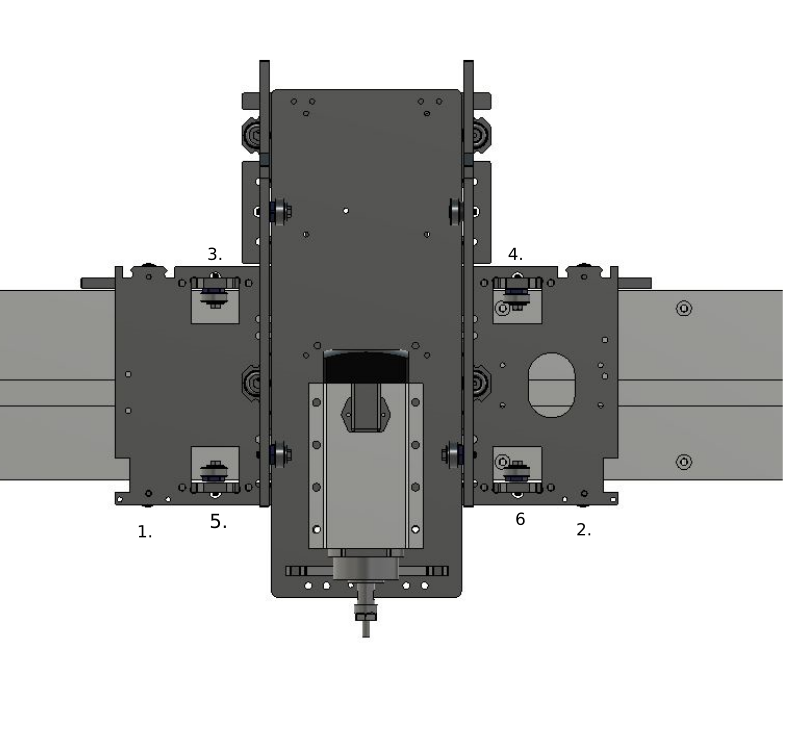

### Z axis tuning

* Tighten them in this order, first:

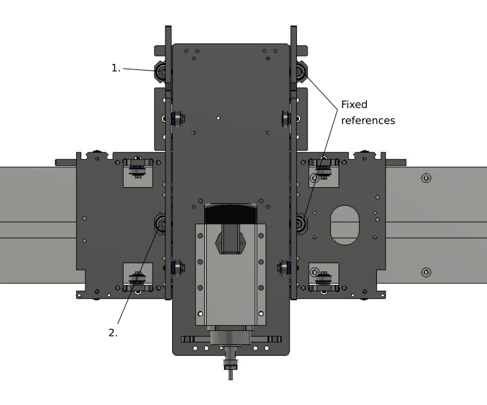

* Then:

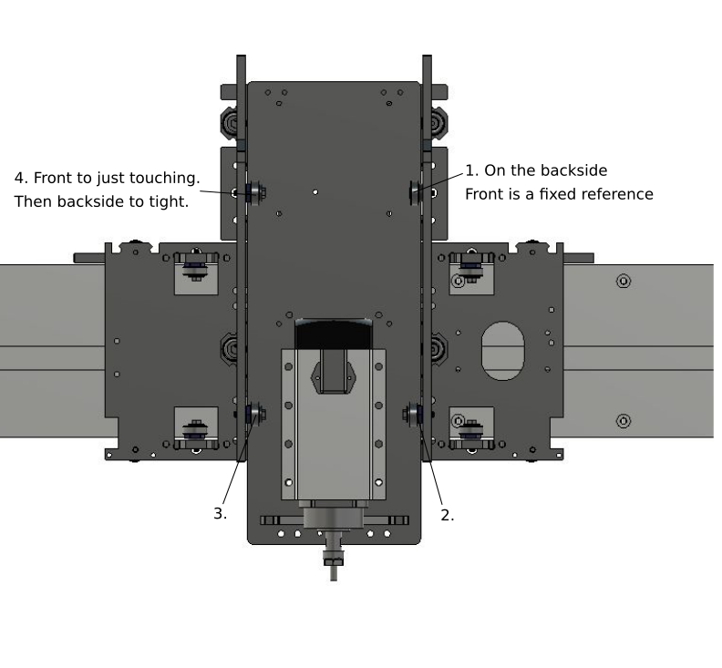

* Remove the Z-axis and attach the spindle to it after tuning it if you have not done it already. Take extra care to make sure you mount it paralell to the sides of the z-axis.

# Tuning the stepper motors and pinions

* Find these parts times four

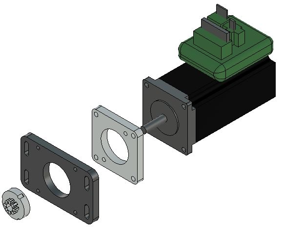

* First drill and thread the pinions the same way you did for the aluminium, at the notches. But take exta care to aim for the center when drilling.
* Insert M5 set screws into the three holes in each pinon so that you can lock it to the motor axis. Do not tighten yet.

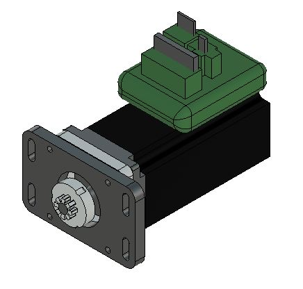

* Assemble the motor plates to the motors
* Attatch pinons to the motor axis loosely
* Dry fit the motors in each place and check that the pinion is positioned 0.5-1 mm from the bottom of the rack pocket to avoid rubbing or breaking.
* Tighten the pinion screws
* Screw the motor assemblies loosely to the machine
* Jiggle the axis until the pinion on the motor interlocks with the rack teeth, try to find a good position of contact without pressing the pinion into the rack at all.
* Tighten the screws holding the motor assembly to the machine.
* Look to check that the pinion is still ca 0.5-1 mm from the bottom of the pocket.
* Gently push the axis through its entire length to see that there are no colissions with protruding screws. The motors should provide even resistance, if it very hard to move, it is possible that the motor position presses the pinion too hard into the rack.
* Install end stop screws for all axis.
* LATER, when the machine is powered, test pushing on each axis to test if there is any free movement before you can feel the teeth engaging. There should be no gap. If there is a gap, try resetting the motor position so that the pinion is tighter on to the rack.
* If the pinion is worn or damaged it will not be possible to get rid of the gap.

## Covers and vipers

After all rollers and motors are tuned: 

* Cover all rollers with 3d-printed covers 
* Wrap the 12  3d-printed vipers with felt strips
* Screw on the 3d printed wipers

CONGRATULATIONS YOUR MACHINE IS NOW TUNED!

You are now ready to start wireing your machine, see the [Electronics](electronics.md) chapter

[Back to assembly main page](Humphrey_how_to_assemble.md)

[Back to Humphrey overview](README.md)

## OPTIONAL EXTRA TUNING: Tramming of spindle

These step are not necessary to start running your machine but rather an optional improvement you can do if you would like to improve the surface quality of milled flat surfaces. If you have noticed your machine leaving "stair steps" at the bottoms of milled pockets or on the spoilboard after planing it, then the spindle might not be perfectly perpendicular to the surface of the work area. This is how to straighten it.

### Before starting

* The same problem can be caused by loose bearings, tune them all first and test again before proceeding.

* To check the tram of the spindle you can fashion a test instrument as shown in this [video.](https://www.youtube.com/watch?v=D6pfIoyhgTc)

* Before testing it you need a flat plane to refer to. Mill the bed flat first using a linear back and forth pattern, do not use a concentrically offset pattern (default in pockets). You do this to avoid heigh differences forming in the diagonals.

* When measuring the tram with the instrument, make sure to check it in different spots on the surface to detect twists in the x-axis or the Y-rails not being paralell.

* If you find that the spindle needs tilting around the y axis you can take out the Z-axis and check that the spindles's position on the Z axis is paralell with the sides of the Z-axis before continuing. 

* If you find a misalignment in the spindle using the steps above you can modify the machine as described below to allow fine adjustment of the spindle tilt. 

### Adding spindle tilt tuning option

* Warning. This will make the machine slightly complicated to tune in the future. Since more rollers will be able to move you will have to keep track on which ones should be adjusted and which ones only control tilt when doing regular tuning later.
* To add tilt tuning: Replace these fixed rollers with excenters:

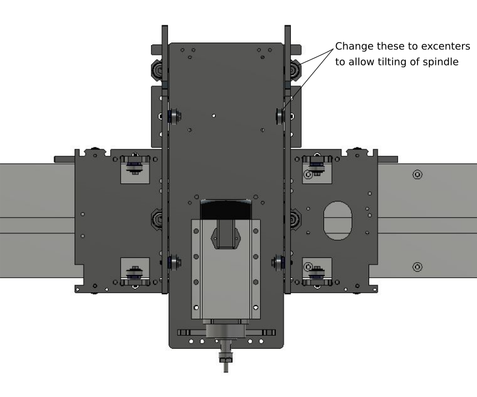

* To rotate the spindle around the Y axis, adjust these rollers:

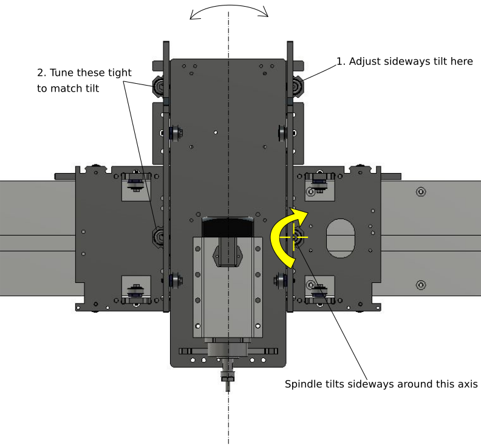

* To rotate the spindle around the X axis, adjust these rollers:

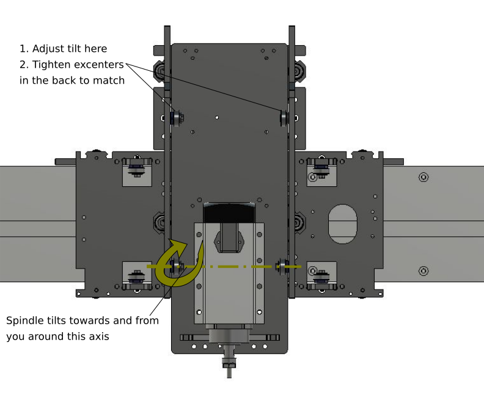

CONGRATULATIONS YOUR MACHINE IS NOW TUNED!

You are now ready to start wireing your machine, see the [Electronics](electronics.md) chapter

[Back to assembly main page](Humphrey_how_to_assemble.md)

[Back to Humphrey overview](README.md)